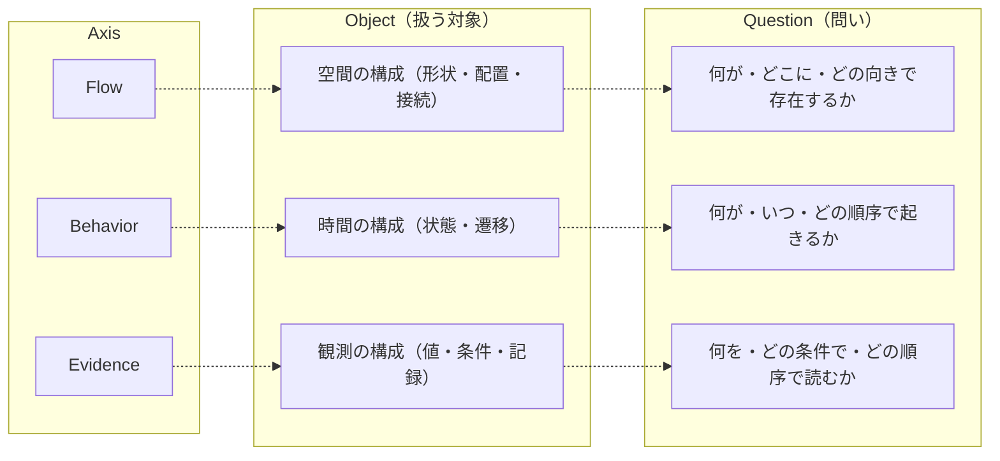

# BSL_1. Core Concepts（基本概念）

**Version: v0.3.7**

---

## Core Dependency

本章が依拠するCoreの定義を以下に示す。

| 参照先 | Core節 | 本章での役割 |
|--------|--------|-------------|
| 三軸（Flow / Behavior / Evidence） | A.1 | 意味座標系の上位定義 |
| 三層（Element / Structure / Basis） | A.2 | 三層モデルの上位定義 |
| Meaning Identity / Variation | A.4 | 同一性・揺れの判定原理 |
| 依存ポリシー | A.3 | 三軸・外側レイヤの依存方向 |
| View / Sidecar | A.5 | 読み取りと外在化の枠組み |
| 外側レイヤ（Context / Variant / Design History） | A.6 | 判断レイヤの型定義 |

Between Core で定義される三軸・三層、View / Sidecar、依存ポリシー、Meaning Identity の定義そのものは **Core Appendix を SSOT として参照し、本章では再定義を行わない**。

---

## 1. Purpose（この章の目的）

BSL は Core の上に位置し、以下を **仕様（Spec）として固定する** レイヤである。

- 意味構造（Flow / Behavior / Evidence）
- 抽象層（Element / Structure / Basis）
- 外側レイヤ（Context / Variant / Design History）

Core では抽象原理として定義されていたものを、BSL では **型・方向性・結合条件・読み取り規則** といった形式的枠組みとして整備する。

本章は、後続章（BSL_2〜9）の基準点を定める「座標系の宣言」である。

---

## 2. 三軸：Flow / Behavior / Evidence

三軸は、対象の意味を成立させる最小構造を提供する。
BSL は Core の定義に従い、以下の役割を仕様上の「責務」として確定する。



### 2.1 Flow（空間・配置）

Flow は **空間的な並びの一貫性** を扱う。

| 層 | 要素 | 説明 |
|----|------|------|
| Element | Part | 識別可能な形状の最小単位 |
| Structure | Assembly | Part間の親子関係・構成 |
| Basis | Placement | 意味的 SSOT を成立させる基準層 |

BSL における責務：
- 空間排他性・基準の定義などの「空間制約」をオプション制約として明文化する
- Placement を Structure の SSOT 判断基準として扱う型仕様を定める
- 外側レイヤ（Variant / Context）が Flow を上書きする場合の安全条件を規定する

### 2.2 Behavior（時間・順序）

Behavior は **時間的整合性・因果性** を扱う。

| 層 | 要素 | 説明 |
|----|------|------|
| Element | Event | 時間軸上の離散的な変化点 |
| Structure | Step | Eventの結果として確定した状態 |
| Basis | Sequence | 意味的 SSOT を成立させる基準層 |

BSL における責務：
- 因果性・前後関係・依存方向の制約を型として規定する
- Step（手順構造）と Sequence（因果基準）を分離し、取り違えを防ぐ
- Flow や Evidence との許可される結合パターンを仕様化する

### 2.3 Evidence（観測・読み取り）

Evidence は **読み取りによる再現可能性** を扱う。

| 層 | 要素 | 説明 |
|----|------|------|
| Element | Reading | その瞬間に読み取った値 |
| Structure | Condition | Readingを意味づける前提条件 |
| Basis | Ordering | 意味的 SSOT を成立させる基準層 |

BSL における責務：
- Reading / Condition / Ordering の型レベルの分離
- Ordering による append-only 原則を Sidecar の仕様として固定する
- View が Structure × Sidecar を解釈する際の読み取り規則を仕様化する
- ActionTrace（行為の記録）は Reading に含めてよい。ただし ActionTrace は成功・反映・権限OKを含意しない。
- EffectDelta（状態変化）は Behavior / Flow の Structure に属し、Evidence の拡張で代替しない（LEM-E3）。
- ドメイン別の便宜的名称（例：ToolCall/ToolEffect）は docs/policies 側でエイリアスとして定義する。

---

## 3. 三層：Element / Structure / Basis

三層は、対象物の複合構造を「粒度として」定義するための枠組みである。
BSL は以下を仕様上の責務とする。

### 3.1 Element（最小単位）

| 軸 | Element |
|----|---------|
| Flow | Part |
| Behavior | Event |
| Evidence | Reading |

BSL の責務：
- Element 間の結合規則は Structure が吸収する（Element は独立）
- Element は Variant の影響を直接受けない

### 3.2 Structure（複合構造）

| 軸 | Structure |
|----|-----------|
| Flow | Assembly |
| Behavior | Step |
| Evidence | Condition |

BSL の責務：
- Structure は常に Basis を参照して意味を確定する
- Structure の変化は Design History が管理し、Behavior / Flow の Structure を直接書き換えない（Design History を経由して解釈する）

### 3.3 Basis（SSOTの基準）

| 軸 | Basis |
|----|-------|
| Flow | Placement |
| Behavior | Sequence |
| Evidence | Ordering |

BSL の責務：
- Basis は Structure をどの前提で読むかを固定する読み取り基準であり、その実データは Sidecar に外在化される。SSOT に Basis を混在させてはならない
- したがって、Basis は意味的 SSOT を成立させる基準であるが、SSOT 本体そのものではない
- 基準が変化する場合、Variant または Design History を経由する
- Basis の破壊的更新は禁止（append-only もしくは置換の明示手続）

---

## 4. 外側レイヤ：Context / Variant / Design History

外側レイヤは「判断・選択・履歴」の役割を持ち、三軸の外側に位置する。

### 4.1 Context（前提条件）

- 環境・目的・使用条件などの **読み方の前提** を保持する
- View の振る舞いに影響は与えるが、三軸の内部構造を変更しない
- Context は Basis / Sidecar と異なり、「座標系や履歴」ではなく「読み取りの目的や利用シナリオ」といった判断前提のみを扱う
- 承認・権限・posture は Context に属する。Evidence には承認根拠として提示された参照（approval_id等）だけを残し、成立判定や実行許可はここで行う。
- Context は、承認・権限・posture に加えて、OperationScope（操作範囲の宣言）を保持してよい。OperationScope は「どの space_id で」「どの artifact_role／cross-space 操作」を許可するかを宣言し、Evidence や View の内容そのものを正当化しない。
- OperationScope は比較の成立条件（Φ の閉包）を代替しないため、compare の許可は同一 space_id かつ同一 Φ の範囲に限定される。
- OperationScope は実装パターン（RBAC 等）を規定しない。許可の意味論のみを定義し、実現方法は実装層に委ねる。

#### OperationScope の最小構造（参考）

| フィールド | 型 | 説明 |
|-----------|-----|------|
| scope_id | string | 操作範囲の識別子。同一 scope_id は同一の許可セットを共有する |
| space_id | string | 適用対象の Space。比較成立の前提が閉じている単位（BSL_9 参照） |
| artifact_role | enum[] | 許可される artifact_role（ssot/view/sidecar/evidence） |
| operation_kind | enum[] | 許可される操作種（propose/append_draft/approve/execute） |
| cross_space_operation | enum[] | 許可される Space 跨ぎ操作（route/redirect）。compare は許可できない |
| confirmation_points | string[] | 人の承認が必要な操作（operation_kind の部分集合） |
| forbidden_set | string[] | 禁止操作 |

OperationScope は Context 配下に属し、Design History や Operation から参照される。

注記（scope_id と space_id の違い）:
- space_id: 比較成立の前提が閉じている単位（Meaning Identity の境界）
- scope_id: 操作許可の単位（OperationScope の識別子）

同一 space_id に対して複数の scope_id が存在しうる（例：閲覧専用と編集可能の区別）。

### 4.2 Variant（意図的な揺れ）

- Flow / Behavior / Evidence の **代替的な構造** を記述する外側レイヤ
- Variant は Structure を複製せず、差分の意図は、Basis（Placement / Sequence / Ordering）に対する **Binding（どの Basis を採用するか）** と、その切り替え方を定める **Rule（変換規則）** の組として表現される

### 4.3 Design History（生成の記録）

- Flow / Behavior / Evidence の「生成順序・編集履歴」を記録する
- SSOT を汚さず、Sidecar と連携して整合性を保証する

---

## 5. Meaning Identity（意味的同一性）

Core 第7章に基づき、BSL では意味的同一性（Identity）を次の3条件で定義する。

| 条件 | 説明 | Core参照 |
|------|------|----------|
| Structure同一性 | Element / Structure の集合と接続関係が一致していること（Flow なら Part/Assembly 構成、Behavior なら Event/Step 構成など） | A.4.1 |
| Basis同一性 | Basis（Placement / Sequence / Ordering）が同じ意味基準（座標系・順序・並び）を共有していること | A.2.2, A.4.1 |
| View一致 | Structure × Sidecar を View で読み取った結果として得られる意味が同一であること（表示やフォーマットの差異は許容） | A.4.2 |

BSL の責務は、これら3条件を **形式仕様として再現できるフォーマット・制約** を定めることである。

---

## 6. Dependency Policy（依存ポリシー）

BSL では Core Appendix の依存ポリシーをそのまま仕様として採用する。

### 6.1 三軸間の依存

| 参照元 | 参照先 | 許可 | 説明 |
|--------|--------|------|------|
| Evidence | Behavior | ○ | 読み取り結果が時間構造を参照することは許可 |
| Behavior | Flow | ○ | 時間構造が空間構造を参照することは許可 |
| Evidence | Flow | ○ | 読み取り結果が空間構造を参照することは許可される |
| Flow | Behavior | × | 空間構造が時間構造に依存することは禁止 |
| Flow | Evidence | × | 空間構造が読み取り結果に依存することは禁止 |
| Behavior | Evidence | × | 時間構造が読み取り結果に依存することは禁止 |

注記：
Core Appendix A.3.1 では Evidence → Flow の直接参照は許可される。
本書 §6.3 の簡略表現は、実務上の代表的な依存連鎖を示したものであり、
Core の許可関係を制限するものではない。

### 6.2 外側レイヤとの依存

| 参照元 | 参照先 | 許可 | 説明 |
|--------|--------|------|------|
| 外側レイヤ | 三軸 | ○ | 判断レイヤが三軸を参照することは許可 |
| 三軸 | 外側レイヤ | × | 三軸側から判断レイヤに依存することは禁止 |

### 6.3 簡略表現

```
許可：Evidence → Behavior → Flow
禁止：Flow → Behavior → Evidence（逆流）

許可：外側レイヤ → 三軸
禁止：三軸 → 外側レイヤ
```

これにより「読み取りが先」「構造が後」「空間が最も外側」という Between Core の基本構造が保持される。
注記：Evidence → Flow の直接参照も許可される（Core A.3.1）。上記は代表的な依存連鎖であり、Core の許可関係を制限しない。

---

## 7. View / Sidecar の役割

### 7.1 View（読み取り写像）

- Structure と Sidecar（Basis / Condition / Ordering）を参照し、Meaning（意味）を射影する操作
- View の適用は本体を変更しない
- BSL の責務は、View の読み取り規則の抽象仕様を定義すること

### 7.2 Sidecar（非侵襲的履歴領域）

- Ordering を中心とした append-only の Evidence chain を保持する
- 基本構造を破壊しない「非侵襲的履歴領域」
- Basis は座標系上の基準であり、その実データは Sidecar に外在化される

---

## 8. Space と Mapping

### 8.1 Space（意味の適用単位）

Space は、同一性（Identity）を評価するための前提が閉じている単位である。
BSL は Space を組織図やシステム構成と同一視しない。Space は識別子（space_id）として扱い、比較や接続の可否を機械的に判定できることを目的とする。

Space は少なくとも次の組で成立する。

| 構成要素 | 役割 |
|---------|------|
| SSOT | 更新責務を持つ真実 |
| view | SSOT からの投影（再生成可能） |
| sidecar | view の解釈条件・補助情報 |

view は SSOT ではない。view は、固定された sidecar（Basis/Condition/Ordering）と投影規則に基づき、SSOT から再計算される派生である。
view は複数並立し得るため、比較は常に SSOT と sidecar（Basis/Condition/Ordering）に遡り、成立条件が一致していることを確認してから行う。

同一の SSOT を参照していても、view または sidecar が異なるなら別 Space として扱ってよい（MAY）。
Space の分割基準に関する推奨は docs/guide を参照のこと。

### 8.2 Mapping（Space 間接続）

Mapping は、Space 間または役割間の接続を表す。
接続の実体は API、ETL、イベント、手作業、帳票など何でもよいが、接続が存在するなら識別子（mapping_id）と種別（mapping_kind）で宣言できなければならない。

Mapping は「直接参照」や「暗黙の逆流」を正当化しない。
Space 間のデータ移送や意味変換は、必ず Mapping として明示する。

#### mapping_kind（最小列挙）

| 値 | 意味 |
|----|------|
| derive | ssot → view（派生・投影） |
| observe | ssot/view → evidence（観測・記録） |
| transfer | spaceA → spaceB（移送） |
| transform | spaceA → spaceB（意味変換を伴う移送） |
| compose | 複数入力からの合成 |
| manual | 人手工程を含む |

### 8.3 Core との関係

Space の意味論的定義は Core 9.2.1 を参照。
BSL は Core 定義を機械可読な識別子・メタデータ・検査として仕様化する。

---

## 9. BSL における基本原則

本章で定義した概念は、BSL 2〜9章における仕様化の基準となる。

| 原則 | ID | 説明 |
|------|-----|------|
| 直交性 | BP-1 | 三軸・三層は常に直交 |
| 外在化 | BP-2 | Basis は Sidecar に外在化 |
| 再構成 | BP-3 | View は Structure × Sidecar から意味を再構成 |
| 非介入 | BP-4 | 外側レイヤは内部構造に介入しない |
| 一方向 | BP-5 | 依存ポリシーは一方向（Evidence → Behavior → Flow） |
| 非複製 | BP-6 | Variant は差分の意図を持ち、Structure を複製しない |
| 非汚染 | BP-7 | Design History は SSOT を汚染しない |
| Space 境界 | BP-8 | 比較は同一 space_id かつ同一 basis_id の内側でのみ許可 |
| Mapping 明示 | BP-9 | Space 間接続は Mapping として明示する |

---

## 10. Running Example（BSL共通）

以降の BSL_2〜BSL_8 における Examples は、特に断りがない限り本節を共通前提とする。

### 10.1 概要

「対象A」という架空の製品を例として使用する。

| 項目 | 内容 |
|------|------|
| 対象 | 対象A（センサユニット） |
| 構成 | Part P001, P002 を含む Assembly A001 |
| 工程 | Sequence Q001 に沿った Step S001, S002 |
| 観測 | Reading R001 による寸法測定 |

本章では、Flow / Behavior / Evidence の関係性を示すことを優先し、属性は最小限にとどめる。各軸の詳細属性は BSL_2〜BSL_4 で拡張する。

### 10.2 Flow（空間）

```json
{
  "assembly": {
    "id": "A001",
    "name": "対象A",
    "parts": ["P001", "P002"]
  },
  "placements": [
    { "id": "L001", "part_id": "P001", "position": {"x": 0, "y": 0, "z": 0} },
    { "id": "L002", "part_id": "P002", "position": {"x": 100, "y": 0, "z": 0} }
  ]
}
```

### 10.3 Behavior（時間）

```json
{
  "sequence": {
    "id": "Q001",
    "name": "組立工程",
    "steps": ["S001", "S002"]
  },
  "steps": [
    { "id": "S001", "name": "初期配置", "events": ["E001"] },
    { "id": "S002", "name": "締結", "events": ["E002"] }
  ]
}
```

### 10.4 Evidence（観測）

```json
{
  "readings": [
    { "id": "R001", "value": 49.95, "unit": "mm", "condition_id": "C001" }
  ],
  "conditions": [
    { "id": "C001", "temperature": 20, "humidity": 50 }
  ],
  "ordering": {
    "id": "O001",
    "sequence_number": 1,
    "previous_ordering_id": null
  }
}
```

### 10.5 相互参照

```
Flow (A001) ← Behavior (Q001) ← Evidence (R001)
         ↑           ↑              ↑
      Placement   Sequence       Ordering
        (L001)      (Q001)        (O001)
```

---

## 11. Summary（本章のまとめ）

| 項目 | 内容 |
|------|------|
| 位置づけ | BSL全体の座標系を宣言する基準仕様 |
| 三軸 | Flow（空間）/ Behavior（時間）/ Evidence（観測） |
| 三層 | Element / Structure / Basis |
| Basis の役割 | 座標系上の基準。実データは Sidecar に外在化され、意味的 SSOT を成立させる基準となる。SSOT 本体そのものではない |
| 外側レイヤ | Context（OperationScope を含む）/ Variant / Design History |
| Meaning Identity | Structure同一性 / Basis同一性 / View一致 の3条件 |
| 依存ポリシー | Evidence → Behavior → Flow（一方向）、外側レイヤ → 三軸（一方向） |
| Space | 同一性を評価するための前提が閉じている単位（space_id で識別） |
| Mapping | Space 間接続（mapping_id / mapping_kind で宣言） |
| 基本原則 | BP-1〜BP-9 |
| Running Example | 全章共通の「対象A」を定義 |

本章が整うことで、BSL 全体が「Between Core の意味座標系を破壊しない仕様レイヤ」として機能することを保証する。

---

## 更新履歴

| バージョン | 日付 | 変更内容 |
|-----------|------|----------|
| v0.1 | - | 初版草案 |
| v0.2 | 2025-06 | Core Dependency表追加、Meaning Identity/依存ポリシー表形式化、Basis/SSOT/Sidecar文言整理、Running Example明示、Summary追加 |
| v0.3 | 2026-01 | Space / Mapping セクション追加（8章）。基本原則に BP-8（Space境界）、BP-9（Mapping明示）を追加。章番号再編 |
| v0.3.1 | 2026-01 | Space セクションに view の派生性・並立性を追記（LEM-4 との整合） |
| v0.3.2 | 2026-01 | ActionTrace / EffectDelta を Evidence 責務に追加。Context に承認・権限・posture の所属を明記 |
| v0.3.3 | 2026-01-14 | Context に OperationScope の位置づけを追記。compare 許可条件との関係を明記。scope_id / space_id の違いを注記 |
| v0.3.4 | 2026-03 | 公開前整合パッチ：§3.3 Basis の SSOT 位置づけを明確化（Core 8章・BP-2 との整合）。Summary の Basis の役割を §3.3 に整合 |
| v0.3.5 | 2026-03 | 公開前整合パッチ：§2.1–2.3 Basis 説明列を「SSOT を成立させる基準層」に統一（appendix A.2.3 との整合） |
| v0.3.6 | 2026-03 | 公開前整合パッチ：§6.1 Evidence→Flow を Core A.3.1 に一致（○）。§6.3 簡略表現との関係を注記 |
| v0.3.7 | 2026-03 | §10.4 の Ordering 例を BSL_4 スキーマ語彙に整合（sequence → sequence_number / previous_ordering_id） |
