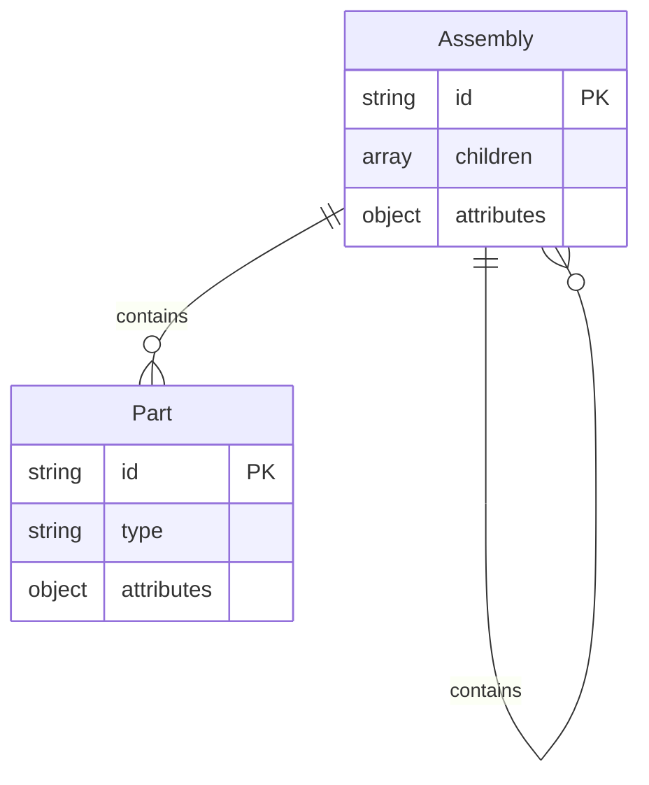

# BSL_2. Flow 仕様

**Version: v0.3.2**

---

## Core Dependency

本章が依拠するCoreの定義を以下に示す。

| 参照先 | Core節 | 本章での役割 |
|--------|--------|-------------|
| F.El（Part） | A.2.2 | 識別可能な形状の最小単位 |
| F.St（Assembly） | A.2.2 | Part間の親子関係・構成 |
| F.Ba（Placement） | A.2.2 | Partを空間に配置する基準（配置基準） |
| 依存ポリシー（軸間） | A.3.1 | Evidence → Behavior → Flow の一方向性 |
| 依存ポリシー（層間） | A.3.2 | Element → Structure → Basis の一方向性 |
| Meaning Identity / Variation | A.4 | children順序やorientation精度の許容範囲の根拠 |
| View | A.5.1 | Flowを別表現へ写像する仕組み |

BSL独自の定義：なし（Core定義の仕様化のみ）

---

## 1. Purpose（この章の目的）

本章は、Flow軸（空間における配置と構成）を機械可読なデータ構造として仕様化する。

仕様化の範囲：
- Part / Assembly / Placement のデータモデル
- 各要素の必須フィールド・制約
- 操作（Create / Update / Compare）の定義
- 依存ポリシーの適用ルール

仕様化の範囲外：
- Flowの意味論的定義 → Core Appendix A.2.2
- CAD / Excel / 2.5D等の具体実装 → Sandboxes

---

## 2. Data Model（データモデル）

### 2.1 Part（F.El）

識別可能な形状の最小単位。

#### Schema

```json
{
  "$schema": "https://json-schema.org/draft/2020-12/schema",
  "type": "object",
  "properties": {
    "id": {
      "type": "string",
      "pattern": "^P[0-9]{3,}$",
      "description": "Part ID（例：P001）"
    },
    "type": {
      "type": "string",
      "description": "型番またはタイプ名"
    },
    "attributes": {
      "type": "object",
      "description": "任意の属性（素材、機能等）",
      "additionalProperties": true
    }
  },
  "required": ["id", "type"]
}
```

#### Field Definition

| フィールド | 型 | 必須 | 制約 | 説明 |
|-----------|-----|------|------|------|
| id | string | ○ | `^P[0-9]{3,}$` | プロジェクト内で一意 |
| type | string | ○ | - | 型番またはタイプ名 |
| attributes | object | - | - | 任意の属性辞書 |

#### Constraints

| ID | 制約 | 根拠 |
|----|------|------|
| P-C1 | id はプロジェクト内で一意 | 同一性判定の前提 |
| P-C2 | 同一形状でも用途が異なれば別Part可 | 意味的分離 |
| P-C3 | 形状データは保持しない | Flow ≠ 形状モデル |

---

### 2.2 Assembly（F.St）

Part間の親子関係・構成を表す構造。

#### Schema

```json
{
  "type": "object",
  "properties": {
    "id": {
      "type": "string",
      "pattern": "^A[0-9]{3,}$",
      "description": "Assembly ID（例：A001）"
    },
    "children": {
      "type": "array",
      "items": {
        "type": "string",
        "pattern": "^[PA][0-9]{3,}$"
      },
      "description": "子要素のID一覧（Part または Assembly）"
    },
    "attributes": {
      "type": "object",
      "additionalProperties": true
    }
  },
  "required": ["id", "children"]
}
```

#### Field Definition

| フィールド | 型 | 必須 | 制約 | 説明 |
|-----------|-----|------|------|------|
| id | string | ○ | `^A[0-9]{3,}$` | プロジェクト内で一意 |
| children | array | ○ | Part/Assembly IDの配列 | 子要素一覧 |
| attributes | object | - | - | 任意の属性辞書 |

#### Constraints

| ID | 制約 | 根拠 |
|----|------|------|
| A-C1 | children に Part ID または Assembly ID を含む | 構成の定義 |
| A-C2 | 循環参照禁止（DAGのみ許可） | Core A.3.3 |
| A-C3 | 複数の親を持ち得る（DAG） | 再利用性 |
| A-C4 | children の順序は意味に影響しない | Variation許容 |

#### Structure Diagram



---

### 2.3 Placement（F.Ba）

Partを空間に配置する基準。Flow軸の Basis。

#### Schema

```json
{
  "type": "object",
  "properties": {
    "id": {
      "type": "string",
      "pattern": "^L[0-9]{3,}$",
      "description": "Placement ID（例：L001）"
    },
    "assembly_id": {
      "type": "string",
      "pattern": "^A[0-9]{3,}$",
      "description": "所属するAssembly"
    },
    "part_id": {
      "type": "string",
      "pattern": "^P[0-9]{3,}$",
      "description": "配置対象のPart"
    },
    "position": {
      "type": "object",
      "properties": {
        "x": { "type": "number" },
        "y": { "type": "number" },
        "z": { "type": "number", "default": 0 }
      },
      "required": ["x", "y"]
    },
    "orientation": {
      "type": "object",
      "properties": {
        "theta": { "type": "number", "default": 0 },
        "phi": { "type": "number", "default": 0 },
        "psi": { "type": "number", "default": 0 }
      }
    },
    "coordinate_system": {
      "type": "string",
      "enum": ["local", "global", "parent"],
      "default": "parent"
    }
  },
  "required": ["id", "assembly_id", "part_id", "position"]
}
```

#### Field Definition

| フィールド | 型 | 必須 | 制約 | 説明 |
|-----------|-----|------|------|------|
| id | string | ○ | `^L[0-9]{3,}$` | プロジェクト内で一意 |
| assembly_id | string | ○ | 既存Assembly ID | 所属Assembly |
| part_id | string | ○ | 既存Part ID | 配置対象Part |
| position | object | ○ | x, y 必須 | 位置座標 |
| orientation | object | - | theta, phi, psi | 回転情報 |
| coordinate_system | string | - | enum | 座標系種別 |

#### Constraints

| ID | 制約 | 根拠 |
|----|------|------|
| L-C1 | (assembly_id, part_id, position) の組で一意性を判定 | 配置基準 |
| L-C2 | 同一Partが複数Placementを持ち得る | 再利用性 |
| L-C3 | 幾何拘束ではなく意味上の位置 | Flow ≠ CAD |
| L-C4 | position.z は省略時 0 | 2D互換 |

---

## 3. Dependency Policy（依存ポリシー）

### 3.1 軸間依存

Flow は他軸から参照される基準であり、他軸を参照しない。

| 参照元 | 参照先 | 許可 | 備考 |
|--------|--------|------|------|
| Behavior | Flow | ○ | Step/Sequence が Part/Placement を参照 |
| Evidence | Flow | ○ | Reading が Part/Placement を参照 |
| Flow | Behavior | × | Core A.3.1 禁止 |
| Flow | Evidence | × | Core A.3.1 禁止 |

### 3.2 層間依存

| 参照元 | 参照先 | 許可 | 備考 |
|--------|--------|------|------|
| Part | Assembly | ○ | 構成要素として |
| Part | Placement | ○ | 配置先として |
| Assembly | Placement | ○ | 配置基準として |
| Placement | Part | × | Core A.3.2 禁止（逆流） |
| Placement | Assembly | × | Core A.3.2 禁止（逆流） |

### 3.3 Sidecar との関係

Flow 自体は空間の意味構造を表し、観測条件や判断履歴は本体構造に混在させない（Core A.3 の一方向依存および A.6.2 の非介入性）。これらは Sidecar / 外側レイヤとして外側に保持される。

| 項目 | 説明 |
|------|------|
| 根拠 | Flow は空間の意味構造であり、観測条件や判断履歴は Core A.3 / A.6.2 により外側に保持される |
| Evidence Chain | Flow外側に蓄積（BSL_4） |
| 変更履歴 | Design History として記録（BSL_6） |
| バージョン管理 | Flow全体を Versioned Structure として扱う |

Flow 自体に Sidecar は付与されないが、比較・評価は外側（Operation / Evidence）にある評価フレーム Φ 参照に依存する。
View は SSOT から再計算可能な派生であり、比較は SSOT と Sidecar（Basis / Condition / Ordering）に遡って成立条件を確認する。

---

## 4. Operations（操作）

### 4.1 Create

| 操作 | 必須入力 | 出力 | 制約 |
|------|----------|------|------|
| create_part | type | Part | id 自動採番 |
| create_assembly | children | Assembly | id 自動採番、循環チェック |
| create_placement | assembly_id, part_id, position | Placement | id 自動採番、参照整合性チェック |

### 4.2 Update

| 操作 | 更新可能フィールド | 制約 |
|------|-------------------|------|
| update_part | type, attributes | id 変更不可 |
| update_assembly | children, attributes | id 変更不可、循環チェック |
| update_placement | position, orientation, coordinate_system | id, assembly_id, part_id 変更不可 |

### 4.3 Compare（同一性判定）

Core A.4.1 Meaning Identity に基づく。

比較は評価フレーム Φ = (ℐ, 𝒜, 𝒞, 𝒪) が固定されている場合にのみ成立する。
Φ が欠落している場合は FAIL、Φ が変更された場合は別比較として扱う。
正規の入口は BSL_7（Operation）の compare 操作であり、本節はその前提条件を定義する。

| 対象 | 同一性条件 | Variation許容 |
|------|-----------|---------------|
| Part | id 一致 | attributes の差異は許容 |
| Assembly | id 一致、children 集合一致 | children の順序差異は許容 |
| Placement | id 一致、position 一致 | orientation の精度差異は許容 |

> 参照：BSL_9（Space Metadata / Checks）、BSL_7（Operation）

---

## 5. Examples（最小例）

本節の例は BSL_1 第10章「Running Example」で定義された共通例に基づく。

### 5.1 単一Part（最小例）

```json
{
  "id": "P001",
  "type": "part_type_A",
  "attributes": {}
}
```

### 5.2 Assembly構成（最小例）

Running Example の A001 に対応。

```json
{
  "parts": [
    { "id": "P001", "type": "part_type_A" }
  ],
  "assemblies": [
    { "id": "A001", "children": ["P001"] }
  ],
  "placements": [
    {
      "id": "L001",
      "assembly_id": "A001",
      "part_id": "P001",
      "position": { "x": 0, "y": 0, "z": 0 }
    }
  ]
}
```

### 5.3 複数Part構成（拡張例）

```json
{
  "parts": [
    { "id": "P001", "type": "part_type_A" },
    { "id": "P002", "type": "part_type_B" }
  ],
  "assemblies": [
    { "id": "A001", "children": ["P001", "P002"] }
  ],
  "placements": [
    { "id": "L001", "assembly_id": "A001", "part_id": "P001", "position": { "x": 0, "y": 0 } },
    { "id": "L002", "assembly_id": "A001", "part_id": "P002", "position": { "x": 100, "y": 0 } }
  ]
}
```

---

## 6. Extension Points（拡張点）

以下の拡張はBSLの範囲外だが、互換性を損なわない範囲で許容される。

| 拡張 | 説明 | 定義場所 |
|------|------|----------|
| 設備・治具構成 | Probe, Fixture, Gauge等への適用 | Sandboxes |
| Multi-View | 2D/3Dの統合表現 | Sandboxes |
| View連携 | 図面ビュー・配置リスト等への写像 | BSL_7 / Sandboxes |
| Variant連携 | 複数案の比較・差分管理 | BSL_5 |

---

## 7. Summary（本章のまとめ）

| 項目 | 内容 |
|------|------|
| 対象 | Flow軸（空間における配置と構成） |
| 三層 | Part (F.El) / Assembly (F.St) / Placement (F.Ba) |
| Basis | Placement がFlow軸の配置基準 |
| 依存方向 | Flow ← Behavior ← Evidence（一方向） |
| Sidecar | Flow本体は持たず、観測条件や判断履歴は外側レイヤに保持 |
| Variation | children順序、orientation精度の差異を許容 |

---

## 更新履歴

| バージョン | 日付 | 変更内容 |
|-----------|------|----------|
| v0.1 | - | 初版（思想説明を含む旧版） |
| v0.2 | 2025-06 | Core参照ブロック追加、JSON Schema形式化、思想成分排除 |
| v0.3 | 2026-01 | Compare に Φ 固定を追加、Sidecar との関係に Φ 参照の補足を追加。BSL_7/BSL_9 への参照 |
| v0.3.1 | 2026-03 | 公開前整合パッチ：Basis の SSOT 表現を「配置基準」に統一。Sidecar 根拠・Summary を整合 |
| v0.3.2 | 2026-03 | 公開前整合パッチ：Running Example 参照を第10章に統一 |
