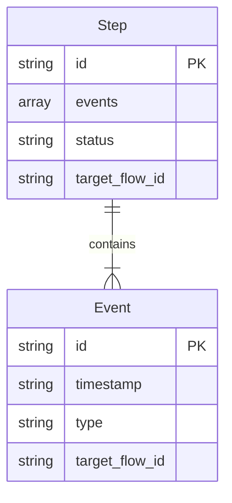

# BSL_3. Behavior 仕様

**Version: v0.3.2**

---

## Core Dependency

本章が依拠するCoreの定義を以下に示す。

| 参照先 | Core節 | 本章での役割 |
|--------|--------|-------------|
| B.El（Event） | A.2.2 | 時間軸上の離散的な変化点 |
| B.St（Step） | A.2.2 | Eventの結果として確定した状態 |
| B.Ba（Sequence） | A.2.2 | Stepが連続して並んだ順序構造 |
| 依存ポリシー（軸間） | A.3.1 | Evidence → Behavior → Flow の一方向性 |
| 依存ポリシー（層間） | A.3.2 | Element → Structure → Basis の一方向性 |
| Meaning Identity / Variation | A.4 | Event順序やStep構成の許容範囲の根拠 |
| Sidecar | A.5.2 | 読み取り条件と証跡を本体構造の外側に保持する原理 |
| 依存ポリシー（外側レイヤ） | A.3, A.6.2 | 本体構造に条件・判断を混在させない根拠 |

BSL独自の定義：なし（Core定義の仕様化のみ）

---

## 1. Purpose（この章の目的）

本章は、Behavior軸（時間における状態と遷移）を機械可読なデータ構造として仕様化する。

仕様化の範囲：
- Event / Step / Sequence のデータモデル
- 各要素の必須フィールド・制約
- 操作（Create / Update / Compare）の定義
- 依存ポリシーの適用ルール（Flow参照、Evidence被参照）

仕様化の範囲外：
- Behaviorの意味論的定義 → Core Appendix A.2.2
- 具体的な工程・手順の実装例 → Sandboxes

---

## 2. Data Model（データモデル）

### 2.1 Event（B.El）

時間軸上の離散的な変化点。

#### Schema

```json
{
  "$schema": "https://json-schema.org/draft/2020-12/schema",
  "type": "object",
  "properties": {
    "id": {
      "type": "string",
      "pattern": "^E[0-9]{3,}$",
      "description": "Event ID（例：E001）"
    },
    "timestamp": {
      "type": "string",
      "description": "時刻（ISO 8601 または論理時刻 T+n）"
    },
    "type": {
      "type": "string",
      "enum": ["start", "end", "trigger", "change", "error"],
      "description": "イベント種別"
    },
    "target_flow_id": {
      "type": "string",
      "pattern": "^[PAL][0-9]{3,}$",
      "description": "対象Flow要素のID（Part/Assembly/Placement）"
    },
    "attributes": {
      "type": "object",
      "additionalProperties": true
    }
  },
  "required": ["id", "timestamp", "type"]
}
```

#### Field Definition

| フィールド | 型 | 必須 | 制約 | 説明 |
|-----------|-----|------|------|------|
| id | string | ○ | `^E[0-9]{3,}$` | プロジェクト内で一意 |
| timestamp | string | ○ | ISO 8601 or T+n | 絶対時刻または論理時刻 |
| type | string | ○ | enum | イベント種別 |
| target_flow_id | string | - | Flow ID参照 | 対象のFlow要素 |
| attributes | object | - | - | 任意の属性辞書 |

#### Constraints

| ID | 制約 | 根拠 |
|----|------|------|
| E-C1 | id はプロジェクト内で一意 | 同一性判定の前提 |
| E-C2 | timestamp は単調増加を推奨 | 順序の明確化 |
| E-C3 | target_flow_id は既存Flow IDを参照 | 依存ポリシー（B→F） |
| E-C4 | Flow要素を変更する操作を含まない | Core A.3.1 |

---

### 2.2 Step（B.St）

Eventの結果として確定した状態。作業単位を表す。

#### Schema

```json
{
  "type": "object",
  "properties": {
    "id": {
      "type": "string",
      "pattern": "^S[0-9]{3,}$",
      "description": "Step ID（例：S001）"
    },
    "events": {
      "type": "array",
      "items": {
        "type": "string",
        "pattern": "^E[0-9]{3,}$"
      },
      "minItems": 1,
      "description": "含まれるEventのID一覧（順序付き）"
    },
    "status": {
      "type": "string",
      "enum": ["normal", "test", "adjustment", "exception"],
      "default": "normal",
      "description": "ステップの状態種別"
    },
    "target_flow_id": {
      "type": "string",
      "pattern": "^[PAL][0-9]{3,}$",
      "description": "対象Flow要素のID"
    },
    "attributes": {
      "type": "object",
      "additionalProperties": true
    }
  },
  "required": ["id", "events"]
}
```

#### Field Definition

| フィールド | 型 | 必須 | 制約 | 説明 |
|-----------|-----|------|------|------|
| id | string | ○ | `^S[0-9]{3,}$` | プロジェクト内で一意 |
| events | array | ○ | Event IDの配列、1件以上 | 含まれるEvent（順序付き） |
| status | string | - | enum | 状態種別 |
| target_flow_id | string | - | Flow ID参照 | 対象のFlow要素 |
| attributes | object | - | - | 任意の属性辞書 |

#### Constraints

| ID | 制約 | 根拠 |
|----|------|------|
| S-C1 | events は1件以上のEvent IDを含む | Step ⊃ Event |
| S-C2 | events の順序は意味を持つ | 時間構造の定義 |
| S-C3 | 参照するEventは既存であること | 整合性 |
| S-C4 | Flowを参照できるが変更しない | Core A.3.1 |

#### Structure Diagram



---

### 2.3 Sequence（B.Ba）

Stepが連続して並んだ順序構造。Behavior軸の Basis。

#### Schema

```json
{
  "type": "object",
  "properties": {
    "id": {
      "type": "string",
      "pattern": "^Q[0-9]{3,}$",
      "description": "Sequence ID（例：Q001）"
    },
    "steps": {
      "type": "array",
      "items": {
        "type": "string",
        "pattern": "^S[0-9]{3,}$"
      },
      "minItems": 1,
      "description": "含まれるStepのID一覧（順序付き）"
    },
    "goal": {
      "type": "string",
      "description": "このSequenceの目的"
    },
    "prerequisite": {
      "type": "string",
      "description": "前提条件"
    },
    "target_flow_id": {
      "type": "string",
      "pattern": "^[PAL][0-9]{3,}$",
      "description": "対象Flow要素のID"
    }
  },
  "required": ["id", "steps"]
}
```

#### Field Definition

| フィールド | 型 | 必須 | 制約 | 説明 |
|-----------|-----|------|------|------|
| id | string | ○ | `^Q[0-9]{3,}$` | プロジェクト内で一意 |
| steps | array | ○ | Step IDの配列、1件以上 | 含まれるStep（順序付き） |
| goal | string | - | - | Sequenceの目的 |
| prerequisite | string | - | - | 前提条件 |
| target_flow_id | string | - | Flow ID参照 | 対象のFlow要素 |

#### Constraints

| ID | 制約 | 根拠 |
|----|------|------|
| Q-C1 | steps は1件以上のStep IDを含む | Sequence ⊃ Step |
| Q-C2 | steps の順序は Sequence の意味そのもの | 順序基準 |
| Q-C3 | 既存Sequenceの破壊的更新は禁止 | 不変性 |
| Q-C4 | 変更は新規Sequenceとして作成 | Variant連携 |

---

## 3. Dependency Policy（依存ポリシー）

### 3.1 軸間依存

Behavior は Flow を参照し、Evidence から参照される。

| 参照元 | 参照先 | 許可 | 備考 |
|--------|--------|------|------|
| Behavior | Flow | ○ | Event/Step/Sequence が Part/Placement を参照 |
| Evidence | Behavior | ○ | Reading が Step/Sequence を参照 |
| Flow | Behavior | × | Core A.3.1 禁止 |
| Behavior | Evidence | × | Core A.3.1 禁止（観測値で手順を変えない） |

### 3.2 層間依存

| 参照元 | 参照先 | 許可 | 備考 |
|--------|--------|------|------|
| Event | Step | ○ | 構成要素として |
| Step | Sequence | ○ | 構成要素として |
| Sequence | Step | × | Core A.3.2 禁止（逆流） |
| Sequence | Event | × | Core A.3.2 禁止（逆流） |

Event は Sequence を直接参照しない。所属は Step を介して決まる。

### 3.3 Sidecar との関係

Behavior 自体は時間の意味構造を表し、観測条件や判断履歴は本体構造に混在させない（Core A.3 の一方向依存および A.6.2 の非介入性）。これらは Sidecar / 外側レイヤとして外側に保持される。

| 項目 | 説明 |
|------|------|
| 根拠 | Behavior は時間の意味構造であり、観測条件や判断履歴は Core A.3 / A.6.2 により外側に保持される |
| 実行ログ | Evidence として記録（BSL_4） |
| 変更履歴 | Design History として記録（BSL_6） |
| バージョン管理 | Sequence全体を Versioned Structure として扱う |

Behavior 自体に Sidecar は付与されないが、比較・評価は外側（Operation / Evidence）にある評価フレーム Φ 参照に依存する。
View は SSOT から再計算可能な派生であり、比較は SSOT と Sidecar（Basis / Condition / Ordering）に遡って成立条件を確認する。

---

## 4. Operations（操作）

### 4.1 Create

| 操作 | 必須入力 | 出力 | 制約 |
|------|----------|------|------|
| create_event | timestamp, type | Event | id 自動採番 |
| create_step | events | Step | id 自動採番、Event存在チェック |
| create_sequence | steps | Sequence | id 自動採番、Step存在チェック |

### 4.2 Update

| 操作 | 更新可能フィールド | 制約 |
|------|-------------------|------|
| update_event | type, attributes | id, timestamp 変更不可 |
| update_step | status, attributes | id, events 変更不可 |
| update_sequence | goal, prerequisite | id, steps 変更不可（新規作成で対応） |

### 4.3 Compare（同一性判定）

Core A.4.1 Meaning Identity に基づく。

比較は評価フレーム Φ = (ℐ, 𝒜, 𝒞, 𝒪) が固定されている場合にのみ成立する。
Φ が欠落している場合は FAIL、Φ が変更された場合は別比較として扱う。
正規の入口は BSL_7（Operation）の compare 操作であり、本節はその前提条件を定義する。

| 対象 | 同一性条件 | Variation許容 |
|------|-----------|---------------|
| Event | id 一致、timestamp 一致 | attributes の差異は許容 |
| Step | id 一致、events 集合・順序一致 | status の差異は許容 |
| Sequence | id 一致、steps 順序一致 | goal, prerequisite の差異は許容 |

> 参照：BSL_9（Space Metadata / Checks）、BSL_7（Operation）

---

## 5. Examples（最小例）

本節の例は BSL_1 第10章「Running Example」で定義された共通例に基づく。

### 5.1 単一Event（最小例）

```json
{
  "id": "E001",
  "timestamp": "T+0",
  "type": "start",
  "target_flow_id": "P001"
}
```

### 5.2 Step構成（最小例）

Running Example の S001 に対応。

```json
{
  "events": [
    { "id": "E001", "timestamp": "T+0", "type": "start", "target_flow_id": "P001" }
  ],
  "steps": [
    { "id": "S001", "events": ["E001"], "status": "normal" }
  ]
}
```

### 5.3 Sequence構成（最小例）

Running Example の Q001 に対応。

```json
{
  "events": [
    { "id": "E001", "timestamp": "T+0", "type": "start", "target_flow_id": "P001" }
  ],
  "steps": [
    { "id": "S001", "events": ["E001"], "status": "normal" }
  ],
  "sequences": [
    {
      "id": "Q001",
      "steps": ["S001"],
      "goal": "operation_A",
      "target_flow_id": "A001"
    }
  ]
}
```

### 5.4 複数Step構成（拡張例）

```json
{
  "events": [
    { "id": "E001", "timestamp": "T+0", "type": "start" },
    { "id": "E002", "timestamp": "T+10", "type": "trigger" },
    { "id": "E003", "timestamp": "T+20", "type": "end" }
  ],
  "steps": [
    { "id": "S001", "events": ["E001"], "status": "normal" },
    { "id": "S002", "events": ["E002", "E003"], "status": "normal" }
  ],
  "sequences": [
    {
      "id": "Q001",
      "steps": ["S001", "S002"],
      "goal": "operation_A",
      "target_flow_id": "A001"
    }
  ]
}
```

---

## 6. Extension Points（拡張点）

以下の拡張はBSLの範囲外だが、互換性を損なわない範囲で許容される。

| 拡張 | 説明 | 定義場所 |
|------|------|----------|
| 分岐・例外処理 | Sequence に branch / exception を導入 | Sandboxes |
| Multi-Sequence | 複数Sequenceの連結 | Sandboxes |
| Design History連携 | SequenceをWhy/Becauseから参照 | BSL_6 |
| 設備動作 | ロボット・センサ等の動作Sequence | Sandboxes |

---

## 7. Summary（本章のまとめ）

| 項目 | 内容 |
|------|------|
| 対象 | Behavior軸（時間における状態と遷移） |
| 三層 | Event (B.El) / Step (B.St) / Sequence (B.Ba) |
| Basis | Sequence がBehavior軸の順序基準 |
| 依存方向 | Flow ← Behavior ← Evidence（一方向） |
| Sidecar | Behavior本体は持たず、観測条件や判断履歴は外側レイヤに保持 |
| Variation | Event順序内での属性差異、Step内のstatus差異を許容 |

---

## 更新履歴

| バージョン | 日付 | 変更内容 |
|-----------|------|----------|
| v0.1 | - | 初版（思想説明を含む旧版） |
| v0.2 | 2025-06 | Core参照ブロック追加、JSON Schema形式化、思想成分排除 |
| v0.3 | 2026-01 | Compare に Φ 固定を追加、Sidecar との関係に Φ 参照の補足を追加。BSL_7/BSL_9 への参照 |
| v0.3.1 | 2026-03 | 公開前整合パッチ：Basis の SSOT 表現を「順序基準」に統一。Sidecar 根拠・Summary を整合 |
| v0.3.2 | 2026-03 | 公開前整合パッチ：Running Example 参照を第10章に統一 |
