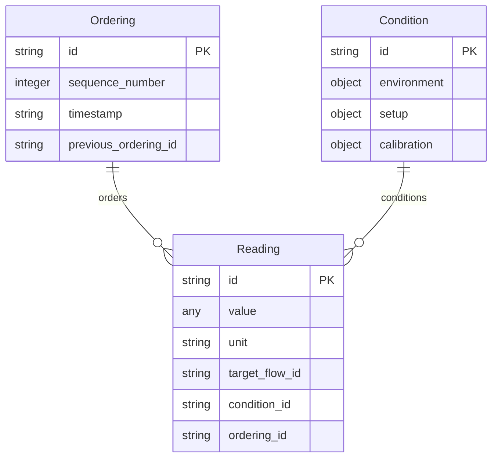

# BSL_4. Evidence 仕様

**Version: v0.6.3**

---

## Core Dependency

本章が依拠するCoreの定義を以下に示す。

| 参照先 | Core節 | 本章での役割 |
|--------|--------|-------------|
| E.El（Reading） | A.2.2 | その瞬間に読み取った値 |
| E.St（Condition） | A.2.2 | Readingを意味づける前提条件 |
| E.Ba（Ordering） | A.2.2 | 観測がどの順番で行われたか |
| 依存ポリシー（軸間） | A.3.1 | Evidence → Behavior → Flow の一方向性 |
| 依存ポリシー（層間） | A.3.2 | Element → Structure → Basis の一方向性 |
| Meaning Identity / Variation | A.4 | Reading値やCondition属性の許容範囲の根拠 |
| Sidecar | A.5.2 | Evidence Chainの非破壊的蓄積 |
| Condition と Context の境界 | A.6.4 | Conditionは Evidence軸内、Contextは外側レイヤ |

BSL独自の定義：Evidence Chain（append-only蓄積構造）

---

## 1. Purpose（この章の目的）

本章は、Evidence軸（観測における値と条件）を機械可読なデータ構造として仕様化する。

仕様化の範囲：
- Reading / Condition / Ordering のデータモデル
- 各要素の必須フィールド・制約
- 操作（Create / Append / Compare）の定義
- Evidence Chain の蓄積ルール
- 依存ポリシーの適用ルール（Flow/Behavior参照）

仕様化の範囲外：
- Evidenceの意味論的定義 → Core Appendix A.2.2
- 具体的な測定・記録形式の実装例 → Sandboxes

---

## 2. Data Model（データモデル）

### 2.1 Reading（E.El）

その瞬間に読み取った値。観測の最小単位。

#### Schema

```json
{
  "$schema": "https://json-schema.org/draft/2020-12/schema",
  "type": "object",
  "properties": {
    "id": {
      "type": "string",
      "pattern": "^R[0-9]{3,}$",
      "description": "Reading ID（例：R001）"
    },
    "value": {
      "oneOf": [
        { "type": "number" },
        { "type": "string" },
        { "type": "object" },
        { "type": "array" },
        { "type": "null" }
      ],
      "description": "観測値（数値、文字列、複合値、または absent 時は null）"
    },
    "unit": {
      "type": "string",
      "description": "単位（例：mm, °C, V）"
    },
    "target_flow_id": {
      "type": "string",
      "pattern": "^[PAL][0-9]{3,}$",
      "description": "対象Flow要素のID"
    },
    "target_behavior_id": {
      "type": "string",
      "pattern": "^[ESQ][0-9]{3,}$",
      "description": "対象Behavior要素のID"
    },
    "condition_id": {
      "type": "string",
      "pattern": "^C[0-9]{3,}$",
      "description": "関連するConditionのID"
    },
    "ordering_id": {
      "type": "string",
      "pattern": "^O[0-9]{3,}$",
      "description": "関連するOrderingのID"
    },
    "timestamp": {
      "type": "string",
      "description": "取得時刻（ISO 8601）"
    },
    "status": {
      "type": "string",
      "enum": ["valid", "invalid", "superseded", "absent"],
      "description": "観測状態"
    },
    "reason": {
      "type": "string",
      "description": "status が invalid/absent の場合の理由（例：timeout, no_response, sensor_error）"
    },
    "superseded_by": {
      "type": "string",
      "pattern": "^R[0-9]{3,}$",
      "description": "status が superseded の場合の後継Reading ID"
    }
  },
  "required": ["id", "value"]
}
```

#### Extension: ActionTrace / AuthorityRef / ApprovalRef（派生Reading）

Reading は value を object として保持できるため、ActionTrace や権限根拠・承認の参照は「派生Reading」として表現できる。
例として、外部ツール呼び出しは Reading.value.kind="action_trace" かつ Reading.value.action_type="tool_call"（Alias: ToolCall）として表現できるが、成功・反映・権限OKを含意しない。
派生Readingは Evidence の中立性（AX-E1）に従い、成功・反映・権限OKを含意しない。

- ActionTraceReading（推奨）: value.kind="action_trace" とし、value に actor_ref / action_type / target_ref / input_ref / output_ref / status / error_ref 等を格納する。
- AuthorityRefReading（推奨）: value.kind="authority_ref" とし、value に authority_id / scope_ref / policy_ref / issued_at / issuer_ref を格納する（権限の根拠への参照であり、真偽判定はしない）。
- ApprovalRefReading（推奨）: value.kind="approval_ref" とし、value に approval_id / scope_ref / status_ref / decided_at / signer_ref を格納する（承認の記録への参照であり、許可を含意しない）。
- EffectDelta（状態変化）は Behavior / Flow に属し、Evidence で代替しない（LEM-E3）。

注記（ドメイン別エイリアス）: value.action_type="tool_call" 等により、AIエージェント運用の表現（ToolCall相当）を派生させてもよい。

注記（adopt 禁止）: AuthorityRefReading / ApprovalRefReading は「参照」であり、権限の真偽や承認の成立を含意しない。採用（adopt）は Design History 側の approved としてのみ表現し、Evidence 単体で採用状態を表さない。trace_id を欠く evidence は採用してはならない（採用は比較と回帰の戻り点を要求するため）。

注記（trace_id の位置）: trace_id は Reading / Condition / Ordering の payload フィールドではなく、BSL_9 6.2 で定義される artifact_role=evidence の Space Metadata として付与する。


#### Field Definition

| フィールド | 型 | 必須 | 制約 | 説明 |
|-----------|-----|------|------|------|
| id | string | ○ | `^R[0-9]{3,}$` | プロジェクト内で一意 |
| value | any | ○ | number/string/object/array/null | 観測値（absent 時は null） |
| unit | string | - | - | 単位 |
| target_flow_id | string | - | Flow ID参照 | 対象のFlow要素 |
| target_behavior_id | string | - | Behavior ID参照 | 対象のBehavior要素 |
| condition_id | string | - | Condition ID参照 | 関連するCondition |
| ordering_id | string | - | Ordering ID参照 | 関連するOrdering |
| timestamp | string | - | ISO 8601 | 取得時刻 |
| status | string | - | enum | 観測状態（valid/invalid/superseded/absent） |
| reason | string | - | - | status が invalid/absent の場合の理由 |
| superseded_by | string | - | Reading ID参照 | status が superseded の場合の後継Reading |

#### Constraints

| ID | 制約 | 根拠 |
|----|------|------|
| R-C1 | id はプロジェクト内で一意 | 同一性判定の前提 |
| R-C2 | value の型は自由（数値、文字列、複合値、null） | 観測の多様性 |
| R-C3 | Flow/Behavior を参照できるが変更しない | Core A.3.1 |
| R-C4 | 一度作成したReadingは削除・上書き禁止 | append-only |
| R-C5 | Evidence 単体で採用（adopt）状態を表さない。採用は Design History の approved として表現 | propose/adopt 分離 |
| R-C6 | status: "absent" の場合、value は必ず null とする | 欠落の明示 |
| R-C7 | status: "absent" は Interpretation（意図推定、同意/拒否の推認等）を含意しない。欠落の意味付けは Evidence ではなく Design History 側へ隔離する | AX-E1 |
| R-C8 | superseded_by を設定する場合、status は "superseded" でなければならない | 非破壊置換 |
| R-C9 | status が "superseded" の場合、superseded_by は必須 | 後継Readingの明示 |

---

### 2.2 Condition（E.St）

Condition は、Evidence を採用してΔを計算するために必要な観測成立の前提であり、Sidecar に明示して固定される比較条件である。

Readingを意味づける前提条件。観測が成立した環境。

#### Schema

```json
{
  "type": "object",
  "properties": {
    "id": {
      "type": "string",
      "pattern": "^C[0-9]{3,}$",
      "description": "Condition ID（例：C001）"
    },
    "environment": {
      "type": "object",
      "properties": {
        "temperature": { "type": "number" },
        "humidity": { "type": "number" },
        "pressure": { "type": "number" }
      },
      "additionalProperties": true,
      "description": "環境条件"
    },
    "setup": {
      "type": "object",
      "additionalProperties": true,
      "description": "セットアップ条件（治具、姿勢等）"
    },
    "calibration": {
      "type": "object",
      "properties": {
        "calibrated": { "type": "boolean" },
        "calibration_date": { "type": "string" },
        "calibration_id": { "type": "string" }
      },
      "description": "校正状態"
    },
    "attributes": {
      "type": "object",
      "additionalProperties": true
    }
  },
  "required": ["id"]
}
```

#### Field Definition

| フィールド | 型 | 必須 | 制約 | 説明 |
|-----------|-----|------|------|------|
| id | string | ○ | `^C[0-9]{3,}$` | プロジェクト内で一意 |
| environment | object | - | - | 環境条件（温度、湿度等） |
| setup | object | - | - | セットアップ条件 |
| calibration | object | - | - | 校正状態 |
| attributes | object | - | - | 任意の属性辞書 |

#### Constraints

| ID | 制約 | 根拠 |
|----|------|------|
| C-C1 | id はプロジェクト内で一意 | 同一性判定の前提 |
| C-C2 | 属性は自由形式（ドメイン特化を許容） | 観測条件の多様性 |
| C-C3 | Contextとは異なる（Evidence軸内に閉じる） | Core A.6.4 |
| C-C4 | 一度作成したConditionは削除・上書き禁止 | append-only |

#### Condition と Context の区別

| 項目 | Condition | Context |
|------|-----------|---------|
| 所属 | Evidence軸 Structure層 | 外側レイヤ |
| 対象 | 単一のReading | 複数のConditionやBasisを束ねたもの |
| 粒度 | 局所的・機械可読 | 横断的・判断可読 |
| 定義場所 | 本章（BSL_4） | BSL_1 4.1 |

---

### 2.3 Ordering（E.Ba）

観測がどの順番で行われたか。Evidence軸の Basis。

#### Schema

```json
{
  "type": "object",
  "properties": {
    "id": {
      "type": "string",
      "pattern": "^O[0-9]{3,}$",
      "description": "Ordering ID（例：O001）"
    },
    "sequence_number": {
      "type": "integer",
      "minimum": 1,
      "description": "順序番号（1始まり）"
    },
    "timestamp": {
      "type": "string",
      "description": "時刻（ISO 8601 または論理時刻）"
    },
    "target_step_id": {
      "type": "string",
      "pattern": "^S[0-9]{3,}$",
      "description": "関連するStep ID"
    },
    "target_sequence_id": {
      "type": "string",
      "pattern": "^Q[0-9]{3,}$",
      "description": "関連するSequence ID"
    },
    "previous_ordering_id": {
      "type": "string",
      "pattern": "^O[0-9]{3,}$",
      "description": "前のOrdering ID（チェイン構造）"
    }
  },
  "required": ["id", "sequence_number"]
}
```

#### Field Definition

| フィールド | 型 | 必須 | 制約 | 説明 |
|-----------|-----|------|------|------|
| id | string | ○ | `^O[0-9]{3,}$` | プロジェクト内で一意 |
| sequence_number | integer | ○ | >= 1 | 順序番号 |
| timestamp | string | - | ISO 8601 or T+n | 時刻 |
| target_step_id | string | - | Step ID参照 | 関連するStep |
| target_sequence_id | string | - | Sequence ID参照 | 関連するSequence |
| previous_ordering_id | string | - | Ordering ID参照 | 前のOrdering（チェイン） |

#### Constraints

| ID | 制約 | 根拠 |
|----|------|------|
| O-C1 | id はプロジェクト内で一意 | 同一性判定の前提 |
| O-C2 | sequence_number は単調増加 | 順序の一意性 |
| O-C3 | Ordering の順序は Evidence Chain の再構成基準である | 再現性 |
| O-C4 | 一度作成したOrderingは削除・上書き禁止 | append-only |

#### Structure Diagram



---

## 3. Evidence Chain（証跡チェーン）

Evidence Chainは、Reading / Condition / Ordering を非破壊で蓄積する構造である。

### 3.1 定義

```
EvidenceChain = Ordering* × (Reading × Condition)*
```

### 3.2 原則

| 原則 | 説明 | 根拠 |
|------|------|------|
| append-only | 追加のみ、削除・上書き禁止 | Core A.5.2 |
| 非破壊性 | Flow/Behavior を変更しない | Core A.3.1 |
| 順序保持 | Ordering により時系列を再構成可能 | 再現性 |
| 結合保持 | Reading と Condition を分離しない形式で保存 | 再現性 |

### 3.3 誤測定・例外の扱い

誤測定や例外は削除せず、追記で対応する。

```json
{
  "id": "R002",
  "value": null,
  "status": "invalid",
  "reason": "measurement_error",
  "superseded_by": "R003"
}
```

| フィールド | 説明 |
|-----------|------|
| status | "valid" / "invalid" / "superseded" |
| reason | 無効理由 |
| superseded_by | 代替するReading ID |

---

## 4. Dependency Policy（依存ポリシー）

### 4.1 軸間依存

Evidence は Flow / Behavior を参照する。他軸からは参照されない。

| 参照元 | 参照先 | 許可 | 備考 |
|--------|--------|------|------|
| Evidence | Flow | ○ | Reading が Part/Placement を参照 |
| Evidence | Behavior | ○ | Reading が Step/Sequence を参照 |
| Flow | Evidence | × | Core A.3.1 禁止 |
| Behavior | Evidence | × | Core A.3.1 禁止 |

### 4.2 層間依存

| 参照元 | 参照先 | 許可 | 備考 |
|--------|--------|------|------|
| Reading | Condition | ○ | 前提条件として |
| Reading | Ordering | ○ | 順序情報として |
| Condition | Ordering | ○ | 順序情報として |
| Ordering | Reading | × | Core A.3.2 禁止（逆流） |
| Ordering | Condition | × | Core A.3.2 禁止（逆流） |

### 4.3 Sidecar としての位置づけ

Evidence は Sidecar として機能し、Flow / Behavior の外側に蓄積される（Core A.5.2）。

| 項目 | 説明 |
|------|------|
| 蓄積先 | Flow / Behavior とは別の構造（Evidence Chain） |
| 参照関係 | Evidence → Flow / Behavior（一方向） |
| 更新ルール | append-only |
| 削除 | 禁止（無効化は status で表現） |

---

## 5. Operations（操作）

### 5.1 Create / Append

| 操作 | 必須入力 | 出力 | 制約 |
|------|----------|------|------|
| append_reading | value | Reading | id 自動採番、ordering_id 自動設定 |
| append_condition | (任意属性) | Condition | id 自動採番 |
| append_ordering | sequence_number | Ordering | id 自動採番、previous自動設定 |

### 5.2 Update

Update操作は原則禁止。代わりに新規Readingを追加し、旧Readingをsupersededにする。

| 操作 | 更新可能フィールド | 制約 |
|------|-------------------|------|
| invalidate_reading | status, reason | value 変更不可 |
| supersede_reading | superseded_by | 旧Reading は status: superseded に |

### 5.3 Compare（同一性判定）

Core A.4.1 Meaning Identity に基づく。

Compare は、同一 SSOT を参照し、同一 Sidecar（Basis/Condition/Ordering）と同一投影規則に基づいて得られた Reading に対してのみ適用する。成立条件が閉じていない比較は再現不能である。

| 対象 | 同一性条件 | Variation許容 |
|------|-----------|---------------|
| Reading | id 一致 | value の精度差異は許容 |
| Condition | id 一致 | 属性の追加は許容（削除は不可） |
| Ordering | id 一致、sequence_number 一致 | timestamp の差異は許容 |

---

## 6. Examples（最小例）

本節の例は BSL_1 第10章「Running Example」で定義された共通例に基づく。

### 6.1 単一Reading（最小例）

```json
{
  "id": "R001",
  "value": 49.987,
  "unit": "mm",
  "target_flow_id": "P001"
}
```

### 6.2 Reading + Condition（最小例）

Running Example の R001, C001 に対応。

```json
{
  "readings": [
    {
      "id": "R001",
      "value": 49.987,
      "unit": "mm",
      "target_flow_id": "P001",
      "condition_id": "C001",
      "ordering_id": "O001"
    }
  ],
  "conditions": [
    {
      "id": "C001",
      "environment": { "temperature": 20.5 },
      "setup": { "clamped": true }
    }
  ],
  "orderings": [
    {
      "id": "O001",
      "sequence_number": 1,
      "target_step_id": "S001"
    }
  ]
}
```

### 6.3 Evidence Chain（拡張例）

```json
{
  "readings": [
    { "id": "R001", "value": 49.987, "unit": "mm", "condition_id": "C001", "ordering_id": "O001" },
    { "id": "R002", "value": 50.012, "unit": "mm", "condition_id": "C001", "ordering_id": "O002" }
  ],
  "conditions": [
    { "id": "C001", "environment": { "temperature": 20.5 }, "setup": { "clamped": true } }
  ],
  "orderings": [
    { "id": "O001", "sequence_number": 1, "timestamp": "T+0" },
    { "id": "O002", "sequence_number": 2, "timestamp": "T+10", "previous_ordering_id": "O001" }
  ]
}
```

### 6.4 誤測定の扱い（例）

```json
{
  "readings": [
    { "id": "R001", "value": 49.987, "unit": "mm", "status": "valid" },
    { "id": "R002", "value": 999.999, "unit": "mm", "status": "invalid", "reason": "sensor_error" },
    { "id": "R003", "value": 50.001, "unit": "mm", "status": "valid" }
  ]
}
```

### 6.5 欠落（absent）の扱い（例）

値が取得できなかった場合、status: "absent" として記録する。absent は Interpretation（意図推定）を含意しない。

```json
{
  "id": "R099",
  "value": null,
  "status": "absent",
  "reason": "timeout"
}
```

reason に使用可能な値（推奨）:
- `timeout`: 応答待ちで時間切れ
- `no_response`: 応答なし（チャネル成立済み）
- `not_applicable`: 対象が存在しない／該当しない
- `sensor_unavailable`: センサ利用不可

reason に使用しない語（禁止）:
- `refused`, `rejected`, `ignored` 等の意図推定語（Interpretation に属する）

### 6.6 Recommended Profiles

本節は規範（normative）ではなく、相互運用のための推奨語彙を定義する。
スキーマへの追加は行わず、既存の Reading.value フィールドを活用する。

#### 6.6.1 Sequence-level check

Behavior の Sequence（全体または区間）が満たすべき制約を検証し、その結果を Evidence として記録するためのプロファイルである。

Core Appendix A.2.2 の非規範注記に基づき、以下の原則を遵守する。

* 検証は Flow/Behavior を変更しない
* 依存方向は Evidence → Behavior → Flow を維持する
* 検証結果は Ordering により時系列に連結され、append-only の証跡となる
NOTE: check は最低限の report を返す（decision、violated constraint、referenced basis、pointers to evidence）。
NOTE: decision は pass/fail だけでなく、停止点（U1–U4 等）を含み得る。
NOTE: violated constraint は、落ちた条件を特定できる識別子（または参照）として表現する。
NOTE: violated constraint は、現行スキーマでは details 等の拡張領域に格納してよい（将来の専用フィールド化は v0.7+ の検討事項）。
NOTE: referenced basis と evidence pointers は、同一条件での再検査（再実行）に必要な参照束を指す。

##### 推奨フィールド

Sequence-level check は Reading.value に以下の構造を持つオブジェクトを格納し、追跡性のため Reading の top-level 参照（target_behavior_id / ordering_id）を併用する。

```json
{
  "id": "R120",
  "value": {
    "kind": "sequence_check",
    "check_id": "CHK-001",
    "scope": {
      "start_step_id": "S001",
      "end_step_id": "S005"
    },
    "predicate": "all_steps_completed",
    "result": "pass",
    "tolerance": {
      "type": "absolute",
      "value": 0.1,
      "unit": "mm"
    },
    "details": {}
  },
  "target_behavior_id": "SEQ-001",
  "ordering_id": "O050"
}
```

##### Field Definition（value 内）

| フィールド     | 必須 | 説明                              |
| --------- | -- | ------------------------------- |
| kind      | ○  | `"sequence_check"` 固定           |
| check_id  | ○  | 検証の一意識別子                        |
| scope     | △  | 検証範囲（省略時は Sequence 全体）          |
| predicate | ○  | 検証条件の識別子または式                    |
| result    | ○  | `"pass"` / `"fail"` / `"error"` |
| tolerance | △  | 許容範囲（BSL Annex B 参照）         |
| details   | △  | 実装依存の追加情報                       |

補足（追跡性）

* `target_behavior_id` に検証対象の Sequence ID を格納する。Reading は `target_behavior_id` を持てる。
* `ordering_id` に検証結果が紐づく Ordering を格納する。Reading は `ordering_id` を持てる。

##### predicate の推奨語彙

| predicate                 | 意味                   |
| ------------------------- | -------------------- |
| all_steps_completed       | すべての Step が完了している    |
| no_step_skipped           | スキップされた Step がない     |
| ordering_preserved        | 順序が保持されている           |
| duration_within_tolerance | 所要時間が許容範囲内           |
| custom                    | 実装依存（details に詳細を記載） |

注記

* predicate は識別子（string）を推奨する。引数が必要な場合は object を用いてもよい（例：`{"name":"duration_within_tolerance","ref":"T001"}`）。

##### result の解釈

| result | 意味          | 位置づけ                               |
| ------ | ----------- | ---------------------------------- |
| pass   | 検証成功        | 共有基盤のもとで制約が満たされた証拠                 |
| fail   | 検証失敗（値が範囲外） | 再評価・再実行の対象（recoverable になりうる）      |
| error  | 検証不能（前提不成立） | 比較基盤の不足を示す可能性（discontinuity になりうる） |

##### tolerance と Variation Policy Schema

tolerance フィールドは BSL Annex B で定義される Variation Policy Schema に準拠する。
これにより、Sequence-level check の許容範囲と Core 7章の Variation Policy が接続される。

##### 注記

* predicate の式評価や実行は BSL では規定しない（Sandboxes に委ねる）
* error の場合、原因が Basis/View の不一致であれば Semantic Discontinuity として扱う
* 検証結果は上書きせず、Ordering の前進として追記する


---

## 7. Evidence Continuity（証跡連続性）

BSL は、SSOT/view の変更が証跡により説明可能であることを要求する。

### 7.1 基本要件

- ssot または view の意味的変更は、対応する evidence（trace_id を持つ）によって参照可能でなければならない。
- trace_id の無い evidence は、比較・監査・回帰確認の根拠として採用してはならない。

### 7.2 意味的変更の判定トリガ（最小）

以下のいずれかに該当する変更は、意味的変更として扱う。

1. **schema の破壊的変更**
   - フィールド削除
   - 型変更
   - 必須化（optional → required）
   - 意味変更を伴うリネーム

2. **mapping_kind が transform の出力仕様変更**

これら以外の判定基準は docs/guide で拡張してよい。

### 7.3 Constraints

| ID | 制約 | 検査結果 |
|----|------|---------|
| EC-C1 | 意味的変更には trace_id 付き evidence が必須 | FAIL |
| EC-C2 | trace_id の無い evidence は監査根拠として不採用 | WARN |

---

## 8. Extension Points（拡張点）

以下の拡張はBSLの範囲外だが、互換性を損なわない範囲で許容される。

| 拡張 | 説明 | 定義場所 |
|------|------|----------|
| Evidence レベル分け | Level 0: 生値、Level 1: 統計値、Level 2: 判定 | Sandboxes |
| Variant連携 | ReadingによるVariant判定 | BSL_5 |
| Design History連携 | ReadingをBecauseとして参照 | BSL_6 |
| AI/最適化連携 | Evidence Chain の解析・予測 | Sandboxes |

---

## 9. Summary（本章のまとめ）

| 項目 | 内容 |
|------|------|
| 対象 | Evidence軸（観測における値と条件） |
| 三層 | Reading (E.El) / Condition (E.St) / Ordering (E.Ba) |
| Basis | Ordering がEvidence軸の順序基準 |
| 依存方向 | Flow ← Behavior ← Evidence（一方向） |
| Sidecar | Evidence Chain として非破壊蓄積 |
| 更新ルール | append-only（削除・上書き禁止） |
| Variation | Reading精度、Condition属性追加を許容 |
| propose/adopt | Evidence は候補提示のみ、採用は DH で表現 |
| Evidence Continuity | 意味的変更は trace_id 付き evidence で説明可能であること |

---

## 更新履歴

| バージョン | 日付 | 変更内容 |
|-----------|------|----------|
| v0.1 | - | 初版 |
| v0.2 | 2025-12 | Core参照ブロック追加、JSON Schema形式化、Evidence Chain明確化、思想成分排除 |
| v0.3 | 2025-12 | 6.5 Recommended Profiles追記 |
| v0.3.1 | 2026-01 | BSL Appendix → BSL Annex 参照名変更 |
| v0.4 | 2026-01 | Evidence Continuity セクション追加（7章）。意味的変更の判定トリガ定義。章番号再編 |
| v0.4.1 | 2026-01 | Condition 定義を追記（DEF-E5 との整合）。Compare に成立条件を追記（LEM-4 との整合） |
| v0.4.2 | 2026-01 | Extension: ActionTrace / ApprovalRef（派生Reading）を追加。ドメイン別エイリアス注記を追加 |
| v0.4.3 | 2026-01-14 | ApprovalRefReading に adopt 禁止の注記を追加。R-C5 追加（propose/adopt 分離） |
| v0.5 | 2026-01-15 | Reading.status に absent 追加。value に null 型追加。R-C6, R-C7 追加（沈黙パターン対応）。6.5 欠落の例追加 |
| v0.6 | 2026-01 | AuthorityRefReading を追加。authority_ref と approval_ref を分離 |
| v0.6.1 | 2026-03 | 公開前整合パッチ：Basis の SSOT 表現を「順序基準」「再現性」に統一。Summary を整合 |
| v0.6.2 | 2026-03 | 公開前整合パッチ：Running Example 参照を第10章に統一 |
| v0.6.3 | 2026-03 | §6.6 Recommended Profiles 配下の小節番号を §6.5.1 → §6.6.1 に修正 |
