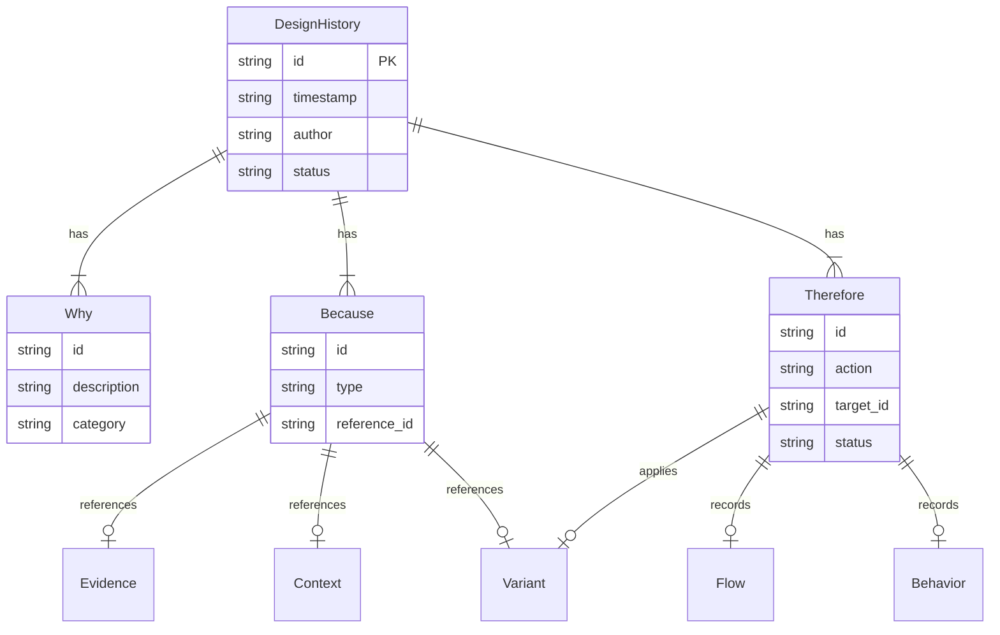

# BSL_6. Design History 仕様

**Version: v0.3.2**

---

## Core Dependency

本章が依拠するCoreの定義を以下に示す。

| 参照先 | Core節 | 本章での役割 |
|--------|--------|-------------|
| 外側レイヤ（Design History） | A.6.1 | 採用の履歴 |
| Design History の最小構造 | A.6.3 | Why / Because / Therefore |
| 外側レイヤと三軸の関係 | A.6.2 | Design History → 三軸 / Variant / Context（一方向） |
| Sidecar | A.5.2 | append-only の非破壊的蓄積 |
| Meaning Identity | A.4 | 判断の同一性条件 |

BSL独自の定義：Decision Unit（Why / Because / Therefore のセット）

---

## 1. Purpose（この章の目的）

本章は、Design History（採用の履歴）を機械可読なデータ構造として仕様化する。

Design Historyは外側レイヤに属し、三軸（Flow / Behavior / Evidence）およびVariant / Contextを参照するが、三軸から参照されない。

仕様化の範囲：
- Decision Unit（Why / Because / Therefore）のデータモデル
- 各要素の必須フィールド・制約
- 操作（Create / Append / Query）の定義
- 三軸・外側レイヤとの依存関係

仕様化の範囲外：
- Design Historyの意味論的定義 → Core Appendix A.6.3
- 具体的な変更管理・承認フローの実装例 → Sandboxes

---

## 2. Design History の位置づけ

### 2.1 外側レイヤとしての役割

```
┌─────────────────────────────────────────┐
│            外側レイヤ                    │
│  ┌─────────┐ ┌─────────┐ ┌────────────┐ │
│  │ Context │ │ Variant │ │ Design     │ │
│  │         │ │         │ │ History    │ │
│  │         │ │         │ │ ★本章     │ │
│  └────┬────┘ └────┬────┘ └─────┬──────┘ │
│       │          │            │        │
│       │          │      ┌─────┘        │
│       │          │      ▼              │
│       │          │  参照可能           │
│       ▼          ▼      ▼              │
└───────┼──────────┼──────┼──────────────┘
        │          │      │
        ▼          ▼      ▼
┌─────────────────────────────────────────┐
│           三軸（参照のみ）               │
│   Flow ←── Behavior ←── Evidence        │
└─────────────────────────────────────────┘
```

### 2.2 Design History が扱うもの

| 要素 | 説明 |
|------|------|
| Decision | 何を採択したか |
| Rationale | なぜその判断を行ったか |
| Consequence | その判断が三軸・Variantにどう影響したか |

---

## 3. Data Model（データモデル）

### 3.1 DesignHistory（判断履歴）

判断履歴全体を表す構造。

#### Schema

```json
{
  "$schema": "https://json-schema.org/draft/2020-12/schema",
  "type": "object",
  "properties": {
    "id": {
      "type": "string",
      "pattern": "^DH[0-9]{3,}$",
      "description": "Design History ID（例：DH001）"
    },
    "why": {
      "$ref": "#/$defs/Why",
      "description": "判断の目的"
    },
    "because": {
      "type": "array",
      "items": { "$ref": "#/$defs/Because" },
      "minItems": 1,
      "description": "判断の根拠一覧"
    },
    "therefore": {
      "type": "array",
      "items": { "$ref": "#/$defs/Therefore" },
      "minItems": 1,
      "description": "採択内容一覧"
    },
    "timestamp": {
      "type": "string",
      "format": "date-time",
      "description": "判断時刻（ISO 8601）"
    },
    "author": {
      "type": "string",
      "description": "判断者"
    },
    "status": {
      "type": "string",
      "enum": ["draft", "review", "approved", "superseded"],
      "default": "draft",
      "description": "状態"
    },
    "superseded_by": {
      "type": "string",
      "pattern": "^DH[0-9]{3,}$",
      "description": "代替するDesign History ID"
    }
  },
  "required": ["id", "why", "because", "therefore"]
}
```

#### Field Definition

| フィールド | 型 | 必須 | 制約 | 説明 |
|-----------|-----|------|------|------|
| id | string | ○ | `^DH[0-9]{3,}$` | プロジェクト内で一意 |
| why | Why | ○ | - | 判断の目的 |
| because | array | ○ | 1件以上 | 判断の根拠 |
| therefore | array | ○ | 1件以上 | 採択内容 |
| timestamp | string | - | ISO 8601 | 判断時刻 |
| author | string | - | - | 判断者 |
| status | string | - | enum | 状態 |
| superseded_by | string | - | DH ID参照 | 代替するDH |

#### Constraints

| ID | 制約 | 根拠 |
|----|------|------|
| DH-C1 | id はプロジェクト内で一意 | 同一性判定の前提 |
| DH-C2 | Why / Because / Therefore は必ずセットで記録 | Decision Unit |
| DH-C3 | 一度作成したDHは削除・上書き禁止。追記は status=draft の間に限る | append-only |
| DH-C4 | 修正はsuperseded_byで新規DHを参照 | 非破壊性 |

---

### 3.2 Why（目的）

判断の目的・動機を表す。

#### Schema

```json
{
  "$defs": {
    "Why": {
      "type": "object",
      "properties": {
        "id": {
          "type": "string",
          "pattern": "^DW[0-9]{3,}$",
          "description": "Why ID（例：DW001）"
        },
        "description": {
          "type": "string",
          "description": "目的の説明"
        },
        "requirement_ref": {
          "type": "string",
          "description": "関連する要求・仕様への参照"
        },
        "category": {
          "type": "string",
          "enum": ["functional", "quality", "cost", "safety", "compliance", "other"],
          "description": "目的の分類"
        }
      },
      "required": ["id", "description"]
    }
  }
}
```

#### Field Definition

| フィールド | 型 | 必須 | 制約 | 説明 |
|-----------|-----|------|------|------|
| id | string | ○ | `^DW[0-9]{3,}$` | DH内で一意 |
| description | string | ○ | - | 目的の説明 |
| requirement_ref | string | - | - | 要求・仕様への参照 |
| category | string | - | enum | 目的の分類 |

---

### 3.3 Because（根拠）

判断の根拠・前提を表す。Evidence / Context / Variant を参照可能。

#### Schema

```json
{
  "$defs": {
    "Because": {
      "type": "object",
      "properties": {
        "id": {
          "type": "string",
          "pattern": "^DB[0-9]{3,}$",
          "description": "Because ID（例：DB001）"
        },
        "type": {
          "type": "string",
          "enum": ["evidence", "context", "variant", "constraint", "assumption"],
          "description": "根拠の種別"
        },
        "reference_id": {
          "type": "string",
          "description": "参照先ID（例：R001, C001, V001）"
        },
        "description": {
          "type": "string",
          "description": "根拠の説明"
        },
        "condition": {
          "type": "string",
          "description": "条件式（例：temperature > 25）"
        }
      },
      "required": ["id", "type"]
    }
  }
}
```

#### Field Definition

| フィールド | 型 | 必須 | 制約 | 説明 |
|-----------|-----|------|------|------|
| id | string | ○ | `^DB[0-9]{3,}$` | DH内で一意 |
| type | string | ○ | enum | 根拠の種別 |
| reference_id | string | - | 既存要素ID | 参照先 |
| description | string | - | - | 根拠の説明 |
| condition | string | - | - | 条件式 |

#### Constraints

| ID | 制約 | 根拠 |
|----|------|------|
| DB-C1 | type: evidence の場合、reference_id は Evidence ID | 参照整合性 |
| DB-C2 | type: context の場合、reference_id は Context ID | 参照整合性 |
| DB-C3 | type: variant の場合、reference_id は Variant ID | 参照整合性 |
| DB-C4 | type: constraint / assumption の場合、reference_id は不要 | 外部参照なし |
| DB-C5 | 複数のBecauseを持つことができる | 階層化された理由 |

---

### 3.4 Therefore（採択）

採択内容を表す。三軸・Variant への適用を記録。

#### Schema

```json
{
  "$defs": {
    "Therefore": {
      "type": "object",
      "properties": {
        "id": {
          "type": "string",
          "pattern": "^DT[0-9]{3,}$",
          "description": "Therefore ID（例：DT001）"
        },
        "action": {
          "type": "string",
          "enum": ["select_variant", "modify_flow", "modify_behavior", "add_evidence", "create", "deprecate"],
          "description": "採択アクション"
        },
        "target_id": {
          "type": "string",
          "description": "対象要素ID（例：V001, P001, S001）"
        },
        "value": {
          "oneOf": [
            { "type": "string" },
            { "type": "number" },
            { "type": "object" }
          ],
          "description": "採択値"
        },
        "status": {
          "type": "string",
          "enum": ["draft", "review", "approved", "superseded"],
          "description": "採択状態"
        },
        "description": {
          "type": "string",
          "description": "採択内容の説明"
        }
      },
      "required": ["id", "action"]
    }
  }
}
```

#### Field Definition

| フィールド | 型 | 必須 | 制約 | 説明 |
|-----------|-----|------|------|------|
| id | string | ○ | `^DT[0-9]{3,}$` | DH内で一意 |
| action | string | ○ | enum | 採択アクション |
| target_id | string | - | 既存要素ID | 対象要素 |
| value | any | - | - | 採択値 |
| status | string | - | enum | 採択状態（draft/review/approved/superseded） |
| description | string | - | - | 採択内容の説明 |

#### Constraints

| ID | 制約 | 根拠 |
|----|------|------|
| DT-C1 | action: select_variant の場合、target_id は Variant/Option ID | 参照整合性 |
| DT-C2 | Therefore は三軸を直接変更しない（記録のみ） | Core A.6.2 |
| DT-C3 | 実際の変更は実装層で行い、DHは背景を保持 | 分離原則 |
| DT-C4 | status=approved のみが比較・判断の入力となる | propose/adopt 分離 |
| DT-C5 | status 変更は Design History として履歴化される | append-only |

#### propose/adopt の層分離

propose は候補提示として Evidence（Reading）に記録され、採用は Design History（Therefore）の status=approved として記録される。これにより、候補提示と採用（判断）を同一の層に混在させない。

| 段階 | 層 | 表現 | 備考 |
|-----|-----|------|------|
| propose | Evidence | ApprovalRefReading 等 | 許可を含意しない |
| adopt | Design History | Therefore.status=approved | 判断の確定 |

status=approved 以外の Therefore は、比較・自動化の入力として採用してはならない。

#### Anti-pattern: DH-AP1 Presentation Reversal

| 項目 | 内容 |
|------|------|
| ID | DH-AP1 |
| Name | Presentation Reversal |
| Type | Anti-pattern（temporal dependency） |

**定義**

Presentation（Therefore／採択・確約・結論）が Because（根拠）より先に生成・流通し、その後に Evidence を収集して正当化することで、時間軸の依存が逆流する状態。

**禁止**

Presentation Reversal を禁止する。これは空間的な参照方向（依存ポリシー Core A.3）とは別の、時間的依存の禁止である。

**検出条件（最小）**

次を満たす場合、Presentation Reversal の疑い（または成立）と判定できる。

1. `Because.type = "evidence"` である Because エントリが存在する
2. `resolve(Because.reference_id)` が指す Evidence の timestamp（Reading.timestamp や Ordering の時刻）が、当該 DesignHistory.timestamp より後である

（例: Because.reference_id = "R042" → R042.timestamp > DesignHistory.timestamp であれば、判断確定後に根拠が生成されたことになる）

NOTE: `resolve(Because.reference_id)` は、reference_id が指す Evidence 要素（Reading / Summary 等）を取得し、その timestamp を返す。比較の基準時刻は DesignHistory.timestamp（判断時刻）であり、Because / Therefore の個別 timestamp ではない。これにより、既存スキーマの範囲で検査が閉じる。

NOTE: Evidence 側 timestamp が欠落する場合（Reading.timestamp は任意フィールド）、時間逆流の機械検査は適用できない。この場合は未検査とし、warning を返す。

**運用上の含意**

- 検出は「断罪」ではなく、Design History の整序と再現性確保のために用いる
- 時間的逆流が起きると、Φ の閉包判定が歪み、比較可能性が劣化する

---

### 3.5 Structure Diagram



---

## 4. Dependency Policy（依存ポリシー）

### 4.1 外側レイヤと三軸の関係

Design History は三軸・Context・Variant を参照するが、三軸から参照されない。

| 参照元 | 参照先 | 許可 | 備考 |
|--------|--------|------|------|
| Design History | Flow | ○ | Therefore の対象として |
| Design History | Behavior | ○ | Therefore の対象として |
| Design History | Evidence | ○ | Because の根拠として |
| Design History | Context | ○ | Because の根拠として |
| Design History | Variant | ○ | Because / Therefore として |
| Flow | Design History | × | Core A.6.2 禁止 |
| Behavior | Design History | × | Core A.6.2 禁止 |
| Evidence | Design History | × | Core A.6.2 禁止 |

### 4.2 外側レイヤ内の関係

| 参照元 | 参照先 | 許可 | 備考 |
|--------|--------|------|------|
| Design History | Context | ○ | Why / Because の構成要素 |
| Design History | Variant | ○ | Therefore として採用結果を記録 |
| Design History | Design History | ○ | 過去の判断を参照（superseded_by） |

### 4.3 Sidecar としての性質

Design History は Sidecar として機能し、判断の履歴を非破壊で蓄積する。

| 項目 | 説明 |
|------|------|
| 蓄積ルール | append-only（追記専用） |
| 削除 | 禁止（無効化は status: superseded で表現） |
| 修正 | 新規DHを作成し、superseded_by で参照 |
| クエリ | 時系列・対象要素・カテゴリで検索可能 |

---

## 5. Operations（操作）

### 5.1 Create

| 操作 | 必須入力 | 出力 | 制約 |
|------|----------|------|------|
| create_design_history | why, because, therefore | DesignHistory | id 自動採番、timestamp 自動設定 |

### 5.2 Append

本節は DH-C3 の運用規則を具体化する。status=draft の Design History に限り追記を許可する。status=review / approved / superseded の Design History は不変とし、修正・差し替えは 5.3 Supersede により新規 DH を作成する。

| 操作 | 入力 | 出力 | 制約 |
|------|------|------|------|
| add_because | DH ID, Because | DesignHistory | status=draft の DH にのみ追加可 |
| add_therefore | DH ID, Therefore | DesignHistory | status=draft の DH にのみ追加可 |

### 5.3 Supersede（無効化・置換）

| 操作 | 入力 | 出力 | 制約 |
|------|------|------|------|
| supersede | old DH ID, new DH | new DesignHistory | 旧DHのstatus: superseded、新DHを作成 |

### 5.4 Query（検索）

| 操作 | 入力 | 出力 | 説明 |
|------|------|------|------|
| query_by_target | target_id | DesignHistory[] | 対象要素に関するDHを検索 |
| query_by_time | start, end | DesignHistory[] | 期間内のDHを検索 |
| query_by_category | category | DesignHistory[] | カテゴリでDHを検索 |
| trace_history | DH ID | DesignHistory[] | superseded チェーンを遡る |

---

## 6. Examples（最小例）

本節の例は BSL_1 第10章「Running Example」で定義された共通例に基づく。

### 6.1 最小Design History

対象A の P001 に対する判断記録。

```json
{
  "id": "DH001",
  "why": {
    "id": "DW001",
    "description": "対象Aの精度要件を満たす",
    "category": "quality"
  },
  "because": [
    {
      "id": "DB001",
      "type": "evidence",
      "reference_id": "R001",
      "description": "測定値が基準値を超過"
    }
  ],
  "therefore": [
    {
      "id": "DT001",
      "action": "select_variant",
      "target_id": "VO002",
      "status": "approved",
      "description": "高精度オプションを採用"
    }
  ],
  "timestamp": "2025-06-01T10:00:00Z",
  "status": "approved"
}
```

### 6.2 複数根拠のDesign History

```json
{
  "id": "DH002",
  "why": {
    "id": "DW002",
    "description": "コストと品質のバランスを最適化",
    "category": "cost"
  },
  "because": [
    {
      "id": "DB002",
      "type": "evidence",
      "reference_id": "R001",
      "condition": "R001.value < 50.0"
    },
    {
      "id": "DB003",
      "type": "context",
      "description": "予算制約あり"
    },
    {
      "id": "DB004",
      "type": "constraint",
      "description": "納期優先"
    }
  ],
  "therefore": [
    {
      "id": "DT002",
      "action": "select_variant",
      "target_id": "VO001",
      "status": "approved",
      "description": "標準オプションを採用"
    }
  ],
  "timestamp": "2025-06-02T14:30:00Z",
  "status": "approved"
}
```

### 6.3 Supersede（判断の修正）

```json
{
  "id": "DH003",
  "why": {
    "id": "DW003",
    "description": "DH001の判断を見直し",
    "category": "quality"
  },
  "because": [
    {
      "id": "DB005",
      "type": "evidence",
      "reference_id": "R002",
      "description": "追加測定で基準内を確認"
    }
  ],
  "therefore": [
    {
      "id": "DT003",
      "action": "select_variant",
      "target_id": "VO001",
      "status": "approved",
      "description": "標準オプションに変更"
    }
  ],
  "timestamp": "2025-06-03T09:00:00Z",
  "status": "approved"
}
```

旧DH001には supersede を示す状態情報のみが付与される。以下はその差分のみの抜粋である：

```json
{
  "id": "DH001",
  "status": "superseded",
  "superseded_by": "DH003"
}
```

---

## 7. ID Scheme（IDスキーム）

Design History関連のIDは以下の接頭辞を使用する。

| 要素 | 接頭辞 | 例 | 説明 |
|------|--------|-----|------|
| DesignHistory | DH | DH001 | 判断履歴全体 |
| Why | DW | DW001 | 目的 |
| Because | DB | DB001 | 根拠 |
| Therefore | DT | DT001 | 採択 |

三軸・Variant のIDスキームとの衝突を避けるため、Design History関連はすべて「D」で始まる。

---

## 8. Extension Points（拡張点）

以下の拡張はBSLの範囲外だが、互換性を損なわない範囲で許容される。

| 拡張 | 説明 | 定義場所 |
|------|------|----------|
| 承認フロー | draft → review → approved の状態遷移 | BSL_6（status フィールド）で最小定義、詳細は Sandboxes |
| 影響分析 | Therefore から三軸への影響トレース | Sandboxes |
| 技能伝承連携 | Design Historyを学習素材として活用 | BSL_8 |
| AI説明可能性 | Because / Therefore の自動生成 | Sandboxes |

---

## 9. Summary（本章のまとめ）

| 項目 | 内容 |
|------|------|
| 対象 | Design History（採用の履歴） |
| 位置づけ | 外側レイヤ |
| 最小構造 | Why / Because / Therefore（Decision Unit） |
| 依存方向 | Design History → 三軸 / Context / Variant（一方向） |
| 三軸への影響 | なし（記録のみ、直接変更禁止） |
| 蓄積ルール | append-only（削除・上書き禁止） |
| IDスキーム | DH / DW / DB / DT |
| propose/adopt 分離 | propose は Evidence、adopt は DH.status=approved |
| Anti-pattern | DH-AP1 Presentation Reversal（時間的逆流の禁止） |

---

## 更新履歴

| バージョン | 日付 | 変更内容 |
|-----------|------|----------|
| v0.1 | - | 初版 |
| v0.2 | 2025-06 | Core参照ブロック追加、JSON Schema形式化、IDスキーム整理、思想成分排除 |
| v0.2.1 | 2026-01-14 | Therefore に status フィールド追加。propose/adopt の層分離を明記。DT-C4, DT-C5 追加 |
| v0.3 | 2026-01-15 | DH-AP1 Presentation Reversal（時間的逆流）を Anti-pattern として追加（沈黙パターン対応） |
| v0.3.1 | 2026-03 | DH-AP1 検出条件を DesignHistory.timestamp と Evidence 側 timestamp の比較に修正。既存スキーマとの整合を確保 |
| v0.3.2 | 2026-03 | 公開前の定義整合および用語整合パッチを適用 |
