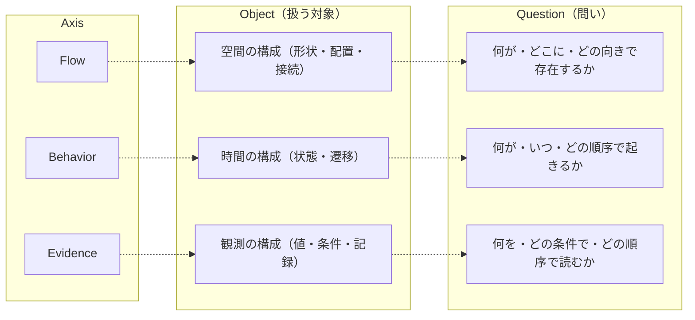
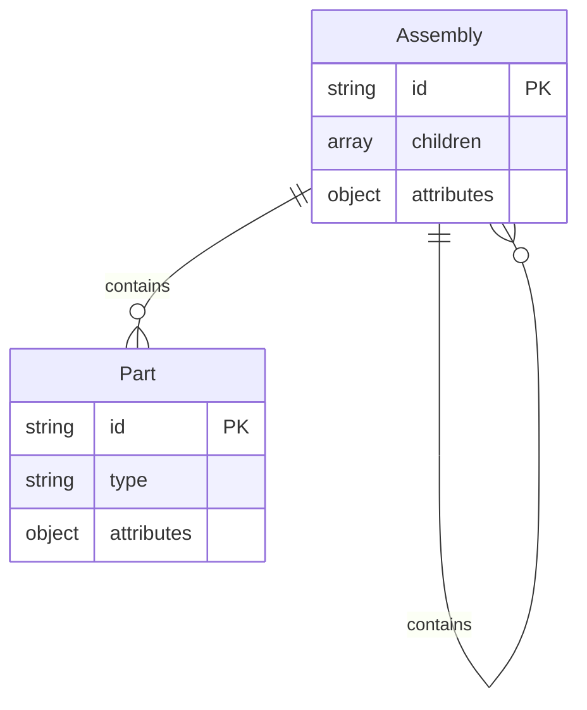
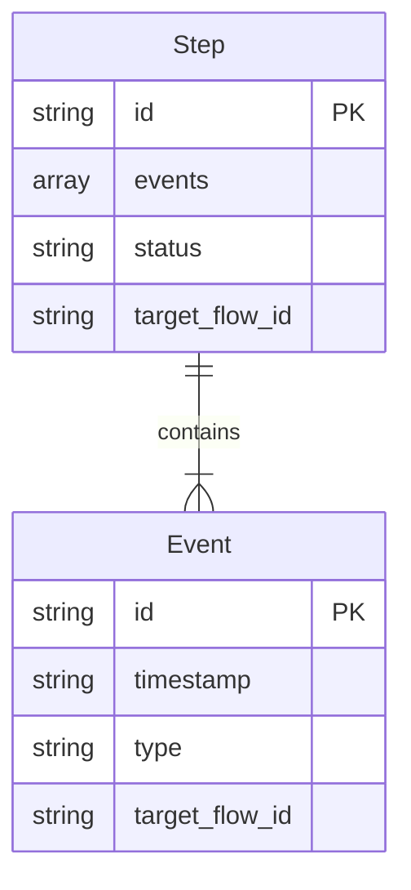
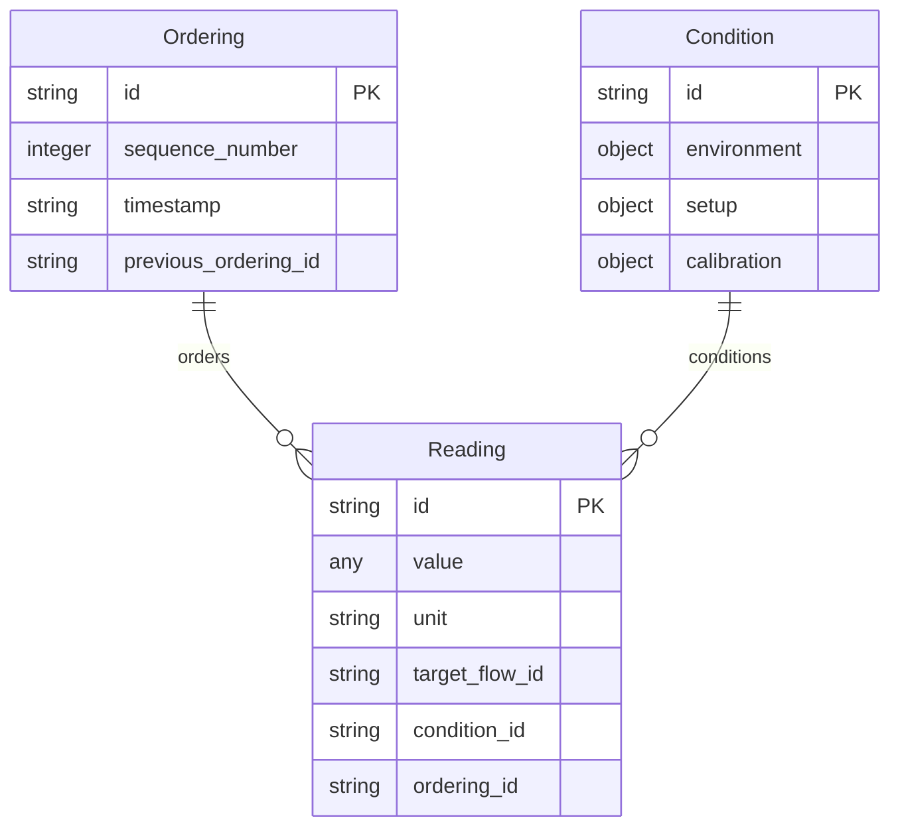
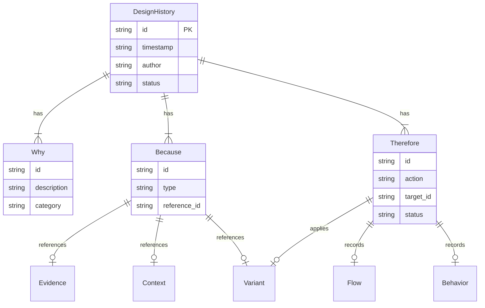

# Between Specification Layer

この文書は通読と配布のための結合版である。
正本は `ja/bsl/` 配下の章別ファイル群であり、修正・差分確認・参照の基準もそちらに置く。
本ファイルは `scripts/generate-combined.py` により再生成する。

---

## Source of Truth

- canonical source: `ja/bsl/`
- derived artifact: `ja/dist/bsl-combined.md`
- filename policy: versionless lowercase hyphen

---

# **0. 位置づけと目的（v0.2.4）**

## **0.1 本書の役割：Between と実装の"あいだ"を定義する**

Between は、ものづくりにおける
**空間（Flow）／時間（Behavior）／観測（Evidence）** を統一的に扱うための
「意味の座標系」を与える思想体系である。

一方、実装としての 2.5D Architecture は、
この座標系を用いて **具体的な自動化・配置・帳票・比較・View 操作**を行うための
参照実装である。

本書は、その両者の"あいだ"に置かれる。
すなわち：

- **Between（思想）** … なぜその構造が必要か
- **BSL（仕様）** … 何を最小限として固定するか
- **2.5D（実装）** … どのように実装するか

の三層構造において、
**BSL は「思想を損なわず、実装を縛らない」ための中位レイヤ**として
最小限の骨格だけを形式化する。

Between の意味構造は、Between Core において
Flow / Behavior / Evidence と三層構造（Element / Structure / Basis）として
形式的に定義されている。
本書（BSL）は、この Core の定義を前提に、
実装が参照できる仕様として骨格だけを固定する。

この形式化により、コミュニティによる拡張と、公開・配布・ライセンス等の運用方針を分離したまま両立できる。

### Normative vs Informative（規範と参考の区分）

本リポジトリにおける文書の規範性は以下の通り定義される。

| 区分 | 場所 | 性質 |
|------|------|------|
| Core Appendix | Between Core | Normative（規範） |
| BSL 本文（Chapter 0-9） | BSL | Normative（規範） |
| BSL Annex | BSL | Informative（参考・非規範） |
| Sandboxes | tools/ | Informative（参考・非規範） |

BSL Annex は例・テンプレート・補足説明を提供するが、規範的主張の根拠としては使用しない。
規範定義は Between Core Appendix を参照すること。

---

## **0.2 本書が定義する範囲と定義しない範囲**

本書（BSL: Between Specification Layer）は、Between Core が与える
**意味構造（Flow / Behavior / Evidence と三層構造）** を、
実装が参照可能な **形式仕様（Structure / 梱包単位 / 依存方向 / 記録原則）** に
落とし込むための「意味OS層」である。

BSL が扱うのは、意味の成立に必要な **最小限の構造だけ** であり、
具体的な計算方法・自動化アルゴリズム・UI などには立ち入らない。

### **0.2.1 本書が定義する範囲（BSL の責務）**

BSL の責務は、以下の「揺れてはならない最小骨格」を固定することである。

#### **(1) 三軸（Flow / Behavior / Evidence）と三層（Element / Structure / Basis）の形式仕様**

Between Core で定義された概念をそのまま形式化し、
**境界・整合性・依存方向** を固定する。

三軸の Basis（Placement / Sequence / Ordering）は、
**意味的 SSOT を成立させる基準** として扱う。

| 軸 | Element | Structure | Basis（読み取り基準） |
|----|---------|-----------|------------------|
| Flow | Part | Assembly | Placement |
| Behavior | Event | Step | Sequence |
| Evidence | Reading | Condition | Ordering |

#### **(2) 外側レイヤ（Variant / Design History / Context）の参照構造**

三軸に対して **一方向参照** を定義し、
判断構造が Flow / Behavior / Evidence を上書きしないよう保証する。

意味的同一性（Meaning Identity）と Variation（揺れ）に関する
**判断前提の形式表現** を提供する。

#### **(3) Evidence Chain（append-only）と Operation / Continuity の記録構造**

- Evidence を非破壊的に積み重ねる **append-only の Sidecar 原則**
- Operation による実行ログ
- Continuity による再開点・復元点

を **最小の記録構造** として定義する。
Evidence chain は Sidecar に append-only で蓄積される読み取り履歴であり、View による Meaning Identity の再構成を可能にする。

#### **(4) 依存ポリシー**

- Evidence → Behavior → Flow の一方向依存
- Element → Structure → Basis の層内一方向依存
- 外側レイヤ → 三軸 → Operation → Continuity の上位化
- 上書き禁止・副作用禁止などの **意味保全の原則**

```
許可：Evidence → Behavior → Flow
禁止：Flow → Behavior → Evidence（逆流）

許可：外側レイヤ → 三軸
禁止：三軸 → 外側レイヤ
```

#### **(5) BSL（OS層）と Sandboxes（実装層）との境界条件**

BSL は **意味の座標系だけ** を提供し、
データ形式や操作手続きは実装層に委ねる。

Slot / Layer / Boundary を通じた
**抽象マッピングの枠組み** を提供する。

---

### **0.2.2 本書が定義しない範囲（実装に委ねる部分）**

BSL は具体的な実装方式を規定しない。
以下はすべて **範囲外** とし、Sandboxes や Annex で扱う。

#### **(1) データ形式・ファイル形式**

- Excel / CSV / SQL / Parquet
- AutoCAD DWG / SVG / JSON5 などすべて自由

#### **(2) 実装技術**

- Python / VBA / TypeScript / .NET
- CAD API / メッセージング基盤 / クラウドサービス

#### **(3) UI / ツール / OSS / 自動化アルゴリズム**

- DoubletViewer, CompareAdvanced, Binder
- 自動作図、自動検図、レイアウト生成
- 差分検出・クラスタリング・機械学習

#### **(4) 2.5D Architecture の具象化**

- AutoCAD と Excel を結ぶ具体的な最小アーキテクチャ
- InsertList / ZLEVEL / ZoomPattern などの運用仕様

これらは **Annex（参照実装ガイド）** に退避する。

#### **(5) 公開・配布・ライセンス運用**

BSL は意味構造の仕様であり、公開形態は別文書で扱う。

---

### **0.2.3 BSL の基本方針**

BSL は次の原則に基づいて設計される。

**意味を固定し、表現は自由にする**

意味（構造・依存関係）は共有するが、実装（表現・データ形式）は拘束しない。

**判断は外側レイヤへ、記録は Sidecar へ、構造は三軸へ**

役割を混ぜないことで、揺れの原因となる境界破綻を防ぐ。

**非破壊・再現可能・冪等性の確保**

再計算・再読込・再開が可能な設計を保証する。

---

## **0.3 公開・配布・ライセンスの境界**

本書は、Between の技術仕様（意味構造と境界条件）の規範を定義する。
公開・配布・ライセンス等の運用方針は本書の範囲外とし、別文書で扱う。

BSL 本文が扱うのは、意味の成立に必要な最小限の骨格だけである。
公開形態に依存する主張や、運用上の判断はここでは行わない。

---

## **0.4 想定読者**

本書の読者として想定しているのは、次の層である。

### （1）実装担当者（OSS開発者・社内開発者）

- 2.5D Architecture を書く際の起点が欲しい
- Between の思想を損なわずに実装したい
- Flow・Behavior・Evidence の境界条件が知りたい

### （2）研究者・アーキテクト

- 構造化やモデル化のメタレベルを扱う立場
- MBSE／SysML／オントロジー工学等との接点に関心がある

### （3）OSSコミュニティ

- 拡張・派生を行う際に「揺れてはならない部分」を理解したい
- Between が何を保証し、何を保証しないかの最小セットを知りたい

---

## **0.5 本書の構成**

本書は、Between Core の意味構造を BSL として形式化し、
Sandboxes（実装層）が安全に利用できるように整えたものである。

以下に各章の役割と読み順をまとめる。

### **第1章 Core Concepts（総論）**

三軸（三層）・外側レイヤ・Operation・Continuity の
**全体像・語彙・Core との対応関係** を示す。

- BSL 全域の前提
- 三軸 × 三層の座標系
- Meaning Identity / Variation の定義
- Running Example（第10章）：BSL_2〜BSL_8 の共通例を定義

### **第2〜4章 Flow / Behavior / Evidence（三軸仕様）**

Core の定義に基づき、各軸を

- Element
- Structure
- Basis

の三層に分けて **形式仕様** として固定する。

ここが BSL の三軸を形式仕様として固定する章である。

| 章 | 軸 | Element | Structure | Basis |
|----|----|---------|-----------|-------|
| 2章 | Flow | Part | Assembly | Placement |
| 3章 | Behavior | Event | Step | Sequence |
| 4章 | Evidence | Reading | Condition | Ordering |

### **第5章 Variant（外側レイヤ：選択肢構造）**

- Variant Type（構造選択）
- Variation（揺れ）
- 三軸の Basis との参照関係

など、**判断側の選択肢構造** を形式化する。

### **第6章 Design History（外側レイヤ：判断理由）**

- Why / Because / Therefore の三分割
- Core の「判断レイヤ」の形式化
- Evidence / Variant / Sequence との対応関係

判断過程を append-only で保存し、
将来の比較・検証が可能な履歴構造を与える。

### **第7章 Operation（実行モデル）**

- 実行単位（OperationSession）
- 実行記録（OperationRecord）
- Evidence Chain の形成原則

「何が、いつ、どう実行されたか」を
**非破壊で積み重ねる最小構造** を定義する。

### **第8章 Continuity（継続性・再開点）**

- Snapshot
- Anchor
- Checkpoint / Restore Point
- Time-order Consistency

プロジェクト・設計・実験などの業務を
**途中で止めても再開できる情報構造** を規定する。

### **第9章 Architecture（OS層の境界条件）**

- OS層（BSL）
- Implementation層（2.5D / CAD / DB 等）
- Application層（DoubletViewer等）

三層モデルとして明確に分離し、
**意味OS ⇄ 実装 ⇄ アプリケーション** の境界条件と依存方向を定義する。

Slot / Layer / Boundary を用いて、実装層と BSL を安全に接続する。

補足：
BSL_2〜BSL_8 の例示は、BSL_1 第10章「Running Example」で定義された共通例を前提とする。
本構成表では章番号を再配番せず、参照先のみを明示する。

### **Annex：参照実装ガイド（2.5D Architecture等）**

本文の意味構造を保持したまま、
実装層でのマッピング例・API案・Slot Type Catalog を示す。

- 2.5D Architecture との対応
- DPM（決定論的配置）の実装指針
- View 操作の実装例

---

## **0.6 本書の狙い**

言い換えるなら、本書の役割は次の一言に尽きる。

**"Between の自由さを損なわず、実装の互換性を確保するための最小仕様を与えること。"**

この最小仕様があることで：

- OSSコミュニティは安心して派生実装を作れる
- 実装者はベンダー依存せずに構造化できる
- 2.5D Architecture は抽象的な基盤を得る

本書は、そのための **"揺れない基準"** を提供する。

---

## Core Dependency

本章で述べた BSL の位置づけは、Between Core で規定された形式的構造に基づいている。

### 三軸×三層の継承

BSL は Core が定義した三軸×三層をそのまま継承する。

| 層＼軸 | Flow (`F`) | Behavior (`B`) | Evidence (`E`) |
|--------|-----------|----------------|----------------|
| Element (`El`) | Part | Event | Reading |
| Structure (`St`) | Assembly | Step | Condition |
| Basis (`Ba`) | Placement | Sequence | Ordering |

### 依存ポリシーの継承

BSL は Core が定義した依存ポリシー（A.3）をそのまま継承する。
0.2.1(4) はその要約であり、正式定義は Core Appendix A.3 を参照。

### 境界条件の継承

BSL は Core が定義した境界条件（9章）を継承し、
実装層への非依存性を維持する。

- BSL は意味の成立条件のみを扱い、実装には踏み込まない
- BSL が依存しないのは：データ形式、API、ツール、業務プロセス
- 実装層は BSL の座標系・View/Sidecar原理・Identity/Variation枠組みを継承する

正式定義は Between Core — Appendix を参照のこと。

- 三軸の定義：A.1
- 三層の定義：A.2
- 依存ポリシー：A.3
- 外側レイヤの型：A.6
- 境界条件：9章

---

## 更新履歴

| バージョン | 日付 | 変更内容 |
|-----------|------|----------|
| v0.1    | 2025-11 | 初版 |
| v0.2    | 2025-12 | Core整合強化：0.2を責務・基本方針で再構成、0.5を現行BSL章構成と整合、Core参照セクション追加 |
| v0.2.1  | 2026-01 | Appendix → Annex 命名変更。Normative vs Informative 宣言を追加   |
| v0.2.2  | 2026-03 | 公開前整合パッチ：Basis を「SSOT を成立させる基準」に統一。表ヘッダ・0.5 節の文言を整合 |
| v0.2.3 | 2026-03 | 公開前整合パッチ：§0.5 に Running Example（BSL_1 第10章）への参照を補足 |
| v0.2.4 | 2026-03 | §0.5 第1章の説明に Running Example（第10章）を追記 |

---

# BSL_1. Core Concepts（基本概念）

**Version: v0.3.7**

---

## Core Dependency

本章が依拠するCoreの定義を以下に示す。

| 参照先 | Core節 | 本章での役割 |
|--------|--------|-------------|
| 三軸（Flow / Behavior / Evidence） | A.1 | 意味座標系の上位定義 |
| 三層（Element / Structure / Basis） | A.2 | 三層モデルの上位定義 |
| Meaning Identity / Variation | A.4 | 同一性・揺れの判定原理 |
| 依存ポリシー | A.3 | 三軸・外側レイヤの依存方向 |
| View / Sidecar | A.5 | 読み取りと外在化の枠組み |
| 外側レイヤ（Context / Variant / Design History） | A.6 | 判断レイヤの型定義 |

Between Core で定義される三軸・三層、View / Sidecar、依存ポリシー、Meaning Identity の定義そのものは **Core Appendix を SSOT として参照し、本章では再定義を行わない**。

---

## 1. Purpose（この章の目的）

BSL は Core の上に位置し、以下を **仕様（Spec）として固定する** レイヤである。

- 意味構造（Flow / Behavior / Evidence）
- 抽象層（Element / Structure / Basis）
- 外側レイヤ（Context / Variant / Design History）

Core では抽象原理として定義されていたものを、BSL では **型・方向性・結合条件・読み取り規則** といった形式的枠組みとして整備する。

本章は、後続章（BSL_2〜9）の基準点を定める「座標系の宣言」である。

---

## 2. 三軸：Flow / Behavior / Evidence

三軸は、対象の意味を成立させる最小構造を提供する。
BSL は Core の定義に従い、以下の役割を仕様上の「責務」として確定する。



### 2.1 Flow（空間・配置）

Flow は **空間的な並びの一貫性** を扱う。

| 層 | 要素 | 説明 |
|----|------|------|
| Element | Part | 識別可能な形状の最小単位 |
| Structure | Assembly | Part間の親子関係・構成 |
| Basis | Placement | 意味的 SSOT を成立させる基準層 |

BSL における責務：
- 空間排他性・基準の定義などの「空間制約」をオプション制約として明文化する
- Placement を Structure の SSOT 判断基準として扱う型仕様を定める
- 外側レイヤ（Variant / Context）が Flow を上書きする場合の安全条件を規定する

### 2.2 Behavior（時間・順序）

Behavior は **時間的整合性・因果性** を扱う。

| 層 | 要素 | 説明 |
|----|------|------|
| Element | Event | 時間軸上の離散的な変化点 |
| Structure | Step | Eventの結果として確定した状態 |
| Basis | Sequence | 意味的 SSOT を成立させる基準層 |

BSL における責務：
- 因果性・前後関係・依存方向の制約を型として規定する
- Step（手順構造）と Sequence（因果基準）を分離し、取り違えを防ぐ
- Flow や Evidence との許可される結合パターンを仕様化する

### 2.3 Evidence（観測・読み取り）

Evidence は **読み取りによる再現可能性** を扱う。

| 層 | 要素 | 説明 |
|----|------|------|
| Element | Reading | その瞬間に読み取った値 |
| Structure | Condition | Readingを意味づける前提条件 |
| Basis | Ordering | 意味的 SSOT を成立させる基準層 |

BSL における責務：
- Reading / Condition / Ordering の型レベルの分離
- Ordering による append-only 原則を Sidecar の仕様として固定する
- View が Structure × Sidecar を解釈する際の読み取り規則を仕様化する
- ActionTrace（行為の記録）は Reading に含めてよい。ただし ActionTrace は成功・反映・権限OKを含意しない。
- EffectDelta（状態変化）は Behavior / Flow の Structure に属し、Evidence の拡張で代替しない（LEM-E3）。
- ドメイン別の便宜的名称（例：ToolCall/ToolEffect）は docs/policies 側でエイリアスとして定義する。

---

## 3. 三層：Element / Structure / Basis

三層は、対象物の複合構造を「粒度として」定義するための枠組みである。
BSL は以下を仕様上の責務とする。

### 3.1 Element（最小単位）

| 軸 | Element |
|----|---------|
| Flow | Part |
| Behavior | Event |
| Evidence | Reading |

BSL の責務：
- Element 間の結合規則は Structure が吸収する（Element は独立）
- Element は Variant の影響を直接受けない

### 3.2 Structure（複合構造）

| 軸 | Structure |
|----|-----------|
| Flow | Assembly |
| Behavior | Step |
| Evidence | Condition |

BSL の責務：
- Structure は常に Basis を参照して意味を確定する
- Structure の変化は Design History が管理し、Behavior / Flow の Structure を直接書き換えない（Design History を経由して解釈する）

### 3.3 Basis（SSOTの基準）

| 軸 | Basis |
|----|-------|
| Flow | Placement |
| Behavior | Sequence |
| Evidence | Ordering |

BSL の責務：
- Basis は Structure をどの前提で読むかを固定する読み取り基準であり、その実データは Sidecar に外在化される。SSOT に Basis を混在させてはならない
- したがって、Basis は意味的 SSOT を成立させる基準であるが、SSOT 本体そのものではない
- 基準が変化する場合、Variant または Design History を経由する
- Basis の破壊的更新は禁止（append-only もしくは置換の明示手続）

---

## 4. 外側レイヤ：Context / Variant / Design History

外側レイヤは「判断・選択・履歴」の役割を持ち、三軸の外側に位置する。

### 4.1 Context（前提条件）

- 環境・目的・使用条件などの **読み方の前提** を保持する
- View の振る舞いに影響は与えるが、三軸の内部構造を変更しない
- Context は Basis / Sidecar と異なり、「座標系や履歴」ではなく「読み取りの目的や利用シナリオ」といった判断前提のみを扱う
- 承認・権限・posture は Context に属する。Evidence には承認根拠として提示された参照（approval_id等）だけを残し、成立判定や実行許可はここで行う。
- Context は、承認・権限・posture に加えて、OperationScope（操作範囲の宣言）を保持してよい。OperationScope は「どの space_id で」「どの artifact_role／cross-space 操作」を許可するかを宣言し、Evidence や View の内容そのものを正当化しない。
- OperationScope は比較の成立条件（Φ の閉包）を代替しないため、compare の許可は同一 space_id かつ同一 Φ の範囲に限定される。
- OperationScope は実装パターン（RBAC 等）を規定しない。許可の意味論のみを定義し、実現方法は実装層に委ねる。

#### OperationScope の最小構造（参考）

| フィールド | 型 | 説明 |
|-----------|-----|------|
| scope_id | string | 操作範囲の識別子。同一 scope_id は同一の許可セットを共有する |
| space_id | string | 適用対象の Space。比較成立の前提が閉じている単位（BSL_9 参照） |
| artifact_role | enum[] | 許可される artifact_role（ssot/view/sidecar/evidence） |
| operation_kind | enum[] | 許可される操作種（propose/append_draft/approve/execute） |
| cross_space_operation | enum[] | 許可される Space 跨ぎ操作（route/redirect）。compare は許可できない |
| confirmation_points | string[] | 人の承認が必要な操作（operation_kind の部分集合） |
| forbidden_set | string[] | 禁止操作 |

OperationScope は Context 配下に属し、Design History や Operation から参照される。

注記（scope_id と space_id の違い）:
- space_id: 比較成立の前提が閉じている単位（Meaning Identity の境界）
- scope_id: 操作許可の単位（OperationScope の識別子）

同一 space_id に対して複数の scope_id が存在しうる（例：閲覧専用と編集可能の区別）。

### 4.2 Variant（意図的な揺れ）

- Flow / Behavior / Evidence の **代替的な構造** を記述する外側レイヤ
- Variant は Structure を複製せず、差分の意図は、Basis（Placement / Sequence / Ordering）に対する **Binding（どの Basis を採用するか）** と、その切り替え方を定める **Rule（変換規則）** の組として表現される

### 4.3 Design History（生成の記録）

- Flow / Behavior / Evidence の「生成順序・編集履歴」を記録する
- SSOT を汚さず、Sidecar と連携して整合性を保証する

---

## 5. Meaning Identity（意味的同一性）

Core 第7章に基づき、BSL では意味的同一性（Identity）を次の3条件で定義する。

| 条件 | 説明 | Core参照 |
|------|------|----------|
| Structure同一性 | Element / Structure の集合と接続関係が一致していること（Flow なら Part/Assembly 構成、Behavior なら Event/Step 構成など） | A.4.1 |
| Basis同一性 | Basis（Placement / Sequence / Ordering）が同じ意味基準（座標系・順序・並び）を共有していること | A.2.2, A.4.1 |
| View一致 | Structure × Sidecar を View で読み取った結果として得られる意味が同一であること（表示やフォーマットの差異は許容） | A.4.2 |

BSL の責務は、これら3条件を **形式仕様として再現できるフォーマット・制約** を定めることである。

---

## 6. Dependency Policy（依存ポリシー）

BSL では Core Appendix の依存ポリシーをそのまま仕様として採用する。

### 6.1 三軸間の依存

| 参照元 | 参照先 | 許可 | 説明 |
|--------|--------|------|------|
| Evidence | Behavior | ○ | 読み取り結果が時間構造を参照することは許可 |
| Behavior | Flow | ○ | 時間構造が空間構造を参照することは許可 |
| Evidence | Flow | ○ | 読み取り結果が空間構造を参照することは許可される |
| Flow | Behavior | × | 空間構造が時間構造に依存することは禁止 |
| Flow | Evidence | × | 空間構造が読み取り結果に依存することは禁止 |
| Behavior | Evidence | × | 時間構造が読み取り結果に依存することは禁止 |

注記：
Core Appendix A.3.1 では Evidence → Flow の直接参照は許可される。
本書 §6.3 の簡略表現は、実務上の代表的な依存連鎖を示したものであり、
Core の許可関係を制限するものではない。

### 6.2 外側レイヤとの依存

| 参照元 | 参照先 | 許可 | 説明 |
|--------|--------|------|------|
| 外側レイヤ | 三軸 | ○ | 判断レイヤが三軸を参照することは許可 |
| 三軸 | 外側レイヤ | × | 三軸側から判断レイヤに依存することは禁止 |

### 6.3 簡略表現

```
許可：Evidence → Behavior → Flow
禁止：Flow → Behavior → Evidence（逆流）

許可：外側レイヤ → 三軸
禁止：三軸 → 外側レイヤ
```

これにより「読み取りが先」「構造が後」「空間が最も外側」という Between Core の基本構造が保持される。
注記：Evidence → Flow の直接参照も許可される（Core A.3.1）。上記は代表的な依存連鎖であり、Core の許可関係を制限しない。

---

## 7. View / Sidecar の役割

### 7.1 View（読み取り写像）

- Structure と Sidecar（Basis / Condition / Ordering）を参照し、Meaning（意味）を射影する操作
- View の適用は本体を変更しない
- BSL の責務は、View の読み取り規則の抽象仕様を定義すること

### 7.2 Sidecar（非侵襲的履歴領域）

- Ordering を中心とした append-only の Evidence chain を保持する
- 基本構造を破壊しない「非侵襲的履歴領域」
- Basis は座標系上の基準であり、その実データは Sidecar に外在化される

---

## 8. Space と Mapping

### 8.1 Space（意味の適用単位）

Space は、同一性（Identity）を評価するための前提が閉じている単位である。
BSL は Space を組織図やシステム構成と同一視しない。Space は識別子（space_id）として扱い、比較や接続の可否を機械的に判定できることを目的とする。

Space は少なくとも次の組で成立する。

| 構成要素 | 役割 |
|---------|------|
| SSOT | 更新責務を持つ真実 |
| view | SSOT からの投影（再生成可能） |
| sidecar | view の解釈条件・補助情報 |

view は SSOT ではない。view は、固定された sidecar（Basis/Condition/Ordering）と投影規則に基づき、SSOT から再計算される派生である。
view は複数並立し得るため、比較は常に SSOT と sidecar（Basis/Condition/Ordering）に遡り、成立条件が一致していることを確認してから行う。

同一の SSOT を参照していても、view または sidecar が異なるなら別 Space として扱ってよい（MAY）。
Space の分割基準に関する推奨は docs/guide を参照のこと。

### 8.2 Mapping（Space 間接続）

Mapping は、Space 間または役割間の接続を表す。
接続の実体は API、ETL、イベント、手作業、帳票など何でもよいが、接続が存在するなら識別子（mapping_id）と種別（mapping_kind）で宣言できなければならない。

Mapping は「直接参照」や「暗黙の逆流」を正当化しない。
Space 間のデータ移送や意味変換は、必ず Mapping として明示する。

#### mapping_kind（最小列挙）

| 値 | 意味 |
|----|------|
| derive | ssot → view（派生・投影） |
| observe | ssot/view → evidence（観測・記録） |
| transfer | spaceA → spaceB（移送） |
| transform | spaceA → spaceB（意味変換を伴う移送） |
| compose | 複数入力からの合成 |
| manual | 人手工程を含む |

### 8.3 Core との関係

Space の意味論的定義は Core 9.2.1 を参照。
BSL は Core 定義を機械可読な識別子・メタデータ・検査として仕様化する。

---

## 9. BSL における基本原則

本章で定義した概念は、BSL 2〜9章における仕様化の基準となる。

| 原則 | ID | 説明 |
|------|-----|------|
| 直交性 | BP-1 | 三軸・三層は常に直交 |
| 外在化 | BP-2 | Basis は Sidecar に外在化 |
| 再構成 | BP-3 | View は Structure × Sidecar から意味を再構成 |
| 非介入 | BP-4 | 外側レイヤは内部構造に介入しない |
| 一方向 | BP-5 | 依存ポリシーは一方向（Evidence → Behavior → Flow） |
| 非複製 | BP-6 | Variant は差分の意図を持ち、Structure を複製しない |
| 非汚染 | BP-7 | Design History は SSOT を汚染しない |
| Space 境界 | BP-8 | 比較は同一 space_id かつ同一 basis_id の内側でのみ許可 |
| Mapping 明示 | BP-9 | Space 間接続は Mapping として明示する |

---

## 10. Running Example（BSL共通）

以降の BSL_2〜BSL_8 における Examples は、特に断りがない限り本節を共通前提とする。

### 10.1 概要

「対象A」という架空の製品を例として使用する。

| 項目 | 内容 |
|------|------|
| 対象 | 対象A（センサユニット） |
| 構成 | Part P001, P002 を含む Assembly A001 |
| 工程 | Sequence Q001 に沿った Step S001, S002 |
| 観測 | Reading R001 による寸法測定 |

本章では、Flow / Behavior / Evidence の関係性を示すことを優先し、属性は最小限にとどめる。各軸の詳細属性は BSL_2〜BSL_4 で拡張する。

### 10.2 Flow（空間）

```json
{
  "assembly": {
    "id": "A001",
    "name": "対象A",
    "parts": ["P001", "P002"]
  },
  "placements": [
    { "id": "L001", "part_id": "P001", "position": {"x": 0, "y": 0, "z": 0} },
    { "id": "L002", "part_id": "P002", "position": {"x": 100, "y": 0, "z": 0} }
  ]
}
```

### 10.3 Behavior（時間）

```json
{
  "sequence": {
    "id": "Q001",
    "name": "組立工程",
    "steps": ["S001", "S002"]
  },
  "steps": [
    { "id": "S001", "name": "初期配置", "events": ["E001"] },
    { "id": "S002", "name": "締結", "events": ["E002"] }
  ]
}
```

### 10.4 Evidence（観測）

```json
{
  "readings": [
    { "id": "R001", "value": 49.95, "unit": "mm", "condition_id": "C001" }
  ],
  "conditions": [
    { "id": "C001", "temperature": 20, "humidity": 50 }
  ],
  "ordering": {
    "id": "O001",
    "sequence_number": 1,
    "previous_ordering_id": null
  }
}
```

### 10.5 相互参照

```
Flow (A001) ← Behavior (Q001) ← Evidence (R001)
         ↑           ↑              ↑
      Placement   Sequence       Ordering
        (L001)      (Q001)        (O001)
```

---

## 11. Summary（本章のまとめ）

| 項目 | 内容 |
|------|------|
| 位置づけ | BSL全体の座標系を宣言する基準仕様 |
| 三軸 | Flow（空間）/ Behavior（時間）/ Evidence（観測） |
| 三層 | Element / Structure / Basis |
| Basis の役割 | 座標系上の基準。実データは Sidecar に外在化され、意味的 SSOT を成立させる基準となる。SSOT 本体そのものではない |
| 外側レイヤ | Context（OperationScope を含む）/ Variant / Design History |
| Meaning Identity | Structure同一性 / Basis同一性 / View一致 の3条件 |
| 依存ポリシー | Evidence → Behavior → Flow（一方向）、外側レイヤ → 三軸（一方向） |
| Space | 同一性を評価するための前提が閉じている単位（space_id で識別） |
| Mapping | Space 間接続（mapping_id / mapping_kind で宣言） |
| 基本原則 | BP-1〜BP-9 |
| Running Example | 全章共通の「対象A」を定義 |

本章が整うことで、BSL 全体が「Between Core の意味座標系を破壊しない仕様レイヤ」として機能することを保証する。

---

## 更新履歴

| バージョン | 日付 | 変更内容 |
|-----------|------|----------|
| v0.1 | - | 初版草案 |
| v0.2 | 2025-06 | Core Dependency表追加、Meaning Identity/依存ポリシー表形式化、Basis/SSOT/Sidecar文言整理、Running Example明示、Summary追加 |
| v0.3 | 2026-01 | Space / Mapping セクション追加（8章）。基本原則に BP-8（Space境界）、BP-9（Mapping明示）を追加。章番号再編 |
| v0.3.1 | 2026-01 | Space セクションに view の派生性・並立性を追記（LEM-4 との整合） |
| v0.3.2 | 2026-01 | ActionTrace / EffectDelta を Evidence 責務に追加。Context に承認・権限・posture の所属を明記 |
| v0.3.3 | 2026-01-14 | Context に OperationScope の位置づけを追記。compare 許可条件との関係を明記。scope_id / space_id の違いを注記 |
| v0.3.4 | 2026-03 | 公開前整合パッチ：§3.3 Basis の SSOT 位置づけを明確化（Core 8章・BP-2 との整合）。Summary の Basis の役割を §3.3 に整合 |
| v0.3.5 | 2026-03 | 公開前整合パッチ：§2.1–2.3 Basis 説明列を「SSOT を成立させる基準層」に統一（appendix A.2.3 との整合） |
| v0.3.6 | 2026-03 | 公開前整合パッチ：§6.1 Evidence→Flow を Core A.3.1 に一致（○）。§6.3 簡略表現との関係を注記 |
| v0.3.7 | 2026-03 | §10.4 の Ordering 例を BSL_4 スキーマ語彙に整合（sequence → sequence_number / previous_ordering_id） |

# BSL_2. Flow 仕様

**Version: v0.3.2**

---

## Core Dependency

本章が依拠するCoreの定義を以下に示す。

| 参照先 | Core節 | 本章での役割 |
|--------|--------|-------------|
| F.El（Part） | A.2.2 | 識別可能な形状の最小単位 |
| F.St（Assembly） | A.2.2 | Part間の親子関係・構成 |
| F.Ba（Placement） | A.2.2 | Partを空間に配置する基準（配置基準） |
| 依存ポリシー（軸間） | A.3.1 | Evidence → Behavior → Flow の一方向性 |
| 依存ポリシー（層間） | A.3.2 | Element → Structure → Basis の一方向性 |
| Meaning Identity / Variation | A.4 | children順序やorientation精度の許容範囲の根拠 |
| View | A.5.1 | Flowを別表現へ写像する仕組み |

BSL独自の定義：なし（Core定義の仕様化のみ）

---

## 1. Purpose（この章の目的）

本章は、Flow軸（空間における配置と構成）を機械可読なデータ構造として仕様化する。

仕様化の範囲：
- Part / Assembly / Placement のデータモデル
- 各要素の必須フィールド・制約
- 操作（Create / Update / Compare）の定義
- 依存ポリシーの適用ルール

仕様化の範囲外：
- Flowの意味論的定義 → Core Appendix A.2.2
- CAD / Excel / 2.5D等の具体実装 → Sandboxes

---

## 2. Data Model（データモデル）

### 2.1 Part（F.El）

識別可能な形状の最小単位。

#### Schema

```json
{
  "$schema": "https://json-schema.org/draft/2020-12/schema",
  "type": "object",
  "properties": {
    "id": {
      "type": "string",
      "pattern": "^P[0-9]{3,}$",
      "description": "Part ID（例：P001）"
    },
    "type": {
      "type": "string",
      "description": "型番またはタイプ名"
    },
    "attributes": {
      "type": "object",
      "description": "任意の属性（素材、機能等）",
      "additionalProperties": true
    }
  },
  "required": ["id", "type"]
}
```

#### Field Definition

| フィールド | 型 | 必須 | 制約 | 説明 |
|-----------|-----|------|------|------|
| id | string | ○ | `^P[0-9]{3,}$` | プロジェクト内で一意 |
| type | string | ○ | - | 型番またはタイプ名 |
| attributes | object | - | - | 任意の属性辞書 |

#### Constraints

| ID | 制約 | 根拠 |
|----|------|------|
| P-C1 | id はプロジェクト内で一意 | 同一性判定の前提 |
| P-C2 | 同一形状でも用途が異なれば別Part可 | 意味的分離 |
| P-C3 | 形状データは保持しない | Flow ≠ 形状モデル |

---

### 2.2 Assembly（F.St）

Part間の親子関係・構成を表す構造。

#### Schema

```json
{
  "type": "object",
  "properties": {
    "id": {
      "type": "string",
      "pattern": "^A[0-9]{3,}$",
      "description": "Assembly ID（例：A001）"
    },
    "children": {
      "type": "array",
      "items": {
        "type": "string",
        "pattern": "^[PA][0-9]{3,}$"
      },
      "description": "子要素のID一覧（Part または Assembly）"
    },
    "attributes": {
      "type": "object",
      "additionalProperties": true
    }
  },
  "required": ["id", "children"]
}
```

#### Field Definition

| フィールド | 型 | 必須 | 制約 | 説明 |
|-----------|-----|------|------|------|
| id | string | ○ | `^A[0-9]{3,}$` | プロジェクト内で一意 |
| children | array | ○ | Part/Assembly IDの配列 | 子要素一覧 |
| attributes | object | - | - | 任意の属性辞書 |

#### Constraints

| ID | 制約 | 根拠 |
|----|------|------|
| A-C1 | children に Part ID または Assembly ID を含む | 構成の定義 |
| A-C2 | 循環参照禁止（DAGのみ許可） | Core A.3.3 |
| A-C3 | 複数の親を持ち得る（DAG） | 再利用性 |
| A-C4 | children の順序は意味に影響しない | Variation許容 |

#### Structure Diagram



---

### 2.3 Placement（F.Ba）

Partを空間に配置する基準。Flow軸の Basis。

#### Schema

```json
{
  "type": "object",
  "properties": {
    "id": {
      "type": "string",
      "pattern": "^L[0-9]{3,}$",
      "description": "Placement ID（例：L001）"
    },
    "assembly_id": {
      "type": "string",
      "pattern": "^A[0-9]{3,}$",
      "description": "所属するAssembly"
    },
    "part_id": {
      "type": "string",
      "pattern": "^P[0-9]{3,}$",
      "description": "配置対象のPart"
    },
    "position": {
      "type": "object",
      "properties": {
        "x": { "type": "number" },
        "y": { "type": "number" },
        "z": { "type": "number", "default": 0 }
      },
      "required": ["x", "y"]
    },
    "orientation": {
      "type": "object",
      "properties": {
        "theta": { "type": "number", "default": 0 },
        "phi": { "type": "number", "default": 0 },
        "psi": { "type": "number", "default": 0 }
      }
    },
    "coordinate_system": {
      "type": "string",
      "enum": ["local", "global", "parent"],
      "default": "parent"
    }
  },
  "required": ["id", "assembly_id", "part_id", "position"]
}
```

#### Field Definition

| フィールド | 型 | 必須 | 制約 | 説明 |
|-----------|-----|------|------|------|
| id | string | ○ | `^L[0-9]{3,}$` | プロジェクト内で一意 |
| assembly_id | string | ○ | 既存Assembly ID | 所属Assembly |
| part_id | string | ○ | 既存Part ID | 配置対象Part |
| position | object | ○ | x, y 必須 | 位置座標 |
| orientation | object | - | theta, phi, psi | 回転情報 |
| coordinate_system | string | - | enum | 座標系種別 |

#### Constraints

| ID | 制約 | 根拠 |
|----|------|------|
| L-C1 | (assembly_id, part_id, position) の組で一意性を判定 | 配置基準 |
| L-C2 | 同一Partが複数Placementを持ち得る | 再利用性 |
| L-C3 | 幾何拘束ではなく意味上の位置 | Flow ≠ CAD |
| L-C4 | position.z は省略時 0 | 2D互換 |

---

## 3. Dependency Policy（依存ポリシー）

### 3.1 軸間依存

Flow は他軸から参照される基準であり、他軸を参照しない。

| 参照元 | 参照先 | 許可 | 備考 |
|--------|--------|------|------|
| Behavior | Flow | ○ | Step/Sequence が Part/Placement を参照 |
| Evidence | Flow | ○ | Reading が Part/Placement を参照 |
| Flow | Behavior | × | Core A.3.1 禁止 |
| Flow | Evidence | × | Core A.3.1 禁止 |

### 3.2 層間依存

| 参照元 | 参照先 | 許可 | 備考 |
|--------|--------|------|------|
| Part | Assembly | ○ | 構成要素として |
| Part | Placement | ○ | 配置先として |
| Assembly | Placement | ○ | 配置基準として |
| Placement | Part | × | Core A.3.2 禁止（逆流） |
| Placement | Assembly | × | Core A.3.2 禁止（逆流） |

### 3.3 Sidecar との関係

Flow 自体は空間の意味構造を表し、観測条件や判断履歴は本体構造に混在させない（Core A.3 の一方向依存および A.6.2 の非介入性）。これらは Sidecar / 外側レイヤとして外側に保持される。

| 項目 | 説明 |
|------|------|
| 根拠 | Flow は空間の意味構造であり、観測条件や判断履歴は Core A.3 / A.6.2 により外側に保持される |
| Evidence Chain | Flow外側に蓄積（BSL_4） |
| 変更履歴 | Design History として記録（BSL_6） |
| バージョン管理 | Flow全体を Versioned Structure として扱う |

Flow 自体に Sidecar は付与されないが、比較・評価は外側（Operation / Evidence）にある評価フレーム Φ 参照に依存する。
View は SSOT から再計算可能な派生であり、比較は SSOT と Sidecar（Basis / Condition / Ordering）に遡って成立条件を確認する。

---

## 4. Operations（操作）

### 4.1 Create

| 操作 | 必須入力 | 出力 | 制約 |
|------|----------|------|------|
| create_part | type | Part | id 自動採番 |
| create_assembly | children | Assembly | id 自動採番、循環チェック |
| create_placement | assembly_id, part_id, position | Placement | id 自動採番、参照整合性チェック |

### 4.2 Update

| 操作 | 更新可能フィールド | 制約 |
|------|-------------------|------|
| update_part | type, attributes | id 変更不可 |
| update_assembly | children, attributes | id 変更不可、循環チェック |
| update_placement | position, orientation, coordinate_system | id, assembly_id, part_id 変更不可 |

### 4.3 Compare（同一性判定）

Core A.4.1 Meaning Identity に基づく。

比較は評価フレーム Φ = (ℐ, 𝒜, 𝒞, 𝒪) が固定されている場合にのみ成立する。
Φ が欠落している場合は FAIL、Φ が変更された場合は別比較として扱う。
正規の入口は BSL_7（Operation）の compare 操作であり、本節はその前提条件を定義する。

| 対象 | 同一性条件 | Variation許容 |
|------|-----------|---------------|
| Part | id 一致 | attributes の差異は許容 |
| Assembly | id 一致、children 集合一致 | children の順序差異は許容 |
| Placement | id 一致、position 一致 | orientation の精度差異は許容 |

> 参照：BSL_9（Space Metadata / Checks）、BSL_7（Operation）

---

## 5. Examples（最小例）

本節の例は BSL_1 第10章「Running Example」で定義された共通例に基づく。

### 5.1 単一Part（最小例）

```json
{
  "id": "P001",
  "type": "part_type_A",
  "attributes": {}
}
```

### 5.2 Assembly構成（最小例）

Running Example の A001 に対応。

```json
{
  "parts": [
    { "id": "P001", "type": "part_type_A" }
  ],
  "assemblies": [
    { "id": "A001", "children": ["P001"] }
  ],
  "placements": [
    {
      "id": "L001",
      "assembly_id": "A001",
      "part_id": "P001",
      "position": { "x": 0, "y": 0, "z": 0 }
    }
  ]
}
```

### 5.3 複数Part構成（拡張例）

```json
{
  "parts": [
    { "id": "P001", "type": "part_type_A" },
    { "id": "P002", "type": "part_type_B" }
  ],
  "assemblies": [
    { "id": "A001", "children": ["P001", "P002"] }
  ],
  "placements": [
    { "id": "L001", "assembly_id": "A001", "part_id": "P001", "position": { "x": 0, "y": 0 } },
    { "id": "L002", "assembly_id": "A001", "part_id": "P002", "position": { "x": 100, "y": 0 } }
  ]
}
```

---

## 6. Extension Points（拡張点）

以下の拡張はBSLの範囲外だが、互換性を損なわない範囲で許容される。

| 拡張 | 説明 | 定義場所 |
|------|------|----------|
| 設備・治具構成 | Probe, Fixture, Gauge等への適用 | Sandboxes |
| Multi-View | 2D/3Dの統合表現 | Sandboxes |
| View連携 | 図面ビュー・配置リスト等への写像 | BSL_7 / Sandboxes |
| Variant連携 | 複数案の比較・差分管理 | BSL_5 |

---

## 7. Summary（本章のまとめ）

| 項目 | 内容 |
|------|------|
| 対象 | Flow軸（空間における配置と構成） |
| 三層 | Part (F.El) / Assembly (F.St) / Placement (F.Ba) |
| Basis | Placement がFlow軸の配置基準 |
| 依存方向 | Flow ← Behavior ← Evidence（一方向） |
| Sidecar | Flow本体は持たず、観測条件や判断履歴は外側レイヤに保持 |
| Variation | children順序、orientation精度の差異を許容 |

---

## 更新履歴

| バージョン | 日付 | 変更内容 |
|-----------|------|----------|
| v0.1 | - | 初版（思想説明を含む旧版） |
| v0.2 | 2025-06 | Core参照ブロック追加、JSON Schema形式化、思想成分排除 |
| v0.3 | 2026-01 | Compare に Φ 固定を追加、Sidecar との関係に Φ 参照の補足を追加。BSL_7/BSL_9 への参照 |
| v0.3.1 | 2026-03 | 公開前整合パッチ：Basis の SSOT 表現を「配置基準」に統一。Sidecar 根拠・Summary を整合 |
| v0.3.2 | 2026-03 | 公開前整合パッチ：Running Example 参照を第10章に統一 |

# BSL_3. Behavior 仕様

**Version: v0.3.2**

---

## Core Dependency

本章が依拠するCoreの定義を以下に示す。

| 参照先 | Core節 | 本章での役割 |
|--------|--------|-------------|
| B.El（Event） | A.2.2 | 時間軸上の離散的な変化点 |
| B.St（Step） | A.2.2 | Eventの結果として確定した状態 |
| B.Ba（Sequence） | A.2.2 | Stepが連続して並んだ順序構造 |
| 依存ポリシー（軸間） | A.3.1 | Evidence → Behavior → Flow の一方向性 |
| 依存ポリシー（層間） | A.3.2 | Element → Structure → Basis の一方向性 |
| Meaning Identity / Variation | A.4 | Event順序やStep構成の許容範囲の根拠 |
| Sidecar | A.5.2 | 読み取り条件と証跡を本体構造の外側に保持する原理 |
| 依存ポリシー（外側レイヤ） | A.3, A.6.2 | 本体構造に条件・判断を混在させない根拠 |

BSL独自の定義：なし（Core定義の仕様化のみ）

---

## 1. Purpose（この章の目的）

本章は、Behavior軸（時間における状態と遷移）を機械可読なデータ構造として仕様化する。

仕様化の範囲：
- Event / Step / Sequence のデータモデル
- 各要素の必須フィールド・制約
- 操作（Create / Update / Compare）の定義
- 依存ポリシーの適用ルール（Flow参照、Evidence被参照）

仕様化の範囲外：
- Behaviorの意味論的定義 → Core Appendix A.2.2
- 具体的な工程・手順の実装例 → Sandboxes

---

## 2. Data Model（データモデル）

### 2.1 Event（B.El）

時間軸上の離散的な変化点。

#### Schema

```json
{
  "$schema": "https://json-schema.org/draft/2020-12/schema",
  "type": "object",
  "properties": {
    "id": {
      "type": "string",
      "pattern": "^E[0-9]{3,}$",
      "description": "Event ID（例：E001）"
    },
    "timestamp": {
      "type": "string",
      "description": "時刻（ISO 8601 または論理時刻 T+n）"
    },
    "type": {
      "type": "string",
      "enum": ["start", "end", "trigger", "change", "error"],
      "description": "イベント種別"
    },
    "target_flow_id": {
      "type": "string",
      "pattern": "^[PAL][0-9]{3,}$",
      "description": "対象Flow要素のID（Part/Assembly/Placement）"
    },
    "attributes": {
      "type": "object",
      "additionalProperties": true
    }
  },
  "required": ["id", "timestamp", "type"]
}
```

#### Field Definition

| フィールド | 型 | 必須 | 制約 | 説明 |
|-----------|-----|------|------|------|
| id | string | ○ | `^E[0-9]{3,}$` | プロジェクト内で一意 |
| timestamp | string | ○ | ISO 8601 or T+n | 絶対時刻または論理時刻 |
| type | string | ○ | enum | イベント種別 |
| target_flow_id | string | - | Flow ID参照 | 対象のFlow要素 |
| attributes | object | - | - | 任意の属性辞書 |

#### Constraints

| ID | 制約 | 根拠 |
|----|------|------|
| E-C1 | id はプロジェクト内で一意 | 同一性判定の前提 |
| E-C2 | timestamp は単調増加を推奨 | 順序の明確化 |
| E-C3 | target_flow_id は既存Flow IDを参照 | 依存ポリシー（B→F） |
| E-C4 | Flow要素を変更する操作を含まない | Core A.3.1 |

---

### 2.2 Step（B.St）

Eventの結果として確定した状態。作業単位を表す。

#### Schema

```json
{
  "type": "object",
  "properties": {
    "id": {
      "type": "string",
      "pattern": "^S[0-9]{3,}$",
      "description": "Step ID（例：S001）"
    },
    "events": {
      "type": "array",
      "items": {
        "type": "string",
        "pattern": "^E[0-9]{3,}$"
      },
      "minItems": 1,
      "description": "含まれるEventのID一覧（順序付き）"
    },
    "status": {
      "type": "string",
      "enum": ["normal", "test", "adjustment", "exception"],
      "default": "normal",
      "description": "ステップの状態種別"
    },
    "target_flow_id": {
      "type": "string",
      "pattern": "^[PAL][0-9]{3,}$",
      "description": "対象Flow要素のID"
    },
    "attributes": {
      "type": "object",
      "additionalProperties": true
    }
  },
  "required": ["id", "events"]
}
```

#### Field Definition

| フィールド | 型 | 必須 | 制約 | 説明 |
|-----------|-----|------|------|------|
| id | string | ○ | `^S[0-9]{3,}$` | プロジェクト内で一意 |
| events | array | ○ | Event IDの配列、1件以上 | 含まれるEvent（順序付き） |
| status | string | - | enum | 状態種別 |
| target_flow_id | string | - | Flow ID参照 | 対象のFlow要素 |
| attributes | object | - | - | 任意の属性辞書 |

#### Constraints

| ID | 制約 | 根拠 |
|----|------|------|
| S-C1 | events は1件以上のEvent IDを含む | Step ⊃ Event |
| S-C2 | events の順序は意味を持つ | 時間構造の定義 |
| S-C3 | 参照するEventは既存であること | 整合性 |
| S-C4 | Flowを参照できるが変更しない | Core A.3.1 |

#### Structure Diagram



---

### 2.3 Sequence（B.Ba）

Stepが連続して並んだ順序構造。Behavior軸の Basis。

#### Schema

```json
{
  "type": "object",
  "properties": {
    "id": {
      "type": "string",
      "pattern": "^Q[0-9]{3,}$",
      "description": "Sequence ID（例：Q001）"
    },
    "steps": {
      "type": "array",
      "items": {
        "type": "string",
        "pattern": "^S[0-9]{3,}$"
      },
      "minItems": 1,
      "description": "含まれるStepのID一覧（順序付き）"
    },
    "goal": {
      "type": "string",
      "description": "このSequenceの目的"
    },
    "prerequisite": {
      "type": "string",
      "description": "前提条件"
    },
    "target_flow_id": {
      "type": "string",
      "pattern": "^[PAL][0-9]{3,}$",
      "description": "対象Flow要素のID"
    }
  },
  "required": ["id", "steps"]
}
```

#### Field Definition

| フィールド | 型 | 必須 | 制約 | 説明 |
|-----------|-----|------|------|------|
| id | string | ○ | `^Q[0-9]{3,}$` | プロジェクト内で一意 |
| steps | array | ○ | Step IDの配列、1件以上 | 含まれるStep（順序付き） |
| goal | string | - | - | Sequenceの目的 |
| prerequisite | string | - | - | 前提条件 |
| target_flow_id | string | - | Flow ID参照 | 対象のFlow要素 |

#### Constraints

| ID | 制約 | 根拠 |
|----|------|------|
| Q-C1 | steps は1件以上のStep IDを含む | Sequence ⊃ Step |
| Q-C2 | steps の順序は Sequence の意味そのもの | 順序基準 |
| Q-C3 | 既存Sequenceの破壊的更新は禁止 | 不変性 |
| Q-C4 | 変更は新規Sequenceとして作成 | Variant連携 |

---

## 3. Dependency Policy（依存ポリシー）

### 3.1 軸間依存

Behavior は Flow を参照し、Evidence から参照される。

| 参照元 | 参照先 | 許可 | 備考 |
|--------|--------|------|------|
| Behavior | Flow | ○ | Event/Step/Sequence が Part/Placement を参照 |
| Evidence | Behavior | ○ | Reading が Step/Sequence を参照 |
| Flow | Behavior | × | Core A.3.1 禁止 |
| Behavior | Evidence | × | Core A.3.1 禁止（観測値で手順を変えない） |

### 3.2 層間依存

| 参照元 | 参照先 | 許可 | 備考 |
|--------|--------|------|------|
| Event | Step | ○ | 構成要素として |
| Step | Sequence | ○ | 構成要素として |
| Sequence | Step | × | Core A.3.2 禁止（逆流） |
| Sequence | Event | × | Core A.3.2 禁止（逆流） |

Event は Sequence を直接参照しない。所属は Step を介して決まる。

### 3.3 Sidecar との関係

Behavior 自体は時間の意味構造を表し、観測条件や判断履歴は本体構造に混在させない（Core A.3 の一方向依存および A.6.2 の非介入性）。これらは Sidecar / 外側レイヤとして外側に保持される。

| 項目 | 説明 |
|------|------|
| 根拠 | Behavior は時間の意味構造であり、観測条件や判断履歴は Core A.3 / A.6.2 により外側に保持される |
| 実行ログ | Evidence として記録（BSL_4） |
| 変更履歴 | Design History として記録（BSL_6） |
| バージョン管理 | Sequence全体を Versioned Structure として扱う |

Behavior 自体に Sidecar は付与されないが、比較・評価は外側（Operation / Evidence）にある評価フレーム Φ 参照に依存する。
View は SSOT から再計算可能な派生であり、比較は SSOT と Sidecar（Basis / Condition / Ordering）に遡って成立条件を確認する。

---

## 4. Operations（操作）

### 4.1 Create

| 操作 | 必須入力 | 出力 | 制約 |
|------|----------|------|------|
| create_event | timestamp, type | Event | id 自動採番 |
| create_step | events | Step | id 自動採番、Event存在チェック |
| create_sequence | steps | Sequence | id 自動採番、Step存在チェック |

### 4.2 Update

| 操作 | 更新可能フィールド | 制約 |
|------|-------------------|------|
| update_event | type, attributes | id, timestamp 変更不可 |
| update_step | status, attributes | id, events 変更不可 |
| update_sequence | goal, prerequisite | id, steps 変更不可（新規作成で対応） |

### 4.3 Compare（同一性判定）

Core A.4.1 Meaning Identity に基づく。

比較は評価フレーム Φ = (ℐ, 𝒜, 𝒞, 𝒪) が固定されている場合にのみ成立する。
Φ が欠落している場合は FAIL、Φ が変更された場合は別比較として扱う。
正規の入口は BSL_7（Operation）の compare 操作であり、本節はその前提条件を定義する。

| 対象 | 同一性条件 | Variation許容 |
|------|-----------|---------------|
| Event | id 一致、timestamp 一致 | attributes の差異は許容 |
| Step | id 一致、events 集合・順序一致 | status の差異は許容 |
| Sequence | id 一致、steps 順序一致 | goal, prerequisite の差異は許容 |

> 参照：BSL_9（Space Metadata / Checks）、BSL_7（Operation）

---

## 5. Examples（最小例）

本節の例は BSL_1 第10章「Running Example」で定義された共通例に基づく。

### 5.1 単一Event（最小例）

```json
{
  "id": "E001",
  "timestamp": "T+0",
  "type": "start",
  "target_flow_id": "P001"
}
```

### 5.2 Step構成（最小例）

Running Example の S001 に対応。

```json
{
  "events": [
    { "id": "E001", "timestamp": "T+0", "type": "start", "target_flow_id": "P001" }
  ],
  "steps": [
    { "id": "S001", "events": ["E001"], "status": "normal" }
  ]
}
```

### 5.3 Sequence構成（最小例）

Running Example の Q001 に対応。

```json
{
  "events": [
    { "id": "E001", "timestamp": "T+0", "type": "start", "target_flow_id": "P001" }
  ],
  "steps": [
    { "id": "S001", "events": ["E001"], "status": "normal" }
  ],
  "sequences": [
    {
      "id": "Q001",
      "steps": ["S001"],
      "goal": "operation_A",
      "target_flow_id": "A001"
    }
  ]
}
```

### 5.4 複数Step構成（拡張例）

```json
{
  "events": [
    { "id": "E001", "timestamp": "T+0", "type": "start" },
    { "id": "E002", "timestamp": "T+10", "type": "trigger" },
    { "id": "E003", "timestamp": "T+20", "type": "end" }
  ],
  "steps": [
    { "id": "S001", "events": ["E001"], "status": "normal" },
    { "id": "S002", "events": ["E002", "E003"], "status": "normal" }
  ],
  "sequences": [
    {
      "id": "Q001",
      "steps": ["S001", "S002"],
      "goal": "operation_A",
      "target_flow_id": "A001"
    }
  ]
}
```

---

## 6. Extension Points（拡張点）

以下の拡張はBSLの範囲外だが、互換性を損なわない範囲で許容される。

| 拡張 | 説明 | 定義場所 |
|------|------|----------|
| 分岐・例外処理 | Sequence に branch / exception を導入 | Sandboxes |
| Multi-Sequence | 複数Sequenceの連結 | Sandboxes |
| Design History連携 | SequenceをWhy/Becauseから参照 | BSL_6 |
| 設備動作 | ロボット・センサ等の動作Sequence | Sandboxes |

---

## 7. Summary（本章のまとめ）

| 項目 | 内容 |
|------|------|
| 対象 | Behavior軸（時間における状態と遷移） |
| 三層 | Event (B.El) / Step (B.St) / Sequence (B.Ba) |
| Basis | Sequence がBehavior軸の順序基準 |
| 依存方向 | Flow ← Behavior ← Evidence（一方向） |
| Sidecar | Behavior本体は持たず、観測条件や判断履歴は外側レイヤに保持 |
| Variation | Event順序内での属性差異、Step内のstatus差異を許容 |

---

## 更新履歴

| バージョン | 日付 | 変更内容 |
|-----------|------|----------|
| v0.1 | - | 初版（思想説明を含む旧版） |
| v0.2 | 2025-06 | Core参照ブロック追加、JSON Schema形式化、思想成分排除 |
| v0.3 | 2026-01 | Compare に Φ 固定を追加、Sidecar との関係に Φ 参照の補足を追加。BSL_7/BSL_9 への参照 |
| v0.3.1 | 2026-03 | 公開前整合パッチ：Basis の SSOT 表現を「順序基準」に統一。Sidecar 根拠・Summary を整合 |
| v0.3.2 | 2026-03 | 公開前整合パッチ：Running Example 参照を第10章に統一 |

# BSL_4. Evidence 仕様

**Version: v0.6.3**

---

## Core Dependency

本章が依拠するCoreの定義を以下に示す。

| 参照先 | Core節 | 本章での役割 |
|--------|--------|-------------|
| E.El（Reading） | A.2.2 | その瞬間に読み取った値 |
| E.St（Condition） | A.2.2 | Readingを意味づける前提条件 |
| E.Ba（Ordering） | A.2.2 | 観測がどの順番で行われたか |
| 依存ポリシー（軸間） | A.3.1 | Evidence → Behavior → Flow の一方向性 |
| 依存ポリシー（層間） | A.3.2 | Element → Structure → Basis の一方向性 |
| Meaning Identity / Variation | A.4 | Reading値やCondition属性の許容範囲の根拠 |
| Sidecar | A.5.2 | Evidence Chainの非破壊的蓄積 |
| Condition と Context の境界 | A.6.4 | Conditionは Evidence軸内、Contextは外側レイヤ |

BSL独自の定義：Evidence Chain（append-only蓄積構造）

---

## 1. Purpose（この章の目的）

本章は、Evidence軸（観測における値と条件）を機械可読なデータ構造として仕様化する。

仕様化の範囲：
- Reading / Condition / Ordering のデータモデル
- 各要素の必須フィールド・制約
- 操作（Create / Append / Compare）の定義
- Evidence Chain の蓄積ルール
- 依存ポリシーの適用ルール（Flow/Behavior参照）

仕様化の範囲外：
- Evidenceの意味論的定義 → Core Appendix A.2.2
- 具体的な測定・記録形式の実装例 → Sandboxes

---

## 2. Data Model（データモデル）

### 2.1 Reading（E.El）

その瞬間に読み取った値。観測の最小単位。

#### Schema

```json
{
  "$schema": "https://json-schema.org/draft/2020-12/schema",
  "type": "object",
  "properties": {
    "id": {
      "type": "string",
      "pattern": "^R[0-9]{3,}$",
      "description": "Reading ID（例：R001）"
    },
    "value": {
      "oneOf": [
        { "type": "number" },
        { "type": "string" },
        { "type": "object" },
        { "type": "array" },
        { "type": "null" }
      ],
      "description": "観測値（数値、文字列、複合値、または absent 時は null）"
    },
    "unit": {
      "type": "string",
      "description": "単位（例：mm, °C, V）"
    },
    "target_flow_id": {
      "type": "string",
      "pattern": "^[PAL][0-9]{3,}$",
      "description": "対象Flow要素のID"
    },
    "target_behavior_id": {
      "type": "string",
      "pattern": "^[ESQ][0-9]{3,}$",
      "description": "対象Behavior要素のID"
    },
    "condition_id": {
      "type": "string",
      "pattern": "^C[0-9]{3,}$",
      "description": "関連するConditionのID"
    },
    "ordering_id": {
      "type": "string",
      "pattern": "^O[0-9]{3,}$",
      "description": "関連するOrderingのID"
    },
    "timestamp": {
      "type": "string",
      "description": "取得時刻（ISO 8601）"
    },
    "status": {
      "type": "string",
      "enum": ["valid", "invalid", "superseded", "absent"],
      "description": "観測状態"
    },
    "reason": {
      "type": "string",
      "description": "status が invalid/absent の場合の理由（例：timeout, no_response, sensor_error）"
    },
    "superseded_by": {
      "type": "string",
      "pattern": "^R[0-9]{3,}$",
      "description": "status が superseded の場合の後継Reading ID"
    }
  },
  "required": ["id", "value"]
}
```

#### Extension: ActionTrace / AuthorityRef / ApprovalRef（派生Reading）

Reading は value を object として保持できるため、ActionTrace や権限根拠・承認の参照は「派生Reading」として表現できる。
例として、外部ツール呼び出しは Reading.value.kind="action_trace" かつ Reading.value.action_type="tool_call"（Alias: ToolCall）として表現できるが、成功・反映・権限OKを含意しない。
派生Readingは Evidence の中立性（AX-E1）に従い、成功・反映・権限OKを含意しない。

- ActionTraceReading（推奨）: value.kind="action_trace" とし、value に actor_ref / action_type / target_ref / input_ref / output_ref / status / error_ref 等を格納する。
- AuthorityRefReading（推奨）: value.kind="authority_ref" とし、value に authority_id / scope_ref / policy_ref / issued_at / issuer_ref を格納する（権限の根拠への参照であり、真偽判定はしない）。
- ApprovalRefReading（推奨）: value.kind="approval_ref" とし、value に approval_id / scope_ref / status_ref / decided_at / signer_ref を格納する（承認の記録への参照であり、許可を含意しない）。
- EffectDelta（状態変化）は Behavior / Flow に属し、Evidence で代替しない（LEM-E3）。

注記（ドメイン別エイリアス）: value.action_type="tool_call" 等により、AIエージェント運用の表現（ToolCall相当）を派生させてもよい。

注記（adopt 禁止）: AuthorityRefReading / ApprovalRefReading は「参照」であり、権限の真偽や承認の成立を含意しない。採用（adopt）は Design History 側の approved としてのみ表現し、Evidence 単体で採用状態を表さない。trace_id を欠く evidence は採用してはならない（採用は比較と回帰の戻り点を要求するため）。

注記（trace_id の位置）: trace_id は Reading / Condition / Ordering の payload フィールドではなく、BSL_9 6.2 で定義される artifact_role=evidence の Space Metadata として付与する。


#### Field Definition

| フィールド | 型 | 必須 | 制約 | 説明 |
|-----------|-----|------|------|------|
| id | string | ○ | `^R[0-9]{3,}$` | プロジェクト内で一意 |
| value | any | ○ | number/string/object/array/null | 観測値（absent 時は null） |
| unit | string | - | - | 単位 |
| target_flow_id | string | - | Flow ID参照 | 対象のFlow要素 |
| target_behavior_id | string | - | Behavior ID参照 | 対象のBehavior要素 |
| condition_id | string | - | Condition ID参照 | 関連するCondition |
| ordering_id | string | - | Ordering ID参照 | 関連するOrdering |
| timestamp | string | - | ISO 8601 | 取得時刻 |
| status | string | - | enum | 観測状態（valid/invalid/superseded/absent） |
| reason | string | - | - | status が invalid/absent の場合の理由 |
| superseded_by | string | - | Reading ID参照 | status が superseded の場合の後継Reading |

#### Constraints

| ID | 制約 | 根拠 |
|----|------|------|
| R-C1 | id はプロジェクト内で一意 | 同一性判定の前提 |
| R-C2 | value の型は自由（数値、文字列、複合値、null） | 観測の多様性 |
| R-C3 | Flow/Behavior を参照できるが変更しない | Core A.3.1 |
| R-C4 | 一度作成したReadingは削除・上書き禁止 | append-only |
| R-C5 | Evidence 単体で採用（adopt）状態を表さない。採用は Design History の approved として表現 | propose/adopt 分離 |
| R-C6 | status: "absent" の場合、value は必ず null とする | 欠落の明示 |
| R-C7 | status: "absent" は Interpretation（意図推定、同意/拒否の推認等）を含意しない。欠落の意味付けは Evidence ではなく Design History 側へ隔離する | AX-E1 |
| R-C8 | superseded_by を設定する場合、status は "superseded" でなければならない | 非破壊置換 |
| R-C9 | status が "superseded" の場合、superseded_by は必須 | 後継Readingの明示 |

---

### 2.2 Condition（E.St）

Condition は、Evidence を採用してΔを計算するために必要な観測成立の前提であり、Sidecar に明示して固定される比較条件である。

Readingを意味づける前提条件。観測が成立した環境。

#### Schema

```json
{
  "type": "object",
  "properties": {
    "id": {
      "type": "string",
      "pattern": "^C[0-9]{3,}$",
      "description": "Condition ID（例：C001）"
    },
    "environment": {
      "type": "object",
      "properties": {
        "temperature": { "type": "number" },
        "humidity": { "type": "number" },
        "pressure": { "type": "number" }
      },
      "additionalProperties": true,
      "description": "環境条件"
    },
    "setup": {
      "type": "object",
      "additionalProperties": true,
      "description": "セットアップ条件（治具、姿勢等）"
    },
    "calibration": {
      "type": "object",
      "properties": {
        "calibrated": { "type": "boolean" },
        "calibration_date": { "type": "string" },
        "calibration_id": { "type": "string" }
      },
      "description": "校正状態"
    },
    "attributes": {
      "type": "object",
      "additionalProperties": true
    }
  },
  "required": ["id"]
}
```

#### Field Definition

| フィールド | 型 | 必須 | 制約 | 説明 |
|-----------|-----|------|------|------|
| id | string | ○ | `^C[0-9]{3,}$` | プロジェクト内で一意 |
| environment | object | - | - | 環境条件（温度、湿度等） |
| setup | object | - | - | セットアップ条件 |
| calibration | object | - | - | 校正状態 |
| attributes | object | - | - | 任意の属性辞書 |

#### Constraints

| ID | 制約 | 根拠 |
|----|------|------|
| C-C1 | id はプロジェクト内で一意 | 同一性判定の前提 |
| C-C2 | 属性は自由形式（ドメイン特化を許容） | 観測条件の多様性 |
| C-C3 | Contextとは異なる（Evidence軸内に閉じる） | Core A.6.4 |
| C-C4 | 一度作成したConditionは削除・上書き禁止 | append-only |

#### Condition と Context の区別

| 項目 | Condition | Context |
|------|-----------|---------|
| 所属 | Evidence軸 Structure層 | 外側レイヤ |
| 対象 | 単一のReading | 複数のConditionやBasisを束ねたもの |
| 粒度 | 局所的・機械可読 | 横断的・判断可読 |
| 定義場所 | 本章（BSL_4） | BSL_1 4.1 |

---

### 2.3 Ordering（E.Ba）

観測がどの順番で行われたか。Evidence軸の Basis。

#### Schema

```json
{
  "type": "object",
  "properties": {
    "id": {
      "type": "string",
      "pattern": "^O[0-9]{3,}$",
      "description": "Ordering ID（例：O001）"
    },
    "sequence_number": {
      "type": "integer",
      "minimum": 1,
      "description": "順序番号（1始まり）"
    },
    "timestamp": {
      "type": "string",
      "description": "時刻（ISO 8601 または論理時刻）"
    },
    "target_step_id": {
      "type": "string",
      "pattern": "^S[0-9]{3,}$",
      "description": "関連するStep ID"
    },
    "target_sequence_id": {
      "type": "string",
      "pattern": "^Q[0-9]{3,}$",
      "description": "関連するSequence ID"
    },
    "previous_ordering_id": {
      "type": "string",
      "pattern": "^O[0-9]{3,}$",
      "description": "前のOrdering ID（チェイン構造）"
    }
  },
  "required": ["id", "sequence_number"]
}
```

#### Field Definition

| フィールド | 型 | 必須 | 制約 | 説明 |
|-----------|-----|------|------|------|
| id | string | ○ | `^O[0-9]{3,}$` | プロジェクト内で一意 |
| sequence_number | integer | ○ | >= 1 | 順序番号 |
| timestamp | string | - | ISO 8601 or T+n | 時刻 |
| target_step_id | string | - | Step ID参照 | 関連するStep |
| target_sequence_id | string | - | Sequence ID参照 | 関連するSequence |
| previous_ordering_id | string | - | Ordering ID参照 | 前のOrdering（チェイン） |

#### Constraints

| ID | 制約 | 根拠 |
|----|------|------|
| O-C1 | id はプロジェクト内で一意 | 同一性判定の前提 |
| O-C2 | sequence_number は単調増加 | 順序の一意性 |
| O-C3 | Ordering の順序は Evidence Chain の再構成基準である | 再現性 |
| O-C4 | 一度作成したOrderingは削除・上書き禁止 | append-only |

#### Structure Diagram



---

## 3. Evidence Chain（証跡チェーン）

Evidence Chainは、Reading / Condition / Ordering を非破壊で蓄積する構造である。

### 3.1 定義

```
EvidenceChain = Ordering* × (Reading × Condition)*
```

### 3.2 原則

| 原則 | 説明 | 根拠 |
|------|------|------|
| append-only | 追加のみ、削除・上書き禁止 | Core A.5.2 |
| 非破壊性 | Flow/Behavior を変更しない | Core A.3.1 |
| 順序保持 | Ordering により時系列を再構成可能 | 再現性 |
| 結合保持 | Reading と Condition を分離しない形式で保存 | 再現性 |

### 3.3 誤測定・例外の扱い

誤測定や例外は削除せず、追記で対応する。

```json
{
  "id": "R002",
  "value": null,
  "status": "invalid",
  "reason": "measurement_error",
  "superseded_by": "R003"
}
```

| フィールド | 説明 |
|-----------|------|
| status | "valid" / "invalid" / "superseded" |
| reason | 無効理由 |
| superseded_by | 代替するReading ID |

---

## 4. Dependency Policy（依存ポリシー）

### 4.1 軸間依存

Evidence は Flow / Behavior を参照する。他軸からは参照されない。

| 参照元 | 参照先 | 許可 | 備考 |
|--------|--------|------|------|
| Evidence | Flow | ○ | Reading が Part/Placement を参照 |
| Evidence | Behavior | ○ | Reading が Step/Sequence を参照 |
| Flow | Evidence | × | Core A.3.1 禁止 |
| Behavior | Evidence | × | Core A.3.1 禁止 |

### 4.2 層間依存

| 参照元 | 参照先 | 許可 | 備考 |
|--------|--------|------|------|
| Reading | Condition | ○ | 前提条件として |
| Reading | Ordering | ○ | 順序情報として |
| Condition | Ordering | ○ | 順序情報として |
| Ordering | Reading | × | Core A.3.2 禁止（逆流） |
| Ordering | Condition | × | Core A.3.2 禁止（逆流） |

### 4.3 Sidecar としての位置づけ

Evidence は Sidecar として機能し、Flow / Behavior の外側に蓄積される（Core A.5.2）。

| 項目 | 説明 |
|------|------|
| 蓄積先 | Flow / Behavior とは別の構造（Evidence Chain） |
| 参照関係 | Evidence → Flow / Behavior（一方向） |
| 更新ルール | append-only |
| 削除 | 禁止（無効化は status で表現） |

---

## 5. Operations（操作）

### 5.1 Create / Append

| 操作 | 必須入力 | 出力 | 制約 |
|------|----------|------|------|
| append_reading | value | Reading | id 自動採番、ordering_id 自動設定 |
| append_condition | (任意属性) | Condition | id 自動採番 |
| append_ordering | sequence_number | Ordering | id 自動採番、previous自動設定 |

### 5.2 Update

Update操作は原則禁止。代わりに新規Readingを追加し、旧Readingをsupersededにする。

| 操作 | 更新可能フィールド | 制約 |
|------|-------------------|------|
| invalidate_reading | status, reason | value 変更不可 |
| supersede_reading | superseded_by | 旧Reading は status: superseded に |

### 5.3 Compare（同一性判定）

Core A.4.1 Meaning Identity に基づく。

Compare は、同一 SSOT を参照し、同一 Sidecar（Basis/Condition/Ordering）と同一投影規則に基づいて得られた Reading に対してのみ適用する。成立条件が閉じていない比較は再現不能である。

| 対象 | 同一性条件 | Variation許容 |
|------|-----------|---------------|
| Reading | id 一致 | value の精度差異は許容 |
| Condition | id 一致 | 属性の追加は許容（削除は不可） |
| Ordering | id 一致、sequence_number 一致 | timestamp の差異は許容 |

---

## 6. Examples（最小例）

本節の例は BSL_1 第10章「Running Example」で定義された共通例に基づく。

### 6.1 単一Reading（最小例）

```json
{
  "id": "R001",
  "value": 49.987,
  "unit": "mm",
  "target_flow_id": "P001"
}
```

### 6.2 Reading + Condition（最小例）

Running Example の R001, C001 に対応。

```json
{
  "readings": [
    {
      "id": "R001",
      "value": 49.987,
      "unit": "mm",
      "target_flow_id": "P001",
      "condition_id": "C001",
      "ordering_id": "O001"
    }
  ],
  "conditions": [
    {
      "id": "C001",
      "environment": { "temperature": 20.5 },
      "setup": { "clamped": true }
    }
  ],
  "orderings": [
    {
      "id": "O001",
      "sequence_number": 1,
      "target_step_id": "S001"
    }
  ]
}
```

### 6.3 Evidence Chain（拡張例）

```json
{
  "readings": [
    { "id": "R001", "value": 49.987, "unit": "mm", "condition_id": "C001", "ordering_id": "O001" },
    { "id": "R002", "value": 50.012, "unit": "mm", "condition_id": "C001", "ordering_id": "O002" }
  ],
  "conditions": [
    { "id": "C001", "environment": { "temperature": 20.5 }, "setup": { "clamped": true } }
  ],
  "orderings": [
    { "id": "O001", "sequence_number": 1, "timestamp": "T+0" },
    { "id": "O002", "sequence_number": 2, "timestamp": "T+10", "previous_ordering_id": "O001" }
  ]
}
```

### 6.4 誤測定の扱い（例）

```json
{
  "readings": [
    { "id": "R001", "value": 49.987, "unit": "mm", "status": "valid" },
    { "id": "R002", "value": 999.999, "unit": "mm", "status": "invalid", "reason": "sensor_error" },
    { "id": "R003", "value": 50.001, "unit": "mm", "status": "valid" }
  ]
}
```

### 6.5 欠落（absent）の扱い（例）

値が取得できなかった場合、status: "absent" として記録する。absent は Interpretation（意図推定）を含意しない。

```json
{
  "id": "R099",
  "value": null,
  "status": "absent",
  "reason": "timeout"
}
```

reason に使用可能な値（推奨）:
- `timeout`: 応答待ちで時間切れ
- `no_response`: 応答なし（チャネル成立済み）
- `not_applicable`: 対象が存在しない／該当しない
- `sensor_unavailable`: センサ利用不可

reason に使用しない語（禁止）:
- `refused`, `rejected`, `ignored` 等の意図推定語（Interpretation に属する）

### 6.6 Recommended Profiles

本節は規範（normative）ではなく、相互運用のための推奨語彙を定義する。
スキーマへの追加は行わず、既存の Reading.value フィールドを活用する。

#### 6.6.1 Sequence-level check

Behavior の Sequence（全体または区間）が満たすべき制約を検証し、その結果を Evidence として記録するためのプロファイルである。

Core Appendix A.2.2 の非規範注記に基づき、以下の原則を遵守する。

* 検証は Flow/Behavior を変更しない
* 依存方向は Evidence → Behavior → Flow を維持する
* 検証結果は Ordering により時系列に連結され、append-only の証跡となる
NOTE: check は最低限の report を返す（decision、violated constraint、referenced basis、pointers to evidence）。
NOTE: decision は pass/fail だけでなく、停止点（U1–U4 等）を含み得る。
NOTE: violated constraint は、落ちた条件を特定できる識別子（または参照）として表現する。
NOTE: violated constraint は、現行スキーマでは details 等の拡張領域に格納してよい（将来の専用フィールド化は v0.7+ の検討事項）。
NOTE: referenced basis と evidence pointers は、同一条件での再検査（再実行）に必要な参照束を指す。

##### 推奨フィールド

Sequence-level check は Reading.value に以下の構造を持つオブジェクトを格納し、追跡性のため Reading の top-level 参照（target_behavior_id / ordering_id）を併用する。

```json
{
  "id": "R120",
  "value": {
    "kind": "sequence_check",
    "check_id": "CHK-001",
    "scope": {
      "start_step_id": "S001",
      "end_step_id": "S005"
    },
    "predicate": "all_steps_completed",
    "result": "pass",
    "tolerance": {
      "type": "absolute",
      "value": 0.1,
      "unit": "mm"
    },
    "details": {}
  },
  "target_behavior_id": "SEQ-001",
  "ordering_id": "O050"
}
```

##### Field Definition（value 内）

| フィールド     | 必須 | 説明                              |
| --------- | -- | ------------------------------- |
| kind      | ○  | `"sequence_check"` 固定           |
| check_id  | ○  | 検証の一意識別子                        |
| scope     | △  | 検証範囲（省略時は Sequence 全体）          |
| predicate | ○  | 検証条件の識別子または式                    |
| result    | ○  | `"pass"` / `"fail"` / `"error"` |
| tolerance | △  | 許容範囲（BSL Annex B 参照）         |
| details   | △  | 実装依存の追加情報                       |

補足（追跡性）

* `target_behavior_id` に検証対象の Sequence ID を格納する。Reading は `target_behavior_id` を持てる。
* `ordering_id` に検証結果が紐づく Ordering を格納する。Reading は `ordering_id` を持てる。

##### predicate の推奨語彙

| predicate                 | 意味                   |
| ------------------------- | -------------------- |
| all_steps_completed       | すべての Step が完了している    |
| no_step_skipped           | スキップされた Step がない     |
| ordering_preserved        | 順序が保持されている           |
| duration_within_tolerance | 所要時間が許容範囲内           |
| custom                    | 実装依存（details に詳細を記載） |

注記

* predicate は識別子（string）を推奨する。引数が必要な場合は object を用いてもよい（例：`{"name":"duration_within_tolerance","ref":"T001"}`）。

##### result の解釈

| result | 意味          | 位置づけ                               |
| ------ | ----------- | ---------------------------------- |
| pass   | 検証成功        | 共有基盤のもとで制約が満たされた証拠                 |
| fail   | 検証失敗（値が範囲外） | 再評価・再実行の対象（recoverable になりうる）      |
| error  | 検証不能（前提不成立） | 比較基盤の不足を示す可能性（discontinuity になりうる） |

##### tolerance と Variation Policy Schema

tolerance フィールドは BSL Annex B で定義される Variation Policy Schema に準拠する。
これにより、Sequence-level check の許容範囲と Core 7章の Variation Policy が接続される。

##### 注記

* predicate の式評価や実行は BSL では規定しない（Sandboxes に委ねる）
* error の場合、原因が Basis/View の不一致であれば Semantic Discontinuity として扱う
* 検証結果は上書きせず、Ordering の前進として追記する


---

## 7. Evidence Continuity（証跡連続性）

BSL は、SSOT/view の変更が証跡により説明可能であることを要求する。

### 7.1 基本要件

- ssot または view の意味的変更は、対応する evidence（trace_id を持つ）によって参照可能でなければならない。
- trace_id の無い evidence は、比較・監査・回帰確認の根拠として採用してはならない。

### 7.2 意味的変更の判定トリガ（最小）

以下のいずれかに該当する変更は、意味的変更として扱う。

1. **schema の破壊的変更**
   - フィールド削除
   - 型変更
   - 必須化（optional → required）
   - 意味変更を伴うリネーム

2. **mapping_kind が transform の出力仕様変更**

これら以外の判定基準は docs/guide で拡張してよい。

### 7.3 Constraints

| ID | 制約 | 検査結果 |
|----|------|---------|
| EC-C1 | 意味的変更には trace_id 付き evidence が必須 | FAIL |
| EC-C2 | trace_id の無い evidence は監査根拠として不採用 | WARN |

---

## 8. Extension Points（拡張点）

以下の拡張はBSLの範囲外だが、互換性を損なわない範囲で許容される。

| 拡張 | 説明 | 定義場所 |
|------|------|----------|
| Evidence レベル分け | Level 0: 生値、Level 1: 統計値、Level 2: 判定 | Sandboxes |
| Variant連携 | ReadingによるVariant判定 | BSL_5 |
| Design History連携 | ReadingをBecauseとして参照 | BSL_6 |
| AI/最適化連携 | Evidence Chain の解析・予測 | Sandboxes |

---

## 9. Summary（本章のまとめ）

| 項目 | 内容 |
|------|------|
| 対象 | Evidence軸（観測における値と条件） |
| 三層 | Reading (E.El) / Condition (E.St) / Ordering (E.Ba) |
| Basis | Ordering がEvidence軸の順序基準 |
| 依存方向 | Flow ← Behavior ← Evidence（一方向） |
| Sidecar | Evidence Chain として非破壊蓄積 |
| 更新ルール | append-only（削除・上書き禁止） |
| Variation | Reading精度、Condition属性追加を許容 |
| propose/adopt | Evidence は候補提示のみ、採用は DH で表現 |
| Evidence Continuity | 意味的変更は trace_id 付き evidence で説明可能であること |

---

## 更新履歴

| バージョン | 日付 | 変更内容 |
|-----------|------|----------|
| v0.1 | - | 初版 |
| v0.2 | 2025-12 | Core参照ブロック追加、JSON Schema形式化、Evidence Chain明確化、思想成分排除 |
| v0.3 | 2025-12 | 6.5 Recommended Profiles追記 |
| v0.3.1 | 2026-01 | BSL Appendix → BSL Annex 参照名変更 |
| v0.4 | 2026-01 | Evidence Continuity セクション追加（7章）。意味的変更の判定トリガ定義。章番号再編 |
| v0.4.1 | 2026-01 | Condition 定義を追記（DEF-E5 との整合）。Compare に成立条件を追記（LEM-4 との整合） |
| v0.4.2 | 2026-01 | Extension: ActionTrace / ApprovalRef（派生Reading）を追加。ドメイン別エイリアス注記を追加 |
| v0.4.3 | 2026-01-14 | ApprovalRefReading に adopt 禁止の注記を追加。R-C5 追加（propose/adopt 分離） |
| v0.5 | 2026-01-15 | Reading.status に absent 追加。value に null 型追加。R-C6, R-C7 追加（沈黙パターン対応）。6.5 欠落の例追加 |
| v0.6 | 2026-01 | AuthorityRefReading を追加。authority_ref と approval_ref を分離 |
| v0.6.1 | 2026-03 | 公開前整合パッチ：Basis の SSOT 表現を「順序基準」「再現性」に統一。Summary を整合 |
| v0.6.2 | 2026-03 | 公開前整合パッチ：Running Example 参照を第10章に統一 |
| v0.6.3 | 2026-03 | §6.6 Recommended Profiles 配下の小節番号を §6.5.1 → §6.6.1 に修正 |

# BSL_5. Variant 仕様

**Version: v0.2.2**

---

## Core Dependency

本章が依拠するCoreの定義を以下に示す。

| 参照先 | Core節 | 本章での役割 |
|--------|--------|-------------|
| 外側レイヤ（Variant） | A.6.1 | 選択肢の構造 |
| 外側レイヤと三軸の関係 | A.6.2 | Variant → 三軸（一方向） |
| Meaning Identity / Variation | A.4 | 同一性を壊さない範囲の揺れ |
| Variation Policy | A.4.3 | 許容される揺れの宣言 |
| 依存ポリシー（軸間） | A.3.1 | Evidence / Behavior / Flow 間の許可依存（詳細は Core A.3.1 参照） |

BSL独自の定義：Option / Binding / Rule の三層構造

---

## 1. Purpose（この章の目的）

本章は、Variant（選択肢の構造）を機械可読なデータ構造として仕様化する。

Variantは外側レイヤに属し、三軸（Flow / Behavior / Evidence）を参照するが、三軸から参照されない。

仕様化の範囲：
- Option / Binding / Rule のデータモデル
- 各要素の必須フィールド・制約
- 操作（Create / Evaluate / Select）の定義
- 三軸との依存関係

仕様化の範囲外：
- Variationの意味論的定義 → Core Appendix A.4
- 具体的なバリアント管理の実装例 → Sandboxes

---

## 2. Variant の位置づけ

### 2.1 外側レイヤとしての役割

```
┌─────────────────────────────────────────┐
│            外側レイヤ                    │
│  ┌─────────┐ ┌─────────┐ ┌────────────┐ │
│  │ Context │ │ Variant │ │ Design     │ │
│  │         │ │ ★本章  │ │ History    │ │
│  └────┬────┘ └────┬────┘ └─────┬──────┘ │
│       │          │            │        │
└───────┼──────────┼────────────┼────────┘
        │          │            │
        ▼          ▼            ▼
┌─────────────────────────────────────────┐
│           三軸（参照のみ）               │
│   Flow ←── Behavior ←── Evidence        │
└─────────────────────────────────────────┘
```

### 2.2 Variant と Variation の区別

| 項目 | Variant | Variation |
|------|---------|-----------|
| 定義場所 | 外側レイヤ | Core A.4 |
| 役割 | 選択肢の構造を定義 | 同一性を壊さない揺れを許容 |
| 対象 | 明示的な分岐（A or B） | 暗黙的な許容（±0.1mm） |
| 表現 | Option / Binding / Rule | Variation Policy |

---

## 3. Data Model（データモデル）

### 3.1 Variant（選択肢セット）

選択肢セット全体を表す構造。

#### Schema

```json
{
  "$schema": "https://json-schema.org/draft/2020-12/schema",
  "type": "object",
  "properties": {
    "id": {
      "type": "string",
      "pattern": "^V[0-9]{3,}$",
      "description": "Variant ID（例：V001）"
    },
    "name": {
      "type": "string",
      "description": "Variant名称"
    },
    "target_axis": {
      "type": "string",
      "enum": ["flow", "behavior", "evidence"],
      "description": "対象となる軸"
    },
    "options": {
      "type": "array",
      "items": { "$ref": "#/$defs/Option" },
      "minItems": 2,
      "description": "選択肢一覧（2件以上）"
    },
    "bindings": {
      "type": "array",
      "items": { "$ref": "#/$defs/Binding" },
      "description": "対象軸要素への紐付け一覧"
    },
    "rules": {
      "type": "array",
      "items": { "$ref": "#/$defs/Rule" },
      "description": "選択ルール一覧"
    },
    "default_option_id": {
      "type": "string",
      "pattern": "^VO[0-9]{3,}$",
      "description": "デフォルトのOption ID"
    }
  },
  "required": ["id", "options"]
}
```

#### Field Definition

| フィールド | 型 | 必須 | 制約 | 説明 |
|-----------|-----|------|------|------|
| id | string | ○ | `^V[0-9]{3,}$` | プロジェクト内で一意 |
| name | string | - | - | Variant名称 |
| target_axis | string | - | enum | 対象軸（flow/behavior/evidence） |
| options | array | ○ | 2件以上 | 選択肢一覧 |
| bindings | array | - | - | 対象軸要素への紐付け |
| rules | array | - | - | 選択ルール |
| default_option_id | string | - | Option ID参照 | デフォルト選択肢 |

---

### 3.2 Option（選択肢）

選択肢の最小単位。

#### Schema

```json
{
  "$defs": {
    "Option": {
      "type": "object",
      "properties": {
        "id": {
          "type": "string",
          "pattern": "^VO[0-9]{3,}$",
          "description": "Option ID（例：VO001）"
        },
        "value": {
          "oneOf": [
            { "type": "string" },
            { "type": "number" },
            { "type": "object" }
          ],
          "description": "選択肢の値"
        },
        "label": {
          "type": "string",
          "description": "表示ラベル"
        },
        "attributes": {
          "type": "object",
          "additionalProperties": true
        }
      },
      "required": ["id", "value"]
    }
  }
}
```

#### Field Definition

| フィールド | 型 | 必須 | 制約 | 説明 |
|-----------|-----|------|------|------|
| id | string | ○ | `^VO[0-9]{3,}$` | Variant内で一意 |
| value | any | ○ | string/number/object | 選択肢の値 |
| label | string | - | - | 表示ラベル |
| attributes | object | - | - | 任意の属性辞書 |

#### Constraints

| ID | 制約 | 根拠 |
|----|------|------|
| VO-C1 | id はVariant内で一意 | 選択の明確化 |
| VO-C2 | value は三軸（Flow / Behavior / Evidence）の構造を変更しない | Core A.6.2 |
| VO-C3 | 同一Variant内に最低2件のOption | 選択肢の意味 |

---

### 3.3 Binding（紐付け）

Optionを三軸のどこへ適用するかを定義する。

#### Schema

```json
{
  "$defs": {
    "Binding": {
      "type": "object",
      "properties": {
        "id": {
          "type": "string",
          "pattern": "^VB[0-9]{3,}$",
          "description": "Binding ID（例：VB001）"
        },
        "target_id": {
          "type": "string",
          "description": "対象要素のID（例：P001）"
        },
        "target_field": {
          "type": "string",
          "description": "対象フィールド（例：material）"
        },
        "option_ids": {
          "type": "array",
          "items": {
            "type": "string",
            "pattern": "^VO[0-9]{3,}$"
          },
          "description": "適用可能なOption ID一覧"
        }
      },
      "required": ["id", "target_id", "option_ids"]
    }
  }
}
```

#### Field Definition

| フィールド | 型 | 必須 | 制約 | 説明 |
|-----------|-----|------|------|------|
| id | string | ○ | `^VB[0-9]{3,}$` | Variant内で一意 |
| target_id | string | ○ | 三軸要素ID参照 | 対象要素のID |
| target_field | string | - | - | 対象フィールド |
| option_ids | array | ○ | Option ID参照 | 適用可能なOption |

#### Constraints

| ID | 制約 | 根拠 |
|----|------|------|
| VB-C1 | target_id は既存の三軸要素を参照 | 参照整合性 |
| VB-C2 | Binding は宣言的であること | 命令的な変更禁止 |
| VB-C3 | 三軸の構造を変更しない | Core A.6.2 |

---

### 3.4 Rule（選択ルール）

どのOptionを使うかを決める条件。

#### Schema

```json
{
  "$defs": {
    "Rule": {
      "type": "object",
      "properties": {
        "id": {
          "type": "string",
          "pattern": "^VR[0-9]{3,}$",
          "description": "Rule ID（例：VR001）"
        },
        "condition": {
          "type": "string",
          "description": "条件式（例：temperature > 25）"
        },
        "condition_type": {
          "type": "string",
          "enum": ["expression", "evidence_ref", "manual"],
          "default": "expression",
          "description": "条件の種別"
        },
        "then_option_id": {
          "type": "string",
          "pattern": "^VO[0-9]{3,}$",
          "description": "条件成立時のOption ID"
        },
        "else_option_id": {
          "type": "string",
          "pattern": "^VO[0-9]{3,}$",
          "description": "条件不成立時のOption ID"
        },
        "priority": {
          "type": "integer",
          "minimum": 1,
          "default": 1,
          "description": "優先度（複数Rule時の評価順）"
        }
      },
      "required": ["id", "condition", "then_option_id"]
    }
  }
}
```

#### Field Definition

| フィールド | 型 | 必須 | 制約 | 説明 |
|-----------|-----|------|------|------|
| id | string | ○ | `^VR[0-9]{3,}$` | Variant内で一意 |
| condition | string | ○ | - | 条件式 |
| condition_type | string | - | enum | 条件の種別 |
| then_option_id | string | ○ | Option ID参照 | 条件成立時のOption |
| else_option_id | string | - | Option ID参照 | 条件不成立時のOption |
| priority | integer | - | >= 1 | 優先度 |

#### Constraints

| ID | 制約 | 根拠 |
|----|------|------|
| VR-C1 | condition は可搬な形式で記述 | ツール非依存 |
| VR-C2 | Flow に依存しない | 構造変更を前提にしない |
| VR-C3 | Evidence / Behavior を参照可能 | Core A.6.2 |
| VR-C4 | Ruleは評価時に適用、三軸を変更しない | 非破壊性 |

---

## 4. Dependency Policy（依存ポリシー）

### 4.1 外側レイヤと三軸の関係

Variant は三軸を参照するが、三軸から参照されない。

| 参照元 | 参照先 | 許可 | 備考 |
|--------|--------|------|------|
| Variant | Flow | ○ | Binding の対象として |
| Variant | Behavior | ○ | Rule の条件として |
| Variant | Evidence | ○ | Rule の条件として |
| Flow | Variant | × | Core A.6.2 禁止 |
| Behavior | Variant | × | Core A.6.2 禁止 |
| Evidence | Variant | × | Core A.6.2 禁止 |

### 4.2 外側レイヤ内の関係

| 参照元 | 参照先 | 許可 | 備考 |
|--------|--------|------|------|
| Design History | Variant | ○ | Therefore として採用結果を記録 |
| Design History | Context | ○ | Why / Because の構成要素 |
| Variant | Context | ○ | Rule の条件として |
| Context | Variant | × | 循環防止 |

### 4.3 Sidecar との関係

Variant は Sidecar を持ち得る（選択履歴の蓄積）。

| 項目 | 説明 |
|------|------|
| 選択履歴 | どのOptionがいつ選択されたか |
| 評価ログ | Ruleの評価結果 |
| Design History連携 | 採用理由の記録（BSL_6） |

---

## 5. Operations（操作）

### 5.1 Create

| 操作 | 必須入力 | 出力 | 制約 |
|------|----------|------|------|
| create_variant | options (2件以上) | Variant | id 自動採番 |
| add_option | value | Option | id 自動採番、Variantに追加 |
| add_binding | target_id, option_ids | Binding | id 自動採番、参照整合性チェック |
| add_rule | condition, then_option_id | Rule | id 自動採番 |

### 5.2 Evaluate（評価）

| 操作 | 入力 | 出力 | 説明 |
|------|------|------|------|
| evaluate_rules | Variant, Context | Option ID | Ruleを優先度順に評価し、最初に成立したOptionを返す |
| get_applicable_options | Binding | Option ID[] | Bindingに適用可能なOption一覧を返す |

### 5.3 Select（選択）

| 操作 | 入力 | 出力 | 制約 |
|------|------|------|------|
| select_option | Variant, Option ID | Selection | 三軸を変更しない |
| apply_selection | Selection, Target | Result | Bindingに従って値を適用（読み取り専用） |

---

## 6. Examples（最小例）

本節の例は BSL_1 第10章「Running Example」で定義された共通例に基づく。

### 6.1 最小Variant

対象A の P001 に対する材質選択。

```json
{
  "id": "V001",
  "name": "material_variant",
  "target_axis": "flow",
  "options": [
    { "id": "VO001", "value": "material_A", "label": "標準材" },
    { "id": "VO002", "value": "material_B", "label": "高強度材" }
  ],
  "bindings": [
    {
      "id": "VB001",
      "target_id": "P001",
      "target_field": "material",
      "option_ids": ["VO001", "VO002"]
    }
  ],
  "default_option_id": "VO001"
}
```

### 6.2 Rule付きVariant

Evidenceを参照してOptionを選択する例。

```json
{
  "id": "V002",
  "name": "precision_mode",
  "target_axis": "behavior",
  "options": [
    { "id": "VO003", "value": "standard", "label": "標準モード" },
    { "id": "VO004", "value": "high_precision", "label": "高精度モード" }
  ],
  "rules": [
    {
      "id": "VR001",
      "condition": "R001.value < 50.0",
      "condition_type": "evidence_ref",
      "then_option_id": "VO004",
      "else_option_id": "VO003",
      "priority": 1
    }
  ],
  "default_option_id": "VO003"
}
```

### 6.3 複数Binding（拡張例）

```json
{
  "id": "V003",
  "name": "sensor_variant",
  "options": [
    { "id": "VO005", "value": "sensor_type_A" },
    { "id": "VO006", "value": "sensor_type_B" }
  ],
  "bindings": [
    { "id": "VB002", "target_id": "P001", "target_field": "sensor", "option_ids": ["VO005", "VO006"] },
    { "id": "VB003", "target_id": "S001", "target_field": "mode", "option_ids": ["VO005", "VO006"] }
  ]
}
```

---

## 7. ID Scheme（IDスキーム）

Variant関連のIDは以下の接頭辞を使用する。

| 要素 | 接頭辞 | 例 | 説明 |
|------|--------|-----|------|
| Variant | V | V001 | 選択肢セット |
| Option | VO | VO001 | 選択肢 |
| Binding | VB | VB001 | 紐付け |
| Rule | VR | VR001 | 選択ルール |

三軸のIDスキーム（BSL_1参照）との衝突を避けるため、Variant関連はすべて「V」で始まる。

---

## 8. Extension Points（拡張点）

以下の拡張はBSLの範囲外だが、互換性を損なわない範囲で許容される。

| 拡張 | 説明 | 定義場所 |
|------|------|----------|
| 排他制約 | Option間の排他関係定義 | Sandboxes |
| 階層Variant | Variant内にVariantを含む構造 | Sandboxes |
| Design History連携 | 選択理由の記録 | BSL_6 |
| Context連携 | 前提条件に基づく選択 | BSL_1 |

---

## 9. Summary（本章のまとめ）

| 項目 | 内容 |
|------|------|
| 対象 | Variant（選択肢の構造） |
| 位置づけ | 外側レイヤ |
| 三層構造 | Option / Binding / Rule |
| 依存方向 | Variant → 三軸（一方向） |
| 三軸への影響 | なし（参照のみ、変更禁止） |
| Sidecar | 選択履歴として持ち得る |
| IDスキーム | V / VO / VB / VR |

---

## 更新履歴

| バージョン | 日付 | 変更内容 |
|-----------|------|----------|
| v0.1 | - | 初版 |
| v0.2 | 2025-06 | Core参照ブロック追加、JSON Schema形式化、IDスキーム整理、思想成分排除 |
| v0.2.1 | 2026-03 | 公開前の用語整合パッチを適用 |
| v0.2.2 | 2026-03 | 公開前整合パッチ：Core Dependency 表の依存ポリシー記述を Core A.3.1 参照に修正 |

# BSL_6. Design History 仕様

**Version: v0.3.2**

---

## Core Dependency

本章が依拠するCoreの定義を以下に示す。

| 参照先 | Core節 | 本章での役割 |
|--------|--------|-------------|
| 外側レイヤ（Design History） | A.6.1 | 採用の履歴 |
| Design History の最小構造 | A.6.3 | Why / Because / Therefore |
| 外側レイヤと三軸の関係 | A.6.2 | Design History → 三軸 / Variant / Context（一方向） |
| Sidecar | A.5.2 | append-only の非破壊的蓄積 |
| Meaning Identity | A.4 | 判断の同一性条件 |

BSL独自の定義：Decision Unit（Why / Because / Therefore のセット）

---

## 1. Purpose（この章の目的）

本章は、Design History（採用の履歴）を機械可読なデータ構造として仕様化する。

Design Historyは外側レイヤに属し、三軸（Flow / Behavior / Evidence）およびVariant / Contextを参照するが、三軸から参照されない。

仕様化の範囲：
- Decision Unit（Why / Because / Therefore）のデータモデル
- 各要素の必須フィールド・制約
- 操作（Create / Append / Query）の定義
- 三軸・外側レイヤとの依存関係

仕様化の範囲外：
- Design Historyの意味論的定義 → Core Appendix A.6.3
- 具体的な変更管理・承認フローの実装例 → Sandboxes

---

## 2. Design History の位置づけ

### 2.1 外側レイヤとしての役割

```
┌─────────────────────────────────────────┐
│            外側レイヤ                    │
│  ┌─────────┐ ┌─────────┐ ┌────────────┐ │
│  │ Context │ │ Variant │ │ Design     │ │
│  │         │ │         │ │ History    │ │
│  │         │ │         │ │ ★本章     │ │
│  └────┬────┘ └────┬────┘ └─────┬──────┘ │
│       │          │            │        │
│       │          │      ┌─────┘        │
│       │          │      ▼              │
│       │          │  参照可能           │
│       ▼          ▼      ▼              │
└───────┼──────────┼──────┼──────────────┘
        │          │      │
        ▼          ▼      ▼
┌─────────────────────────────────────────┐
│           三軸（参照のみ）               │
│   Flow ←── Behavior ←── Evidence        │
└─────────────────────────────────────────┘
```

### 2.2 Design History が扱うもの

| 要素 | 説明 |
|------|------|
| Decision | 何を採択したか |
| Rationale | なぜその判断を行ったか |
| Consequence | その判断が三軸・Variantにどう影響したか |

---

## 3. Data Model（データモデル）

### 3.1 DesignHistory（判断履歴）

判断履歴全体を表す構造。

#### Schema

```json
{
  "$schema": "https://json-schema.org/draft/2020-12/schema",
  "type": "object",
  "properties": {
    "id": {
      "type": "string",
      "pattern": "^DH[0-9]{3,}$",
      "description": "Design History ID（例：DH001）"
    },
    "why": {
      "$ref": "#/$defs/Why",
      "description": "判断の目的"
    },
    "because": {
      "type": "array",
      "items": { "$ref": "#/$defs/Because" },
      "minItems": 1,
      "description": "判断の根拠一覧"
    },
    "therefore": {
      "type": "array",
      "items": { "$ref": "#/$defs/Therefore" },
      "minItems": 1,
      "description": "採択内容一覧"
    },
    "timestamp": {
      "type": "string",
      "format": "date-time",
      "description": "判断時刻（ISO 8601）"
    },
    "author": {
      "type": "string",
      "description": "判断者"
    },
    "status": {
      "type": "string",
      "enum": ["draft", "review", "approved", "superseded"],
      "default": "draft",
      "description": "状態"
    },
    "superseded_by": {
      "type": "string",
      "pattern": "^DH[0-9]{3,}$",
      "description": "代替するDesign History ID"
    }
  },
  "required": ["id", "why", "because", "therefore"]
}
```

#### Field Definition

| フィールド | 型 | 必須 | 制約 | 説明 |
|-----------|-----|------|------|------|
| id | string | ○ | `^DH[0-9]{3,}$` | プロジェクト内で一意 |
| why | Why | ○ | - | 判断の目的 |
| because | array | ○ | 1件以上 | 判断の根拠 |
| therefore | array | ○ | 1件以上 | 採択内容 |
| timestamp | string | - | ISO 8601 | 判断時刻 |
| author | string | - | - | 判断者 |
| status | string | - | enum | 状態 |
| superseded_by | string | - | DH ID参照 | 代替するDH |

#### Constraints

| ID | 制約 | 根拠 |
|----|------|------|
| DH-C1 | id はプロジェクト内で一意 | 同一性判定の前提 |
| DH-C2 | Why / Because / Therefore は必ずセットで記録 | Decision Unit |
| DH-C3 | 一度作成したDHは削除・上書き禁止。追記は status=draft の間に限る | append-only |
| DH-C4 | 修正はsuperseded_byで新規DHを参照 | 非破壊性 |

---

### 3.2 Why（目的）

判断の目的・動機を表す。

#### Schema

```json
{
  "$defs": {
    "Why": {
      "type": "object",
      "properties": {
        "id": {
          "type": "string",
          "pattern": "^DW[0-9]{3,}$",
          "description": "Why ID（例：DW001）"
        },
        "description": {
          "type": "string",
          "description": "目的の説明"
        },
        "requirement_ref": {
          "type": "string",
          "description": "関連する要求・仕様への参照"
        },
        "category": {
          "type": "string",
          "enum": ["functional", "quality", "cost", "safety", "compliance", "other"],
          "description": "目的の分類"
        }
      },
      "required": ["id", "description"]
    }
  }
}
```

#### Field Definition

| フィールド | 型 | 必須 | 制約 | 説明 |
|-----------|-----|------|------|------|
| id | string | ○ | `^DW[0-9]{3,}$` | DH内で一意 |
| description | string | ○ | - | 目的の説明 |
| requirement_ref | string | - | - | 要求・仕様への参照 |
| category | string | - | enum | 目的の分類 |

---

### 3.3 Because（根拠）

判断の根拠・前提を表す。Evidence / Context / Variant を参照可能。

#### Schema

```json
{
  "$defs": {
    "Because": {
      "type": "object",
      "properties": {
        "id": {
          "type": "string",
          "pattern": "^DB[0-9]{3,}$",
          "description": "Because ID（例：DB001）"
        },
        "type": {
          "type": "string",
          "enum": ["evidence", "context", "variant", "constraint", "assumption"],
          "description": "根拠の種別"
        },
        "reference_id": {
          "type": "string",
          "description": "参照先ID（例：R001, C001, V001）"
        },
        "description": {
          "type": "string",
          "description": "根拠の説明"
        },
        "condition": {
          "type": "string",
          "description": "条件式（例：temperature > 25）"
        }
      },
      "required": ["id", "type"]
    }
  }
}
```

#### Field Definition

| フィールド | 型 | 必須 | 制約 | 説明 |
|-----------|-----|------|------|------|
| id | string | ○ | `^DB[0-9]{3,}$` | DH内で一意 |
| type | string | ○ | enum | 根拠の種別 |
| reference_id | string | - | 既存要素ID | 参照先 |
| description | string | - | - | 根拠の説明 |
| condition | string | - | - | 条件式 |

#### Constraints

| ID | 制約 | 根拠 |
|----|------|------|
| DB-C1 | type: evidence の場合、reference_id は Evidence ID | 参照整合性 |
| DB-C2 | type: context の場合、reference_id は Context ID | 参照整合性 |
| DB-C3 | type: variant の場合、reference_id は Variant ID | 参照整合性 |
| DB-C4 | type: constraint / assumption の場合、reference_id は不要 | 外部参照なし |
| DB-C5 | 複数のBecauseを持つことができる | 階層化された理由 |

---

### 3.4 Therefore（採択）

採択内容を表す。三軸・Variant への適用を記録。

#### Schema

```json
{
  "$defs": {
    "Therefore": {
      "type": "object",
      "properties": {
        "id": {
          "type": "string",
          "pattern": "^DT[0-9]{3,}$",
          "description": "Therefore ID（例：DT001）"
        },
        "action": {
          "type": "string",
          "enum": ["select_variant", "modify_flow", "modify_behavior", "add_evidence", "create", "deprecate"],
          "description": "採択アクション"
        },
        "target_id": {
          "type": "string",
          "description": "対象要素ID（例：V001, P001, S001）"
        },
        "value": {
          "oneOf": [
            { "type": "string" },
            { "type": "number" },
            { "type": "object" }
          ],
          "description": "採択値"
        },
        "status": {
          "type": "string",
          "enum": ["draft", "review", "approved", "superseded"],
          "description": "採択状態"
        },
        "description": {
          "type": "string",
          "description": "採択内容の説明"
        }
      },
      "required": ["id", "action"]
    }
  }
}
```

#### Field Definition

| フィールド | 型 | 必須 | 制約 | 説明 |
|-----------|-----|------|------|------|
| id | string | ○ | `^DT[0-9]{3,}$` | DH内で一意 |
| action | string | ○ | enum | 採択アクション |
| target_id | string | - | 既存要素ID | 対象要素 |
| value | any | - | - | 採択値 |
| status | string | - | enum | 採択状態（draft/review/approved/superseded） |
| description | string | - | - | 採択内容の説明 |

#### Constraints

| ID | 制約 | 根拠 |
|----|------|------|
| DT-C1 | action: select_variant の場合、target_id は Variant/Option ID | 参照整合性 |
| DT-C2 | Therefore は三軸を直接変更しない（記録のみ） | Core A.6.2 |
| DT-C3 | 実際の変更は実装層で行い、DHは背景を保持 | 分離原則 |
| DT-C4 | status=approved のみが比較・判断の入力となる | propose/adopt 分離 |
| DT-C5 | status 変更は Design History として履歴化される | append-only |

#### propose/adopt の層分離

propose は候補提示として Evidence（Reading）に記録され、採用は Design History（Therefore）の status=approved として記録される。これにより、候補提示と採用（判断）を同一の層に混在させない。

| 段階 | 層 | 表現 | 備考 |
|-----|-----|------|------|
| propose | Evidence | ApprovalRefReading 等 | 許可を含意しない |
| adopt | Design History | Therefore.status=approved | 判断の確定 |

status=approved 以外の Therefore は、比較・自動化の入力として採用してはならない。

#### Anti-pattern: DH-AP1 Presentation Reversal

| 項目 | 内容 |
|------|------|
| ID | DH-AP1 |
| Name | Presentation Reversal |
| Type | Anti-pattern（temporal dependency） |

**定義**

Presentation（Therefore／採択・確約・結論）が Because（根拠）より先に生成・流通し、その後に Evidence を収集して正当化することで、時間軸の依存が逆流する状態。

**禁止**

Presentation Reversal を禁止する。これは空間的な参照方向（依存ポリシー Core A.3）とは別の、時間的依存の禁止である。

**検出条件（最小）**

次を満たす場合、Presentation Reversal の疑い（または成立）と判定できる。

1. `Because.type = "evidence"` である Because エントリが存在する
2. `resolve(Because.reference_id)` が指す Evidence の timestamp（Reading.timestamp や Ordering の時刻）が、当該 DesignHistory.timestamp より後である

（例: Because.reference_id = "R042" → R042.timestamp > DesignHistory.timestamp であれば、判断確定後に根拠が生成されたことになる）

NOTE: `resolve(Because.reference_id)` は、reference_id が指す Evidence 要素（Reading / Summary 等）を取得し、その timestamp を返す。比較の基準時刻は DesignHistory.timestamp（判断時刻）であり、Because / Therefore の個別 timestamp ではない。これにより、既存スキーマの範囲で検査が閉じる。

NOTE: Evidence 側 timestamp が欠落する場合（Reading.timestamp は任意フィールド）、時間逆流の機械検査は適用できない。この場合は未検査とし、warning を返す。

**運用上の含意**

- 検出は「断罪」ではなく、Design History の整序と再現性確保のために用いる
- 時間的逆流が起きると、Φ の閉包判定が歪み、比較可能性が劣化する

---

### 3.5 Structure Diagram



---

## 4. Dependency Policy（依存ポリシー）

### 4.1 外側レイヤと三軸の関係

Design History は三軸・Context・Variant を参照するが、三軸から参照されない。

| 参照元 | 参照先 | 許可 | 備考 |
|--------|--------|------|------|
| Design History | Flow | ○ | Therefore の対象として |
| Design History | Behavior | ○ | Therefore の対象として |
| Design History | Evidence | ○ | Because の根拠として |
| Design History | Context | ○ | Because の根拠として |
| Design History | Variant | ○ | Because / Therefore として |
| Flow | Design History | × | Core A.6.2 禁止 |
| Behavior | Design History | × | Core A.6.2 禁止 |
| Evidence | Design History | × | Core A.6.2 禁止 |

### 4.2 外側レイヤ内の関係

| 参照元 | 参照先 | 許可 | 備考 |
|--------|--------|------|------|
| Design History | Context | ○ | Why / Because の構成要素 |
| Design History | Variant | ○ | Therefore として採用結果を記録 |
| Design History | Design History | ○ | 過去の判断を参照（superseded_by） |

### 4.3 Sidecar としての性質

Design History は Sidecar として機能し、判断の履歴を非破壊で蓄積する。

| 項目 | 説明 |
|------|------|
| 蓄積ルール | append-only（追記専用） |
| 削除 | 禁止（無効化は status: superseded で表現） |
| 修正 | 新規DHを作成し、superseded_by で参照 |
| クエリ | 時系列・対象要素・カテゴリで検索可能 |

---

## 5. Operations（操作）

### 5.1 Create

| 操作 | 必須入力 | 出力 | 制約 |
|------|----------|------|------|
| create_design_history | why, because, therefore | DesignHistory | id 自動採番、timestamp 自動設定 |

### 5.2 Append

本節は DH-C3 の運用規則を具体化する。status=draft の Design History に限り追記を許可する。status=review / approved / superseded の Design History は不変とし、修正・差し替えは 5.3 Supersede により新規 DH を作成する。

| 操作 | 入力 | 出力 | 制約 |
|------|------|------|------|
| add_because | DH ID, Because | DesignHistory | status=draft の DH にのみ追加可 |
| add_therefore | DH ID, Therefore | DesignHistory | status=draft の DH にのみ追加可 |

### 5.3 Supersede（無効化・置換）

| 操作 | 入力 | 出力 | 制約 |
|------|------|------|------|
| supersede | old DH ID, new DH | new DesignHistory | 旧DHのstatus: superseded、新DHを作成 |

### 5.4 Query（検索）

| 操作 | 入力 | 出力 | 説明 |
|------|------|------|------|
| query_by_target | target_id | DesignHistory[] | 対象要素に関するDHを検索 |
| query_by_time | start, end | DesignHistory[] | 期間内のDHを検索 |
| query_by_category | category | DesignHistory[] | カテゴリでDHを検索 |
| trace_history | DH ID | DesignHistory[] | superseded チェーンを遡る |

---

## 6. Examples（最小例）

本節の例は BSL_1 第10章「Running Example」で定義された共通例に基づく。

### 6.1 最小Design History

対象A の P001 に対する判断記録。

```json
{
  "id": "DH001",
  "why": {
    "id": "DW001",
    "description": "対象Aの精度要件を満たす",
    "category": "quality"
  },
  "because": [
    {
      "id": "DB001",
      "type": "evidence",
      "reference_id": "R001",
      "description": "測定値が基準値を超過"
    }
  ],
  "therefore": [
    {
      "id": "DT001",
      "action": "select_variant",
      "target_id": "VO002",
      "status": "approved",
      "description": "高精度オプションを採用"
    }
  ],
  "timestamp": "2025-06-01T10:00:00Z",
  "status": "approved"
}
```

### 6.2 複数根拠のDesign History

```json
{
  "id": "DH002",
  "why": {
    "id": "DW002",
    "description": "コストと品質のバランスを最適化",
    "category": "cost"
  },
  "because": [
    {
      "id": "DB002",
      "type": "evidence",
      "reference_id": "R001",
      "condition": "R001.value < 50.0"
    },
    {
      "id": "DB003",
      "type": "context",
      "description": "予算制約あり"
    },
    {
      "id": "DB004",
      "type": "constraint",
      "description": "納期優先"
    }
  ],
  "therefore": [
    {
      "id": "DT002",
      "action": "select_variant",
      "target_id": "VO001",
      "status": "approved",
      "description": "標準オプションを採用"
    }
  ],
  "timestamp": "2025-06-02T14:30:00Z",
  "status": "approved"
}
```

### 6.3 Supersede（判断の修正）

```json
{
  "id": "DH003",
  "why": {
    "id": "DW003",
    "description": "DH001の判断を見直し",
    "category": "quality"
  },
  "because": [
    {
      "id": "DB005",
      "type": "evidence",
      "reference_id": "R002",
      "description": "追加測定で基準内を確認"
    }
  ],
  "therefore": [
    {
      "id": "DT003",
      "action": "select_variant",
      "target_id": "VO001",
      "status": "approved",
      "description": "標準オプションに変更"
    }
  ],
  "timestamp": "2025-06-03T09:00:00Z",
  "status": "approved"
}
```

旧DH001には supersede を示す状態情報のみが付与される。以下はその差分のみの抜粋である：

```json
{
  "id": "DH001",
  "status": "superseded",
  "superseded_by": "DH003"
}
```

---

## 7. ID Scheme（IDスキーム）

Design History関連のIDは以下の接頭辞を使用する。

| 要素 | 接頭辞 | 例 | 説明 |
|------|--------|-----|------|
| DesignHistory | DH | DH001 | 判断履歴全体 |
| Why | DW | DW001 | 目的 |
| Because | DB | DB001 | 根拠 |
| Therefore | DT | DT001 | 採択 |

三軸・Variant のIDスキームとの衝突を避けるため、Design History関連はすべて「D」で始まる。

---

## 8. Extension Points（拡張点）

以下の拡張はBSLの範囲外だが、互換性を損なわない範囲で許容される。

| 拡張 | 説明 | 定義場所 |
|------|------|----------|
| 承認フロー | draft → review → approved の状態遷移 | BSL_6（status フィールド）で最小定義、詳細は Sandboxes |
| 影響分析 | Therefore から三軸への影響トレース | Sandboxes |
| 技能伝承連携 | Design Historyを学習素材として活用 | BSL_8 |
| AI説明可能性 | Because / Therefore の自動生成 | Sandboxes |

---

## 9. Summary（本章のまとめ）

| 項目 | 内容 |
|------|------|
| 対象 | Design History（採用の履歴） |
| 位置づけ | 外側レイヤ |
| 最小構造 | Why / Because / Therefore（Decision Unit） |
| 依存方向 | Design History → 三軸 / Context / Variant（一方向） |
| 三軸への影響 | なし（記録のみ、直接変更禁止） |
| 蓄積ルール | append-only（削除・上書き禁止） |
| IDスキーム | DH / DW / DB / DT |
| propose/adopt 分離 | propose は Evidence、adopt は DH.status=approved |
| Anti-pattern | DH-AP1 Presentation Reversal（時間的逆流の禁止） |

---

## 更新履歴

| バージョン | 日付 | 変更内容 |
|-----------|------|----------|
| v0.1 | - | 初版 |
| v0.2 | 2025-06 | Core参照ブロック追加、JSON Schema形式化、IDスキーム整理、思想成分排除 |
| v0.2.1 | 2026-01-14 | Therefore に status フィールド追加。propose/adopt の層分離を明記。DT-C4, DT-C5 追加 |
| v0.3 | 2026-01-15 | DH-AP1 Presentation Reversal（時間的逆流）を Anti-pattern として追加（沈黙パターン対応） |
| v0.3.1 | 2026-03 | DH-AP1 検出条件を DesignHistory.timestamp と Evidence 側 timestamp の比較に修正。既存スキーマとの整合を確保 |
| v0.3.2 | 2026-03 | 公開前の定義整合および用語整合パッチを適用 |

# BSL_7. Operation 仕様

**Version: v0.5.2**

---

## Core Dependency

本章が依拠するCoreの定義を以下に示す。

| 参照先 | Core節 | 本章での役割 |
|--------|--------|-------------|
| 依存ポリシー（軸間） | A.3.1 | Evidence → Behavior → Flow の一方向性 |
| Sidecar | A.5.2 | 運転記録の非破壊的蓄積 |
| View | A.5.1 | 条件を与えて意味を読み取る仕組み |
| 外側レイヤと三軸の関係 | A.6.2 | Operation は三軸を参照するが変更しない |
| 評価フレームの閉包 | AX-8 | 比較・評価の成立条件として Φ を固定 |

BSL独自の定義：OperationRecord / State / Transition / Session

---

## 1. Purpose（この章の目的）

本章は、Operation（運転モデル）を機械可読なデータ構造として仕様化する。

Operationは、三軸（Flow / Behavior / Evidence）および外側レイヤ（Variant / Design History）で定義された意味構造を、実際の運用で実行・記録するための仕組みである。

仕様化の範囲：
- OperationRecord / State / Transition のデータモデル
- 運転セッションの構造
- 読み取り（Read）・適用（Apply）・記録（Record）の操作定義
- 三軸・外側レイヤとの依存関係

仕様化の範囲外：
- 具体的なドメイン固有の運転手順 → Sandboxes
- UI/制御系の実装詳細 → Sandboxes

---

## 2. Operation の位置づけ

### 2.1 実行レイヤとしての役割

```
┌─────────────────────────────────────────┐
│            外側レイヤ                    │
│   Context / Variant / Design History    │
└───────────────┬─────────────────────────┘
                │ 参照
                ▼
┌─────────────────────────────────────────┐
│           三軸（SSOT）                   │
│   Flow ←── Behavior ←── Evidence        │
└───────────────┬─────────────────────────┘
                │ 参照（読み取りのみ）
                ▼
┌─────────────────────────────────────────┐
│         Operation（実行レイヤ）          │
│   ★本章                                 │
│   State / Transition / Record           │
└───────────────┬─────────────────────────┘
                │ 追記
                ▼
┌─────────────────────────────────────────┐
│         Sidecar（運転記録）              │
│   Evidence Chain への追加               │
└─────────────────────────────────────────┘
```

### 2.2 Operation が扱う6つの領域

| 領域 | 説明 | 対応する三軸・外側レイヤ |
|------|------|-------------------------|
| State | 運転時の状態 | Flow / Variant に基づく |
| Transition | 状態遷移 | Behavior (Step/Event) に基づく |
| Read | 観測値の読み取り | Evidence (Reading/Condition) を参照 |
| Apply | 設定の適用 | Variant の選択結果を参照 |
| Record | 運転記録 | Evidence Chain への追記 |
| Explain | 説明可能性 | Design History を参照 |

注記：
- 本章でいう Operation は、運転上の読み取り・適用・記録を扱う実行レイヤである
- SSOT commit は Operation そのものではなく、差分参照と承認参照に基づく外側手続として別に成立する
- Operation は commit の前提となる action trace、ordering、approval や authority 参照を記録し得るが、採用確定そのものを代替しない

---

## 3. Data Model（データモデル）

### 3.1 OperationSession（運転セッション）

一連の運転を束ねるセッション構造。

#### Schema

```json
{
  "$schema": "https://json-schema.org/draft/2020-12/schema",
  "type": "object",
  "properties": {
    "id": {
      "type": "string",
      "pattern": "^OS[0-9]{3,}$",
      "description": "Session ID（例：OS001）"
    },
    "target_flow_id": {
      "type": "string",
      "pattern": "^[PAL][0-9]{3,}$",
      "description": "対象Flow要素のID"
    },
    "target_sequence_id": {
      "type": "string",
      "pattern": "^Q[0-9]{3,}$",
      "description": "実行するSequence ID"
    },
    "variant_selections": {
      "type": "array",
      "items": {
        "type": "object",
        "properties": {
          "variant_id": { "type": "string", "pattern": "^V[0-9]{3,}$" },
          "selected_option_id": { "type": "string", "pattern": "^VO[0-9]{3,}$" }
        },
        "required": ["variant_id", "selected_option_id"]
      },
      "description": "採用済みVariant選択"
    },
    "start_time": {
      "type": "string",
      "format": "date-time",
      "description": "セッション開始時刻"
    },
    "end_time": {
      "type": "string",
      "format": "date-time",
      "description": "セッション終了時刻"
    },
    "status": {
      "type": "string",
      "enum": ["pending", "running", "completed", "aborted"],
      "default": "pending"
    },
    "records": {
      "type": "array",
      "items": { "$ref": "#/$defs/OperationRecord" },
      "description": "運転記録一覧"
    },
    "eval_frame_snapshot": {
      "type": "object",
      "properties": {
        "identity_criteria_ref": { "type": "string", "description": "Identity 判定基準 ℐ への参照" },
        "evidence_adoption_ref": { "type": "string", "description": "Evidence 採用条件 𝒜 への参照" },
        "condition_ref": { "type": "string", "description": "Condition 𝒞 への参照" },
        "ordering_ref": { "type": "string", "description": "Ordering 𝒪 への参照" }
      },
      "description": "評価フレーム Φ のスナップショット。セッション開始時に固定"
    }
  },
  "required": ["id", "target_sequence_id"]
}
```

#### Field Definition

| フィールド | 型 | 必須 | 制約 | 説明 |
|-----------|-----|------|------|------|
| id | string | ○ | `^OS[0-9]{3,}$` | プロジェクト内で一意 |
| target_flow_id | string | - | Flow ID参照 | 対象Flow要素 |
| target_sequence_id | string | ○ | Sequence ID参照 | 実行するSequence |
| variant_selections | array | - | - | 採用済みVariant選択 |
| start_time | string | - | ISO 8601 | 開始時刻 |
| end_time | string | - | ISO 8601 | 終了時刻 |
| status | string | - | enum | セッション状態 |
| records | array | - | - | 運転記録一覧 |
| eval_frame_snapshot | object | - | - | 評価フレーム Φ のスナップショット |

eval_frame_snapshot は、セッション開始時に評価フレーム Φ = (ℐ, 𝒜, 𝒞, 𝒪) を固定するために使用する。
同一セッション内で Φ を暗黙に変更してはならない。Φ を変更する場合は、セッションを分割するか、別評価として履歴化する。

---

### 3.2 OperationRecord（運転記録）

運転中の個々の記録。

#### Schema

```json
{
  "$defs": {
    "OperationRecord": {
      "type": "object",
      "properties": {
        "id": {
          "type": "string",
          "pattern": "^OR[0-9]{3,}$",
          "description": "Record ID（例：OR001）"
        },
        "timestamp": {
          "type": "string",
          "format": "date-time",
          "description": "記録時刻"
        },
        "step_id": {
          "type": "string",
          "pattern": "^S[0-9]{3,}$",
          "description": "実行中のStep ID"
        },
        "event_id": {
          "type": "string",
          "pattern": "^E[0-9]{3,}$",
          "description": "発生したEvent ID"
        },
        "state": {
          "$ref": "#/$defs/OperationState",
          "description": "記録時点の状態"
        },
        "transition": {
          "$ref": "#/$defs/Transition",
          "description": "状態遷移（あれば）"
        },
        "readings": {
          "type": "array",
          "items": {
            "type": "string",
            "pattern": "^R[0-9]{3,}$"
          },
          "description": "取得したReading ID一覧"
        },
        "record_type": {
          "type": "string",
          "enum": ["read", "apply", "transition", "checkpoint", "error"],
          "description": "記録種別"
        }
      },
      "required": ["id", "timestamp", "record_type"]
    }
  }
}
```

#### Field Definition

| フィールド | 型 | 必須 | 制約 | 説明 |
|-----------|-----|------|------|------|
| id | string | ○ | `^OR[0-9]{3,}$` | セッション内で一意 |
| timestamp | string | ○ | ISO 8601 | 記録時刻 |
| step_id | string | - | Step ID参照 | 実行中のStep |
| event_id | string | - | Event ID参照 | 発生したEvent |
| state | OperationState | - | - | 記録時点の状態 |
| transition | Transition | - | - | 状態遷移 |
| readings | array | - | Reading ID参照 | 取得したReading |
| record_type | string | ○ | enum | 記録種別 |

---

### 3.3 OperationState（運転状態）

運転時点の状態を表す。

#### Schema

```json
{
  "$defs": {
    "OperationState": {
      "type": "object",
      "properties": {
        "id": {
          "type": "string",
          "pattern": "^OT[0-9]{3,}$",
          "description": "State ID（例：OT001）"
        },
        "flow_snapshot": {
          "type": "object",
          "description": "Flow要素の状態スナップショット"
        },
        "variant_state": {
          "type": "object",
          "description": "適用中のVariant状態"
        },
        "condition_snapshot": {
          "type": "object",
          "description": "現在のCondition状態"
        },
        "step_status": {
          "type": "string",
          "enum": ["not_started", "in_progress", "completed", "skipped", "error"],
          "description": "Stepの進行状態"
        }
      },
      "required": ["id"]
    }
  }
}
```

---

### 3.4 Transition（状態遷移）

状態間の遷移を表す。

#### Schema

```json
{
  "$defs": {
    "Transition": {
      "type": "object",
      "properties": {
        "id": {
          "type": "string",
          "pattern": "^OX[0-9]{3,}$",
          "description": "Transition ID（例：OX001）"
        },
        "from_state_id": {
          "type": "string",
          "pattern": "^OT[0-9]{3,}$",
          "description": "遷移元State ID"
        },
        "to_state_id": {
          "type": "string",
          "pattern": "^OT[0-9]{3,}$",
          "description": "遷移先State ID"
        },
        "trigger_event_id": {
          "type": "string",
          "pattern": "^E[0-9]{3,}$",
          "description": "遷移を引き起こしたEvent ID"
        },
        "trigger_reading_id": {
          "type": "string",
          "pattern": "^R[0-9]{3,}$",
          "description": "遷移を引き起こしたReading ID"
        }
      },
      "required": ["id", "from_state_id", "to_state_id"]
    }
  }
}
```

#### confirmation_event（参考）

提案と採用の境界（confirmation_event）を Transition として履歴化する場合、以下のフィールドを追加してよい。

| フィールド | 型 | 説明 |
|-----------|-----|------|
| confirmation_type | enum | propose_to_adopt / reject / escalate |
| scope_ref | string | 参照した OperationScope の scope_id。埋め込みではなく参照とし、同一 scope_id を再利用可能にする |
| approver_ref | string | 承認者の参照（人またはシステム） |

これにより、同じ出力でも「誰がどの権限で採用したか」を追跡できる。

注記: scope_ref は OperationScope を参照するための ID であり、OperationScope の内容を複製しない。

---

### 3.5 Constraints

| ID | 制約 | 根拠 |
|----|------|------|
| OS-C1 | Session ID はプロジェクト内で一意 | 同一性判定の前提 |
| OS-C2 | target_sequence_id は既存Sequence ID | 参照整合性 |
| OS-C3 | variant_selections は Design History で採択済みのもの | 設計と運転の分離 |
| OR-C1 | Record は append-only | 非破壊性（Core A.5.2） |
| OR-C2 | Record は Flow / Behavior / Variant を変更しない | 依存ポリシー |
| OR-C3 | readings は Evidence Chain に追加される | Sidecar蓄積 |
| OT-C1 | flow_snapshot は参照のみ（変更禁止） | 非破壊性 |
| OX-C1 | Transition は Behavior の Step/Event に対応 | 整合性検証 |

---

## 4. Dependency Policy（依存ポリシー）

### 4.1 Operation と三軸の関係

Operation は三軸を参照するが、三軸を変更しない。

| 参照元 | 参照先 | 許可 | 備考 |
|--------|--------|------|------|
| Operation | Flow | ○（読取） | State の計算元として |
| Operation | Behavior | ○（読取） | Transition のテンプレートとして |
| Operation | Evidence | ○（読取／追記） | Read で参照、Record で Evidence Chain に append-only |
| Flow | Operation | × | 禁止 |
| Behavior | Operation | × | 禁止 |

### 4.2 Operation と外側レイヤの関係

| 参照元 | 参照先 | 許可 | 備考 |
|--------|--------|------|------|
| Operation | Variant | ○（読取） | 採択済み選択を参照 |
| Operation | Design History | ○（読取） | Explain のため |
| Operation | Context | ○（読取） | 条件判定のため |
| Variant | Operation | × | 禁止 |
| Design History | Operation | × | 禁止 |

#### 承認記録の位置づけ

承認は Operation の Event/Transition として記録できるが、承認参照（ApprovalRefReading）は許可や成立を含意しない。許可判定は Context（OperationScope を含む）に属し、Operation はその結果を記録する。

approval_ref は、operation の実行に対する「承認の記録」を参照するためのフィールドである。
authority_ref は、「権限の根拠」（例：role/policy/委任/署名）を参照するためのフィールドである。
承認（approval_ref）は、主体（actor_ref）が権限根拠（authority_ref）の下で実行したことを、外部手続きとして記録する。

外部作用を伴う operation では、呼出し記録（action trace）と結果観測参照（effect）を分離して記録する。
承認参照のみで「実行済み／反映済み」を含意してはならない（採用は Design History に閉じる）。

| 要素 | 記録場所 | 備考 |
|------|----------|------|
| 権限根拠 | Evidence（AuthorityRefReading） | 権限の根拠を参照（真偽判定はしない） |
| 承認参照 | Evidence（ApprovalRefReading） | 承認の記録を参照（許可を含意しない） |
| 許可判定 | Context（OperationScope） | 成立判定・実行許可 |
| 承認イベント | Operation（Event/Transition） | 結果の履歴化 |
| 採用確定 | Design History（Therefore.status=approved） | 判断の確定 |

注記（approve と adopt の関係）: 承認イベント（approve/confirmation）は Operation に記録され、採用（adopt）は Design History の Therefore.status=approved として記録される。承認イベントが記録されても、Therefore.status=approved が存在しなければ採用は成立しない。


### 4.3 Sidecar との関係

Operation の出力は Sidecar（Evidence Chain）に追記される。

| 項目 | 説明 |
|------|------|
| 追記対象 | Reading / Condition / Ordering |
| 追記ルール | append-only |
| 参照元 | OperationRecord.readings |

---

## 5. Operation Tenets（運用原則）

| 原則 | ID | 説明 |
|------|-----|------|
| Non-destructive | OT-1 | Flow / Variant を直接変更しない |
| Evidence-first | OT-2 | すべての運転判断は Evidence に基づく |
| Traceable | OT-3 | Operation → Evidence → Design History へ遡及可能 |
| Deterministic | OT-4 | 同じ入力（Flow/Behavior/Variant/Evidence）に対し同じ結果 |
| Append-only | OT-5 | 記録は Sidecar にのみ追記 |
| Explainable | OT-6 | Operation は Design History を参照して説明可能 |
| Frame-fixed | OT-7 | 同一セッション内で評価フレーム Φ を暗黙に変更しない。変更する場合はセッション分割または別評価として履歴化 |
| Scope-aware | OT-8 | 操作を記録する Event/Transition は scope_ref を持つ。許可されない操作は execute として記録せず、propose または reject として記録する |

---

## 6. Operations（操作）

### 6.1 Session 操作

| 操作 | 必須入力 | 出力 | 制約 |
|------|----------|------|------|
| create_session | target_sequence_id | OperationSession | id 自動採番 |
| start_session | session_id | OperationSession | status: running に変更 |
| complete_session | session_id | OperationSession | status: completed に変更 |
| abort_session | session_id, reason | OperationSession | status: aborted に変更 |

### 6.2 Record 操作

| 操作 | 必須入力 | 出力 | 制約 |
|------|----------|------|------|
| record_read | session_id, reading_id | OperationRecord | Evidence Chain に追記 |
| record_transition | session_id, from_state, to_state, trigger | OperationRecord | Behavior 整合性チェック |
| record_checkpoint | session_id, state | OperationRecord | 状態スナップショット保存 |
| record_error | session_id, error_info | OperationRecord | エラー情報記録 |

### 6.3 Query 操作

| 操作 | 入力 | 出力 | 説明 |
|------|------|------|------|
| get_current_state | session_id | OperationState | 現在の状態を取得 |
| get_session_history | session_id | OperationRecord[] | セッションの記録一覧 |
| explain_state | session_id, state_id | DesignHistory[] | 状態の理由を Design History から取得 |
| verify_sequence | session_id | boolean | Behavior との整合性を検証 |
| compare | session_id, target_a, target_b | CompareResult | 同一性を判定（Φ 必須） |

compare 操作は、eval_frame_snapshot（評価フレーム Φ）が固定されている場合にのみ実行可能である。
Φ を欠く compare は UNDETERMINED を返す。Flow/Behavior 章の Compare は本操作を正規の入口として参照する。

### 6.4 CompareResult（比較結果）

Compare の結果は次の5種に分類される。

| output | meaning | next_action |
|--------|---------|-------------|
| `MATCH` | Φ 固定済みで一致 | 次工程へ進む |
| `FAIL` | Φ 固定済みで不一致 | 不一致として扱う（diff 参照） |
| `UNDETERMINED` | Φ 固定不能（Semantic Discontinuity） | Φ 要素（ℐ, 𝒜, 𝒞, 𝒪）の明示要求 |
| `EVIDENCE_REQUIRED` | 𝒜 不足（必要 Reading 不足） | 追加 Evidence 要求 |
| `PENDING` | 𝒪 未合意（順序未確定） | 順序合意手順を提示 |

注：`FAIL` は「不一致」、`UNDETERMINED` は「比較不成立」に意味を限定する。

#### CompareResult Schema

```json
{
  "$defs": {
    "CompareResult": {
      "type": "object",
      "properties": {
        "output": {
          "type": "string",
          "enum": ["MATCH", "FAIL", "UNDETERMINED", "EVIDENCE_REQUIRED", "PENDING"],
          "description": "比較結果"
        },
        "eval_frame_snapshot": {
          "type": ["string", "null"],
          "description": "評価フレーム Φ のスナップショット参照（Core A.4.5）"
        },
        "diff_ref": {
          "type": "string",
          "description": "FAIL 時の差分参照"
        },
        "missing": {
          "type": "array",
          "items": { "type": "string" },
          "description": "EVIDENCE_REQUIRED 時の不足 Reading ID"
        },
        "pending": {
          "type": "string",
          "description": "PENDING 時の未合意項目"
        }
      },
      "required": ["output"]
    }
  }
}
```

#### CompareResult と undefined_type の対応

CompareResult は利用者向けの結果型であり、BSL_9 §7.6 の undefined_type は比較不成立時の停止点分類である。

| CompareResult | 典型対応 | 説明 |
|---|---|---|
| MATCH | undefined なし | 比較成立かつ差分なし |
| FAIL | undefined なし | 比較は成立したが差分あり |
| UNDETERMINED | U1 / U2 / U3 | 比較前提が閉じず未確定 |
| EVIDENCE_REQUIRED | U4 | Evidence Chain が不足 |
| PENDING | U3（Ordering 未確定の場合）または なし | 承認・順序・採用判断の未確定 |
#### CompareResult Examples

```json
{ "output": "MATCH", "eval_frame_snapshot": "EF001" }
{ "output": "FAIL", "diff_ref": "D123", "eval_frame_snapshot": "EF001" }
{ "output": "UNDETERMINED", "eval_frame_snapshot": null }
{ "output": "EVIDENCE_REQUIRED", "missing": ["R099", "R102"] }
{ "output": "PENDING", "pending": "ordering" }
```

---

## 7. Examples（最小例）

本節の例は BSL_1 第10章「Running Example」で定義された共通例に基づく。

### 7.1 最小Session

```json
{
  "id": "OS001",
  "target_flow_id": "A001",
  "target_sequence_id": "Q001",
  "variant_selections": [
    { "variant_id": "V001", "selected_option_id": "VO001" }
  ],
  "start_time": "2025-06-01T10:00:00Z",
  "status": "running",
  "records": []
}
```

### 7.2 OperationRecord（Read）

```json
{
  "id": "OR001",
  "timestamp": "2025-06-01T10:05:00Z",
  "step_id": "S001",
  "record_type": "read",
  "readings": ["R001"],
  "state": {
    "id": "OT001",
    "step_status": "in_progress"
  }
}
```

### 7.3 OperationRecord（Transition）

```json
{
  "id": "OR002",
  "timestamp": "2025-06-01T10:10:00Z",
  "step_id": "S001",
  "event_id": "E001",
  "record_type": "transition",
  "transition": {
    "id": "OX001",
    "from_state_id": "OT001",
    "to_state_id": "OT002",
    "trigger_event_id": "E001"
  }
}
```

### 7.4 完了したSession

```json
{
  "id": "OS001",
  "target_flow_id": "A001",
  "target_sequence_id": "Q001",
  "variant_selections": [
    { "variant_id": "V001", "selected_option_id": "VO001" }
  ],
  "start_time": "2025-06-01T10:00:00Z",
  "end_time": "2025-06-01T10:30:00Z",
  "status": "completed",
  "records": [
    { "id": "OR001", "record_type": "read", "timestamp": "2025-06-01T10:05:00Z" },
    { "id": "OR002", "record_type": "transition", "timestamp": "2025-06-01T10:10:00Z" },
    { "id": "OR003", "record_type": "checkpoint", "timestamp": "2025-06-01T10:30:00Z" }
  ]
}
```

---

## 8. ID Scheme（IDスキーム）

Operation関連のIDは以下の接頭辞を使用する。

| 要素 | 接頭辞 | 例 | 説明 |
|------|--------|-----|------|
| OperationSession | OS | OS001 | 運転セッション |
| OperationRecord | OR | OR001 | 運転記録 |
| OperationState | OT | OT001 | 運転状態 |
| Transition | OX | OX001 | 状態遷移 |

三軸・外側レイヤのIDスキームとの衝突を避けるため、Operation関連はすべて「O」で始まる（ただしOrdering: O との区別のため2文字目で識別）。

---

## 9. Extension Points（拡張点）

以下の拡張はBSLの範囲外だが、互換性を損なわない範囲で許容される。

| 拡張 | 説明 | 定義場所 |
|------|------|----------|
| 自動運転 | Behavior に基づく自動実行 | Sandboxes |
| 並列実行 | 複数Session の同時実行 | Sandboxes |
| ロールバック | 状態の巻き戻し（読取専用） | Sandboxes |
| リアルタイム監視 | State の継続的監視 | Sandboxes |

---

## 10. Summary（本章のまとめ）

| 項目 | 内容 |
|------|------|
| 対象 | Operation（運転モデル） |
| 位置づけ | 実行レイヤ（三軸・外側レイヤの下位） |
| 主要構造 | Session / Record / State / Transition |
| 三軸との関係 | 参照のみ（変更禁止） |
| 出力先 | Sidecar（Evidence Chain）への追記 |
| 運用原則 | Non-destructive / Evidence-first / Traceable / Deterministic / Append-only / Explainable / Frame-fixed / Scope-aware |
| IDスキーム | OS / OR / OT / OX |

---

## 更新履歴

| バージョン | 日付 | 変更内容 |
|-----------|------|----------|
| v0.1 | - | 初版（思想説明を含む旧版） |
| v0.2 | 2025-06 | Core参照ブロック追加、JSON Schema形式化、IDスキーム整理、思想成分排除 |
| v0.3 | 2026-01 | eval_frame_snapshot 追加、OT-7（Frame-fixed）追加、compare 操作追加。Core AX-8 との接続 |
| v0.3.1 | 2026-01-14 | 承認記録の位置づけを追記。confirmation_event 参考定義追加。OT-8（Scope-aware）追加。approve/adopt 関係を注記 |
| v0.4 | 2026-01-15 | CompareResult を5種分類（MATCH/FAIL/UNDETERMINED/EVIDENCE_REQUIRED/PENDING）に拡張。CompareResult Schema 追加（沈黙パターン対応） |
| v0.5 | 2026-01 | authority_ref と approval_ref を分離。外部作用の呼出し記録と結果観測の分離を追記 |
| v0.5.1 | 2026-03 | 公開前整合パッチ：§2.2 に Operation と SSOT commit の境界に関する注記を追加。§10 Summary 運用原則に Frame-fixed を追加 |
| v0.5.2 | 2026-03 | 公開前整合パッチ：Running Example 参照を第10章に統一。CompareResult と undefined_type の対応表を §6.4 に追加 |

# BSL_8. Continuity 仕様

**Version: v0.3.1**

---

## Core Dependency

本章が依拠するCoreの定義を以下に示す。

| 参照先 | Core節 | 本章での役割 |
|--------|--------|-------------|
| Sidecar | A.5.2 | append-only による非破壊的蓄積 |
| 依存ポリシー | A.3 | 参照関係の一方向性 |
| Meaning Identity | A.4 | 再開・復元時の同一性判定 |
| Design History | A.6.3 | 判断の連鎖の保持 |

BSL独自の定義：ContinuityRecord / ResumePoint / RestorePoint / Checkpoint

---

## 1. Purpose（この章の目的）

本章は、Continuity（継続性）を機械可読なデータ構造として仕様化する。

Continuityは、三軸（Flow / Behavior / Evidence）、外側レイヤ（Variant / Design History）、および Operation の「時系列的な連続性」を保証する仕組みである。

仕様化の範囲：
- ContinuityRecord / ResumePoint / RestorePoint のデータモデル
- Checkpoint の構造と作成ルール
- 再開・復元の操作定義
- 各章の構造との参照関係

仕様化の範囲外：
- 具体的な技能伝承プロセスの実装 → Sandboxes
- 組織運営・承認フローの詳細 → Sandboxes

---

## 2. Continuity の位置づけ

### 2.1 連続性保証レイヤとしての役割

```
┌─────────────────────────────────────────┐
│       Continuity（連続性保証）           │
│       ★本章                             │
│   History / Chain / Anchor              │
└───────────────┬─────────────────────────┘
                │ 参照・束ねる
                ▼
┌─────────────────────────────────────────┐
│         Operation（実行レイヤ）          │
│   Session / Record / State              │
└───────────────┬─────────────────────────┘
                │
┌───────────────┼─────────────────────────┐
│            外側レイヤ                    │
│   Context / Variant / Design History    │
└───────────────┬─────────────────────────┘
                │
┌───────────────┼─────────────────────────┐
│           三軸（SSOT）                   │
│   Flow ←── Behavior ←── Evidence        │
└─────────────────────────────────────────┘
```

### 2.2 Continuity が扱う3つの要素

| 要素 | 説明 | 対応するBSL章 |
|------|------|---------------|
| History | 判断・実行の時間軸 | Design History (BSL_6) / Operation (BSL_7) |
| Chain | 観測値の連続性 | Evidence Chain (BSL_4) |
| Anchor | 復元可能性の基準 | Flow / Variant / Ordering |

### 2.3 継続性の最小単位

継続性設計の最小単位は「個人（利用者単位）」である。

| 原則 | 説明 |
|------|------|
| 最小単位 | 技能伝承の最小単位は組織ではなく個人 |
| 自己参照可能性 | 将来の自分が読み取れる形式で記述する |
| 他者への波及 | 自己参照可能な記述は、他者にも伝達可能である |

---

## 3. Data Model（データモデル）

### 3.1 ContinuityRecord（継続性レコード）

継続性を担保するための参照集合。

#### Schema

```json
{
  "$schema": "https://json-schema.org/draft/2020-12/schema",
  "type": "object",
  "properties": {
    "id": {
      "type": "string",
      "pattern": "^CT[0-9]{3,}$",
      "description": "Continuity Record ID（例：CT001）"
    },
    "flow_ref": {
      "type": "string",
      "pattern": "^[PAL][0-9]{3,}$",
      "description": "参照するFlow要素ID"
    },
    "behavior_ref": {
      "type": "string",
      "pattern": "^[ESQ][0-9]{3,}$",
      "description": "参照するBehavior要素ID"
    },
    "variant_ref": {
      "type": "string",
      "pattern": "^V[0-9]{3,}$",
      "description": "参照するVariant ID"
    },
    "operation_ref": {
      "type": "string",
      "pattern": "^OS[0-9]{3,}$",
      "description": "参照するOperation Session ID"
    },
    "evidence_chain": {
      "type": "array",
      "items": {
        "type": "string",
        "pattern": "^[RCO][0-9]{3,}$"
      },
      "description": "Evidence Chain（Reading/Condition/Ordering ID一覧）"
    },
    "design_history_ref": {
      "type": "string",
      "pattern": "^DH[0-9]{3,}$",
      "description": "参照するDesign History ID"
    },
    "anchor": {
      "$ref": "#/$defs/Anchor",
      "description": "復元可能性の基準"
    },
    "timestamp": {
      "type": "string",
      "format": "date-time",
      "description": "作成時刻"
    },
    "description": {
      "type": "string",
      "description": "継続性レコードの説明"
    }
  },
  "required": ["id", "anchor"]
}
```

#### Field Definition

| フィールド | 型 | 必須 | 制約 | 説明 |
|-----------|-----|------|------|------|
| id | string | ○ | `^CT[0-9]{3,}$` | プロジェクト内で一意 |
| flow_ref | string | - | Flow ID参照 | 参照するFlow要素 |
| behavior_ref | string | - | Behavior ID参照 | 参照するBehavior要素 |
| variant_ref | string | - | Variant ID参照 | 参照するVariant |
| operation_ref | string | - | Session ID参照 | 参照するOperation |
| evidence_chain | array | - | Evidence ID参照 | Evidence Chain |
| design_history_ref | string | - | DH ID参照 | 参照するDesign History |
| anchor | Anchor | ○ | - | 復元可能性の基準 |
| timestamp | string | - | ISO 8601 | 作成時刻 |
| description | string | - | - | 説明 |

---

### 3.2 Anchor（復元基準）

復元可能性を保証する基準点。

#### Schema

```json
{
  "$defs": {
    "Anchor": {
      "type": "object",
      "properties": {
        "type": {
          "type": "string",
          "enum": ["flow", "behavior", "evidence", "variant"],
          "description": "基準の種別"
        },
        "target_id": {
          "type": "string",
          "description": "基準となる要素のID"
        },
        "ordering_ref": {
          "type": "string",
          "pattern": "^O[0-9]{3,}$",
          "description": "Ordering ID（時系列上の位置）"
        }
      },
      "required": ["type", "target_id"]
    }
  }
}
```

---

### 3.3 ResumePoint（再開点）

「どこから再開できるか」を示す論理点。

#### Schema

```json
{
  "$defs": {
    "ResumePoint": {
      "type": "object",
      "properties": {
        "id": {
          "type": "string",
          "pattern": "^CR[0-9]{3,}$",
          "description": "Resume Point ID（例：CR001）"
        },
        "continuity_record_id": {
          "type": "string",
          "pattern": "^CT[0-9]{3,}$",
          "description": "対応するContinuity Record ID"
        },
        "step_id": {
          "type": "string",
          "pattern": "^S[0-9]{3,}$",
          "description": "再開すべきStep ID"
        },
        "state_snapshot": {
          "type": "object",
          "description": "再開時の状態スナップショット"
        },
        "preconditions": {
          "type": "array",
          "items": { "type": "string" },
          "description": "再開に必要な前提条件"
        },
        "created_at": {
          "type": "string",
          "format": "date-time"
        }
      },
      "required": ["id", "continuity_record_id", "step_id"]
    }
  }
}
```

#### Field Definition

| フィールド | 型 | 必須 | 制約 | 説明 |
|-----------|-----|------|------|------|
| id | string | ○ | `^CR[0-9]{3,}$` | プロジェクト内で一意 |
| continuity_record_id | string | ○ | CT ID参照 | 対応するContinuity Record |
| step_id | string | ○ | Step ID参照 | 再開すべきStep |
| state_snapshot | object | - | - | 再開時の状態 |
| preconditions | array | - | - | 再開に必要な前提条件 |
| created_at | string | - | ISO 8601 | 作成時刻 |

---

### 3.4 RestorePoint（復元点）

「どこに戻ればよいか」を示す判断点。

#### Schema

```json
{
  "$defs": {
    "RestorePoint": {
      "type": "object",
      "properties": {
        "id": {
          "type": "string",
          "pattern": "^CX[0-9]{3,}$",
          "description": "Restore Point ID（例：CX001）"
        },
        "continuity_record_id": {
          "type": "string",
          "pattern": "^CT[0-9]{3,}$",
          "description": "対応するContinuity Record ID"
        },
        "design_history_id": {
          "type": "string",
          "pattern": "^DH[0-9]{3,}$",
          "description": "復元対象のDesign History ID"
        },
        "reason": {
          "type": "string",
          "description": "復元が必要な理由"
        },
        "restore_scope": {
          "type": "string",
          "enum": ["flow", "behavior", "variant", "full"],
          "description": "復元の範囲"
        },
        "created_at": {
          "type": "string",
          "format": "date-time"
        }
      },
      "required": ["id", "continuity_record_id", "design_history_id"]
    }
  }
}
```

#### Field Definition

| フィールド | 型 | 必須 | 制約 | 説明 |
|-----------|-----|------|------|------|
| id | string | ○ | `^CX[0-9]{3,}$` | プロジェクト内で一意 |
| continuity_record_id | string | ○ | CT ID参照 | 対応するContinuity Record |
| design_history_id | string | ○ | DH ID参照 | 復元対象のDesign History |
| reason | string | - | - | 復元が必要な理由 |
| restore_scope | string | - | enum | 復元の範囲 |
| created_at | string | - | ISO 8601 | 作成時刻 |

---

### 3.5 Checkpoint（チェックポイント）

定期的または重要時点での継続性スナップショット。

#### Schema

```json
{
  "$defs": {
    "Checkpoint": {
      "type": "object",
      "properties": {
        "id": {
          "type": "string",
          "pattern": "^CP[0-9]{3,}$",
          "description": "Checkpoint ID（例：CP001）"
        },
        "continuity_record_id": {
          "type": "string",
          "pattern": "^CT[0-9]{3,}$",
          "description": "対応するContinuity Record ID"
        },
        "checkpoint_type": {
          "type": "string",
          "enum": ["milestone", "periodic", "manual", "error_recovery"],
          "description": "チェックポイント種別"
        },
        "label": {
          "type": "string",
          "description": "チェックポイントのラベル"
        },
        "resume_point_id": {
          "type": "string",
          "pattern": "^CR[0-9]{3,}$",
          "description": "関連するResume Point ID"
        },
        "restore_point_id": {
          "type": "string",
          "pattern": "^CX[0-9]{3,}$",
          "description": "関連するRestore Point ID"
        },
        "created_at": {
          "type": "string",
          "format": "date-time"
        }
      },
      "required": ["id", "continuity_record_id", "checkpoint_type"]
    }
  }
}
```

---

### 3.6 Constraints

| ID | 制約 | 根拠 |
|----|------|------|
| CT-C1 | ContinuityRecord は append-only | 非破壊性（Core A.5.2） |
| CT-C2 | anchor は必須（復元可能性の保証） | 継続性の定義 |
| CT-C3 | 参照先は既存の要素であること | 参照整合性 |
| CT-C4 | evidence_chain は Evidence Chain（BSL_4）の append-only 原則に従う | 観測の連続性 |
| CR-C1 | ResumePoint は step_id を持つこと | 再開位置の明確化 |
| CX-C1 | RestorePoint は design_history_id を持つこと | 判断の復元 |
| CP-C1 | Checkpoint は checkpoint_type を持つこと | 分類の明確化 |

---

## 4. Continuity Principles（継続性の原則）

| 原則 | ID | 説明 |
|------|-----|------|
| Append-only | CP-1 | Sidecar（Evidence/History）は追記専用、過去は書き換えない |
| Two-layer History | CP-2 | 設計履歴（Design History）と運転履歴（Operation）を対で保持 |
| Separation | CP-3 | 理由（Design History）と動作（Operation/Evidence）を混同しない |
| Resumability | CP-4 | どこからでも再開できる構造を維持 |
| Restorability | CP-5 | どこに戻ればよいかが明確な構造を維持 |
| Closure | CP-6 | 比較・評価は、同一 SSOT を参照し、Sidecar（Basis/Condition/Ordering）と投影規則が固定され参照可能である場合にのみ成立する（改訂は version として記録する） |

---

## 5. Dependency Policy（依存ポリシー）

### 5.1 Continuity と他レイヤの関係

Continuity は全レイヤを参照するが、変更しない。

| 参照元 | 参照先 | 許可 | 備考 |
|--------|--------|------|------|
| Continuity | Flow | ○（読取） | Anchor / 状態スナップショットとして |
| Continuity | Behavior | ○（読取） | ResumePoint の step_id として |
| Continuity | Evidence | ○（読取） | Evidence Chain として |
| Continuity | Variant | ○（読取） | variant_ref として |
| Continuity | Design History | ○（読取） | RestorePoint として |
| Continuity | Operation | ○（読取） | operation_ref として |
| 各レイヤ | Continuity | × | 禁止（逆流防止） |

---

## 6. Operations（操作）

### 6.1 ContinuityRecord 操作

| 操作 | 必須入力 | 出力 | 制約 |
|------|----------|------|------|
| create_continuity_record | anchor | ContinuityRecord | id 自動採番 |
| add_evidence_to_chain | ct_id, evidence_id | ContinuityRecord | append-only |

### 6.2 ResumePoint 操作

| 操作 | 必須入力 | 出力 | 制約 |
|------|----------|------|------|
| create_resume_point | ct_id, step_id | ResumePoint | id 自動採番 |
| get_resume_point | cr_id | ResumePoint | 状態スナップショット含む |

### 6.3 RestorePoint 操作

| 操作 | 必須入力 | 出力 | 制約 |
|------|----------|------|------|
| create_restore_point | ct_id, dh_id | RestorePoint | id 自動採番 |
| get_restore_point | cx_id | RestorePoint | 復元範囲含む |

### 6.4 Checkpoint 操作

| 操作 | 必須入力 | 出力 | 制約 |
|------|----------|------|------|
| create_checkpoint | ct_id, checkpoint_type | Checkpoint | id 自動採番 |
| list_checkpoints | ct_id | Checkpoint[] | 時系列順 |

### 6.5 Query 操作

| 操作 | 入力 | 出力 | 説明 |
|------|------|------|------|
| trace_history | ct_id | (DH[], OS[]) | Design History と Operation の履歴を取得 |
| find_resume_point | flow_id, step_id | ResumePoint | 再開点を検索 |
| find_restore_point | dh_id | RestorePoint | 復元点を検索 |

---

## 7. Examples（最小例）

本節の例は BSL_1 第10章「Running Example」で定義された共通例に基づく。

### 7.1 最小ContinuityRecord

```json
{
  "id": "CT001",
  "flow_ref": "A001",
  "behavior_ref": "Q001",
  "variant_ref": "V001",
  "operation_ref": "OS001",
  "evidence_chain": ["R001", "C001", "O001"],
  "design_history_ref": "DH001",
  "anchor": {
    "type": "behavior",
    "target_id": "S001",
    "ordering_ref": "O001"
  },
  "timestamp": "2025-06-01T12:00:00Z",
  "description": "対象Aの初期継続性レコード"
}
```

### 7.2 ResumePoint

```json
{
  "id": "CR001",
  "continuity_record_id": "CT001",
  "step_id": "S001",
  "state_snapshot": {
    "flow_state": "A001",
    "variant_selection": "VO001"
  },
  "preconditions": [
    "Condition C001 が成立していること"
  ],
  "created_at": "2025-06-01T12:00:00Z"
}
```

### 7.3 RestorePoint

```json
{
  "id": "CX001",
  "continuity_record_id": "CT001",
  "design_history_id": "DH001",
  "reason": "品質異常発生時の判断復元用",
  "restore_scope": "variant",
  "created_at": "2025-06-01T12:00:00Z"
}
```

### 7.4 Checkpoint

```json
{
  "id": "CP001",
  "continuity_record_id": "CT001",
  "checkpoint_type": "milestone",
  "label": "初期設定完了",
  "resume_point_id": "CR001",
  "restore_point_id": "CX001",
  "created_at": "2025-06-01T12:00:00Z"
}
```

---

## 8. ID Scheme（IDスキーム）

Continuity関連のIDは以下の接頭辞を使用する。

| 要素 | 接頭辞 | 例 | 説明 |
|------|--------|-----|------|
| ContinuityRecord | CT | CT001 | 継続性レコード |
| ResumePoint | CR | CR001 | 再開点 |
| RestorePoint | CX | CX001 | 復元点 |
| Checkpoint | CP | CP001 | チェックポイント |

すべて「C」で始まるが、Condition（C）との衝突を避けるため2文字目で識別。

---

## 9. Extension Points（拡張点）

以下の拡張はBSLの範囲外だが、互換性を損なわない範囲で許容される。

| 拡張 | 説明 | 定義場所 |
|------|------|----------|
| Operation Anchor | Anchor.type に operation を追加し、Session を基準とする | Sandboxes |
| 自動チェックポイント | 定期的な Checkpoint 自動生成 | Sandboxes |
| 差分比較 | ContinuityRecord 間の差分検出 | Sandboxes |
| 技能伝承ワークフロー | 組織的な知識継承プロセス | Sandboxes |
| ブランチ管理 | 派生・分岐の管理 | Sandboxes |

---

## 10. Summary（本章のまとめ）

| 項目 | 内容 |
|------|------|
| 対象 | Continuity（継続性） |
| 位置づけ | 連続性保証レイヤ（全レイヤの上位） |
| 3要素 | History / Chain / Anchor |
| 主要構造 | ContinuityRecord / ResumePoint / RestorePoint / Checkpoint |
| 原則 | Append-only / Two-layer History / Separation / Resumability / Restorability / Closure |
| 最小単位 | 個人（利用者単位） |
| IDスキーム | CT / CR / CX / CP |

---

## 更新履歴

| バージョン | 日付 | 変更内容 |
|-----------|------|----------|
| v0.1 | - | 初版（思想説明を含む旧版） |
| v0.2 | 2025-06 | Core参照ブロック追加、JSON Schema形式化、IDスキーム整理、思想成分排除 |
| v0.3 | 2026-01 | CP-6（Closure: 比較・評価の成立条件）を追加 |
| v0.3.1 | 2026-03 | 公開前の用語整合パッチを適用 |

# BSL_9. Architecture 仕様

**Version: v1.1.3**

---

## Core Dependency

本章が依拠するCoreの定義を以下に示す。

| Core節 | 本章での役割 |
|--------|-------------|
| A.1 / A.2（三軸×三層） | OS層（BSL）の構造基盤 |
| A.3（依存ポリシー） | レイヤ間の参照方向 |
| A.5（View / Sidecar） | 実装層への最小インターフェース |
| A.6（外側レイヤ） | 判断構造の位置づけ |

BSL独自の定義：Layer / Boundary / Slot

---

## 1. Purpose（この章の目的）

本章は、BSLが担う「意味のOS層」が、実装層やアプリケーション層とどのように関係し、どこまでが固定され、どこからが自由かを形式的に定義する「境界仕様」である。

BSLが扱うもの（意味構造）と、扱わないもの（表現・実装）を明確に分離する。

仕様化の範囲：
- レイヤ構造（OS / Implementation / Application）
- 境界条件（固定／自由）
- Slot（抽象マッピング構造）
- 依存ポリシー

仕様化の範囲外：
- 実装層の詳細仕様 → BSL Annex / Sandboxes
- UI／操作／アルゴリズム → Sandboxes
- OSS公開／特許戦略 → 別文書

---

## 2. Layer Structure（レイヤ構造）

### 2.1 三層モデル

```
┌─────────────────────────────────────────┐
│      Application Layer                  │
│      アプリケーション層                  │
│      問題解決・UX提供                    │
└───────────────┬─────────────────────────┘
                │ 利用
                ▼
┌─────────────────────────────────────────┐
│      Implementation Layer               │
│      実装層                              │
│      表現 / 操作 / データ形式            │
└───────────────┬─────────────────────────┘
                │ 準拠
                ▼
┌─────────────────────────────────────────┐
│      OS Layer (BSL)                     │
│      意味OS層                            │
│      Flow / Behavior / Evidence /       │
│      Variant / Design History /         │
│      Operation / Continuity             │
└─────────────────────────────────────────┘
```

### 2.2 各層の責務

| 層 | 名称 | 責務 | BSLとの関係 |
|----|------|------|-------------|
| OS層 | BSL | 意味の座標を定義 | 本仕様 |
| 実装層 | 任意 | 意味を現場形式に変換 | BSLに準拠 |
| アプリ層 | 任意 | 問題解決・UX提供 | 実装層を利用 |

---

## 3. Boundary Definition（境界定義）

### 3.1 BSL（OS層）が固定するもの

| カテゴリ | 固定内容 | 参照 |
|----------|----------|------|
| 三軸構造 | Flow / Behavior / Evidence | BSL_2〜4 |
| 三層構造 | Element / Structure / Basis | Core A.2 |
| 外側レイヤ | Variant / Design History | BSL_5, 6 |
| 実行構造 | Operation / Continuity | BSL_7, 8 |
| 依存方向 | Evidence → Behavior → Flow | Core A.3 |
| 非破壊記録 | Evidence Chain append-only | Core A.5 |
| 同一性 | Meaning Identity / Variation | Core A.4 |
| 評価フレーム | Φ = (ℐ, 𝒜, 𝒞, 𝒪) の固定 | Core AX-8 |

評価フレーム Φ は、比較・評価・最適化が成立するための最小契約である。
Φ を構成する Identity 判定基準 ℐ、Evidence 採用条件 𝒜、Condition 𝒞、Ordering 𝒪 のいずれかが欠落または暗黙変更された場合、比較結果は再現不能となり、同列比較の対象とならない。

### 3.2 実装層が自由に決めるもの

| カテゴリ | 自由度 | 例 |
|----------|--------|-----|
| データ形式 | 完全自由 | JSON / YAML / SQL / ファイル |
| 表現形式 | 完全自由 | ベクタ / ラスタ / テキスト |
| 実装言語 | 完全自由 | 任意の言語・ランタイム |
| UI / 操作 | 完全自由 | CLI / GUI / API |
| Sidecar物理形式 | 完全自由 | ファイル / DB / クラウド |
| View挙動 | 完全自由 | フィルタ / ズーム / ハイライト |
| アルゴリズム | 完全自由 | 配置決定 / 差分検出 / 自動生成 |

### 3.3 境界条件（Boundary Conditions）

| ID | 条件 | 説明 |
|----|------|------|
| BD-1 | 意味の固定 | BSLが定義する意味座標は不変 |
| BD-2 | 表現の自由 | 表現・形式は実装層が自由に決定 |
| BD-3 | 依存方向 | 実装層 → OS層への準拠のみ（逆方向禁止） |
| BD-4 | 非侵食 | 実装都合がOS層仕様を歪めてはならない |

---

## 4. Data Model（データモデル）

### 4.1 Layer（レイヤ定義）

レイヤを形式的に定義する構造。補足の JSON Schema 例は BSL Annex を参照。

#### Example

```json
{
  "id": "LY001",
  "name": "os",
  "description": "BSL - 意味OS層",
  "components": ["Flow", "Behavior", "Evidence", "Variant", "DesignHistory", "Operation", "Continuity"],
  "depends_on": []
}
```

### 4.2 Slot（意味概念 → 実装データの写像）

Slot は、OS層の概念を実装層のデータに対応づける抽象マッピング構造。

- BSLは Slot の構造を定義する
- 実装層は Slot の payload形式を自由に決められる

#### Schema

```json
{
  "$defs": {
    "Slot": {
      "type": "object",
      "properties": {
        "id": {
          "type": "string",
          "description": "一意識別子（ハッシュ推奨）"
        },
        "type": {
          "type": "string",
          "description": "BSL概念名（例：Flow.Part, Evidence.Reading）"
        },
        "payload": {
          "description": "実データ（形式は実装依存）"
        },
        "evidence_chain": {
          "type": "array",
          "items": { "type": "string" },
          "description": "裏付けEvidence（append-only）"
        },
        "metadata": {
          "type": "object",
          "description": "実装固有のメタデータ"
        }
      },
      "required": ["id", "type"]
    }
  }
}
```

#### Field Definition

| フィールド | 型 | 必須 | 制約 | 説明 |
|-----------|-----|------|------|------|
| id | string | ○ | 一意 | 識別子（ハッシュ推奨） |
| type | string | ○ | BSL概念名 | 参考: Slot Type Catalog（Annex） |
| payload | any | - | 実装依存 | 実データ |
| evidence_chain | array | - | append-only | 裏付けEvidence |
| metadata | object | - | - | 実装固有情報 |

Slot.type にはBSL概念名（Flow.Part, Behavior.Step, Evidence.Reading 等）を使用する。標準的な type 一覧の参考例は BSL Annex「Slot Type Catalog」を参照。

### 4.3 Constraints

| ID | 制約 | 根拠 |
|----|------|------|
| SL-C1 | Slot.type はBSL概念に対応すること | 意味座標の固定 |
| SL-C2 | payload形式は実装層が決定 | BD-2 |
| SL-C3 | evidence_chain はappend-only | Core A.5 |
| SL-C4 | Evidence/Behavior/Flowの依存方向を崩さない | Core A.3 |
| LY-C1 | 下位レイヤは上位レイヤに依存しない | BD-3 |

---

## 5. Dependency Policy（依存ポリシー）

### 5.1 レイヤ間依存

| 参照元 | 参照先 | 許可 | 備考 |
|--------|--------|------|------|
| アプリ層 | 実装層 | ○ | 利用 |
| アプリ層 | OS層 | ○ | 概念参照 |
| 実装層 | OS層 | ○ | 準拠 |
| OS層 | 実装層 | × | 禁止（逆流） |
| OS層 | アプリ層 | × | 禁止（逆流） |
| 実装層 | アプリ層 | × | 禁止（逆流） |

### 5.2 BSL内部の依存（再掲）

```
Continuity
   ↑
Operation
   ↑
外側レイヤ（Variant / DesignHistory / Context）
   ↑
三軸（Evidence → Behavior → Flow）
```

---

## 6. Space Metadata（Space メタデータ）

BSL は既存の型宣言（JSON Schema / OpenAPI / Protobuf / TypeScript 型など）へ付与できる共通メタデータを定義する。
表現方法（vendor extension、独自キー、コメント等）は媒体に委ねるが、キーと意味は統一する。

### 6.1 必須キー

| キー | 型 | 説明 |
|------|-----|------|
| space_id | string, required | Space を識別する ID。同一性（Identity）の比較単位 |
| artifact_role | enum, required | 当該アーティファクトの役割: ssot / view / sidecar / evidence |

### 6.2 条件付き必須キー

| キー | 型 | 条件 | 説明 |
|------|-----|------|------|
| basis_id | string | required if artifact_role is view or sidecar | 解釈前提を識別する ID。basis_id が異なる成果物は直接比較してはならない |
| trace_id | string | required if artifact_role is evidence | 証跡連鎖を識別する ID。trace_id を欠く evidence は採用してはならない |

### 6.3 任意キー

| キー | 型 | 説明 |
|------|-----|------|
| space_type | enum/string, optional | Space の性質を表す分類。列挙は運用で拡張してよい。比較許可は space_id を基準とする |
| mapping_id | string, optional | Mapping を識別する ID。Space 間接続が存在するなら付与してよい |
| mapping_kind | enum, required if mapping_id is present | Mapping の種別: derive / observe / transfer / transform / compose / manual |
| eval_frame_ref | string, optional | 評価フレーム Φ を同定する参照。比較・評価を実行する際に Φ を参照可能にする。注記：Space Metadata として常に付与する必要はないが、compare または check を実行する時点では解決可能でなければならない |
| effect_declaration | object, optional | operation が外部に要求する依存（effect）を宣言する。詳細は後述 |

mapping_kind の列挙は運用で拡張してよいが、compare 相当の意味を持つ拡張は許可しない（compare は 7章 Checks で定義される）。

eval_frame_ref は、比較・評価の実行時に Φ = (ℐ, 𝒜, 𝒞, 𝒪) を同定するためのキーである。
Φ の構成要素（Identity 判定基準、Evidence 採用条件、Condition、Ordering）は、別途参照可能な形で保存されている前提とする。
eval_frame_ref を欠く比較は、Φ の固定を保証できないため、再現可能性が検証不能となる。

#### 6.3.1 effect_declaration（外部依存の宣言）

`effect_declaration` は、operation が外部に要求する依存（effect）を宣言するための任意キーである。
OS層は「参照できること」だけを要求し、具体フィールドや payload 形式は Implementation 層で決定してよい。

##### Minimal shape (normative)

| フィールド | 型 | 必須 | 説明 |
|-----------|-----|------|------|
| effect_id | string | ○ | effect 宣言を参照するための識別子。ID 規則は BSL に準拠（例: `^EF[0-9]{3,}$`） |
| kind | string | ○ | effect の種別（例: toolcall / external_lookup / model_version / dictionary_version / timestamp_asof / heuristic_threshold） |
| ref | string | ○ | 参照対象（tool 名、辞書名、モデル名、外部システム名など） |
| as_of | string | - | 参照時刻または参照版の固定（値の形式は Implementation 層で決定してよい） |
| params | object | - | 閾値、フィルタ、Locale 等の実体。形式は Implementation 層で決定してよい |

##### Interpretation (normative)

- `mapping_kind` は「何をするか」を表す。
- `effect_declaration` は「外部に何を要求するか」を表す。
- 呼出しの記録（action trace）と、外部状態変化の観測参照（effect）は別物であり、相互に含意しない（call≠effect）。
- effect を伴う SSOT commit は、effect 参照に加えて承認参照（approval_ref）および権限根拠（authority_ref）の存在を要件としてよい（詳細は Implementation 層）。
- `effect_declaration` が欠落または参照不能な場合、当該 operation は不成立（undefined）として扱う（分類は 7.6 に従う）。
  - undefined_type: U3（frame_not_closed）
  - diagnostic_reason 例: effect_missing / effect_ref_unresolvable / effect_version_mismatch / permission_denied

#### 6.3.2 Checks logging（pass/failの記録）

pass（通過）と fail（停止）は同一スキーマで記録されなければならない。
fail は停止点（undefined_type: U1〜U4）と diagnostic_reason を含まなければならない。
fail も Evidence Chain へ追記されなければならない。
fail 記録ができない場合は、操作は不成立（U4）として扱う。

NOTE（non-normative）: fail の記録により、同じ失敗の再発を検出可能にし、diagnostic_reason の辞書が育つことで回復手順の入口が明確化される。失敗が資産化され、観測設計の改善につながる。

> 参照：Core DEF-Contract（Contract の定義）、BSL_9 6.5（Contract）

### 6.4 Constraints

| ID | 制約 | 根拠 |
|----|------|------|
| SM-C1 | space_id は比較の許可単位として必須 | Core 9.2.1 |
| SM-C2 | artifact_role は役割の明示として必須 | BSL_1 |
| SM-C3 | view/sidecar には basis_id が必須 | Meaning Identity |
| SM-C4 | evidence には trace_id が必須 | Evidence Continuity |
| SM-C5 | mapping_id がある場合 mapping_kind は必須 | Mapping 明示原則 |

### 6.5 Contract（操作成立の最小契約）

Contract は、特定の operation を特定の Space で成立させるために必要な前提の束である。
本節は Core DEF-Contract が定める最小構成（OperationScope + Φ + RequiredEvidence + EffectDeclaration）を前提とし、BSL における採用手続を伴う operation のために条件付き必須項目を追加する。
Contract は Context の部分射影であり、当該 operation の成立に必要な要素だけを取り出したものである。
Contract は「比較成立」だけでなく「採用（SSOT更新）」の成立にも射程を持つ。

#### 6.5.1 最小構成（normative）

| 構成要素 | 役割 | 必須条件 | 参照 |
|---|---|---|---|
| OperationScope | 操作範囲の宣言 | 常に必須 | BSL_1 4.1 / BSL_7 4.2 |
| Φ（eval_frame_ref） | 評価フレーム | 評価を伴う operation で必須 | Core AX-8 / BSL_7 3.1 |
| RequiredEvidence | 成立に必要な Evidence | evidence 採用・参照で必須 | BSL_4 / BSL_7 6.3, 6.4 |
| EffectDeclaration | 外部依存の宣言 | 外部依存を持つ operation で必須 | 6.3 |
| decision_unit_ref | Design History参照 | 採用を伴う operation で必須 | Core Appendix A.6.3 |
| approval_status | 採用判断の状態 | 採用を伴う operation で必須 | — |
| adoption_ref | 採用根拠の Evidence束 | 採用を伴う operation で必須 | BSL_4 |

NOTE: comparison_scope は OperationScope の部分射影であり、独立要素ではない。

#### 6.5.2 Scope（比較単位と基準の分離）

comparison_scope は「比較と採用を閉じる単位」であり、space_id（Basis層の識別）とは異なる。
comparison_scope は OperationScope の部分射影として扱い、境界が閉じない場合は比較不能として停止する。

#### 6.5.3 Evidence と採用境界（normative）

Evidence は観測結果の記録であり、採用状態を含まない。
採用は Decision Unit（approved）でのみ表現され、approved のみが SSOT 反映の根拠となる。

#### 6.5.4 Decision Unit 参照（decision_unit_ref）

decision_unit_ref は、Design History（Core Appendix A.6.3）の Why/Because/Therefore を束縛する参照である。
Because は adoption_ref を参照し、採用根拠を Evidence に束縛する。

#### 6.5.5 Approval 状態（approval_status）

approval_status は採用判断の状態であり、少なくとも approved/blocked を持つ。
approval_status が不在、または approved 以外の場合、SSOT 更新は不成立として停止する。

approval_status（状態）と approval_ref（承認記録への参照、BSL_4参照）は異なる。
approval_ref は Evidence として記録され、approval_status は Contract で判定される。

#### 6.5.6 Evidence 参照束（minimum）

adoption_ref は、approved が参照する Evidence 束であり、少なくとも trace_id と as-of 束縛を含む。
trace_id を欠く Evidence は採用根拠として不適格である。

判断を受け入れたこと（approved）の Evidence には、結果だけでなく根拠参照が最低限必要である：

| 参照要素 | 役割 | 必須条件 | 参照 |
|---------|------|----------|------|
| approval_ref | 承認の記録 | 必須 | BSL_4 ApprovalRefReading |
| authority_ref | 権限の根拠 | 必須 | BSL_4 AuthorityRefReading |
| trace_id | Evidence Chain の識別 | 必須 | BSL_4 Reading |
| diff_ref | 差分への参照 | 外部作用を伴う更新で必須 | — |
| basis_ref | 基準への参照 | 外部作用を伴う更新で必須 | — |

**定義（normative）**:
- diff_ref: 採用判断の対象となった差分（比較対象）を一意に指す参照
- basis_ref: 判断基準（仕様・規格・合意・試験条件など）を一意に指す参照
- diff_ref/basis_ref は解決可能な参照（resolvable reference）であり、参照先を一意に解決でき、as-of 束縛（版・時刻・コミット等）を付与可能でなければならない。

これらの参照が欠落または不適格な場合、採用は不成立として停止する。

#### 6.5.7 call と effect の区別（ActionTrace≠EffectDelta）

ActionTrace（行為ログ）は「何が実行されたか」の記録であり、EffectDelta（効果差分）ではない。
ActionTrace のみを根拠に採用を主張することはできず、EffectDelta を含む Evidence に束縛されない場合は不成立として停止する。

#### 解釈（normative）

- OperationScope によって禁止される operation は FAIL として扱う（undefined には分類しない）。
- Φ / RequiredEvidence / EffectDeclaration のいずれかが欠落または参照不能な場合、当該 operation は不成立（undefined）として扱う。
- decision_unit_ref / approval_status / adoption_ref が欠落または不適格な場合、採用を伴う operation は不成立（undefined）として扱う。
- 不成立の分類は 7.6 undefined_type に従う。
- Contract は実装パターン（RBAC 等）を規定しない。成立条件の意味論のみを定義する。

> 参照：Core DEF-Contract（Contract の定義）、Core LEM-5（SSOT更新の根拠）、Annex C（Curry–Howard 対応）

---

## 7. Space Boundary Checks（Space 境界チェック）

Checks は、比較・派生・採用の判定結果として FAIL / WARN を返す。
7章は判定条件と停止点を定義し、実行結果の記録形式と追記規則は 6.3.2（Checks logging）が担う。
加えて、不成立（undefined）を第一級の結果型として返してよい（7.6 参照）。
これは既存の FAIL/WARN と互換であり、より詳細な分類を提供する。

NOTE: 本章の各検査表における FAIL は互換表現であり、実装は対応する undefined_type（7.6）を返してよい。

### 7.1 直接比較禁止（No direct compare across spaces）

比較の許可条件は space_id 一致だけでは不十分であり、basis_id 一致を含む。

異なる space_id の成果物を、前提を揃えずに直接比較してはならない。
比較は同一 space_id かつ同一 basis_id の内側でのみ許可される。

例外を設ける場合は、比較前に Mapping を介して前提（basis_id）を整列させ、
整列に用いた mapping_id を明示しなければならない。

#### 検査（最小）

| 検査 | 結果 |
|------|------|
| compare 対象に space_id 不一致がある | FAIL |
| compare 対象に basis_id 不一致がある | FAIL |

### 7.2 SSOT への逆流禁止（No backflow to SSOT）

**原理（normative）**

外部作用を伴う更新は、Evidence（参照束）を伴う append-only 追記としてのみ成立する。
成立しない場合は停止し、その停止も Evidence として記録される。

ある Space の SSOT へ、別 Space から直接書き戻してはならない。
書き戻しが必要な場合は、Mapping として明示し、対応する evidence（trace_id）で説明可能でなければならない。

ssot 更新に関与する経路は、mapping_kind が transfer / transform / manual のいずれかでなければならない。
derive / observe / compose は ssot 更新の根拠として許可されない。
外部作用を伴う ssot 更新は、EffectDeclaration（外部依存の宣言）と承認参照（approval_ref）および権限根拠（authority_ref）を揃えるまで成立させてはならない。

#### append-only とゲートの性質（normative）

SSOT 更新は Evidence Chain への追記に先行してはならない。
追記が成立しない更新は不成立として停止する。
停止も Evidence として追記される（fail ログ）。

この制約により、更新許可の必要条件が「証跡追記の成功」となり、暗黙更新が構造的に禁止される。

#### 検査（最小）

| 検査 | 結果 |
|------|------|
| ssot 更新が mapping_id を欠く | FAIL |
| ssot 更新が evidence（trace_id）参照を欠く | FAIL |
| ssot 更新の mapping_kind が transfer / transform / manual 以外 | FAIL |

### 7.3 Basis drift 検出（Detect basis drift）

同一 space_id 内で basis_id が増殖・漂流する場合、比較の安定性が崩れる。
basis_id が増える場合は、増加理由と影響範囲を evidence として残さなければならない。

#### 検査（最小）

| 検査 | 結果 |
|------|------|
| 同一 space_id で basis_id が増えた変更 | WARN |
| WARN を許容する場合、同一変更内に trace_id を持つ evidence が追加されていない | FAIL |

### 7.4 評価フレーム固定（Evaluation Frame Closure）

比較・評価・最適化の実行時には、評価フレーム Φ = (ℐ, 𝒜, 𝒞, 𝒪) が固定されていなければならない。
Φ が欠落または暗黙に変更された場合、その比較結果は再現不能であり、別評価として扱う。

#### 検査（最小）

| 検査 | 結果 |
|------|------|
| compare 実行時に eval_frame_ref を欠く | FAIL |
| 同一セッション内で Φ が変更された | FAIL（別評価として分割が必要） |
| Φ の構成要素（ℐ, 𝒜, 𝒞, 𝒪）のいずれかが参照不能 | FAIL |

> 参照：Core AX-8（評価フレームの閉包）、BSL_7（Operation）

### 7.5 Cross-Space Operations（Space 跨ぎ操作）

異なる space_id 間での compare は禁止する（7.1 参照）。Cross-Space 操作として route（別 space_id への参照を返す）および redirect（別 space_id の操作へ委譲、権限は継承しない）を許可する。

route/redirect は評価結果を生成しないため、Φ の一致条件を要求しない。

| 操作 | 同一 Space | 異 Space | 許可元 | 備考 |
|------|-----------|----------|--------|------|
| compare | 許可（Φ 一致要） | 禁止 | 7.1, 7.4 | 評価結果を生成 |
| route | - | 許可 | OperationScope | 参照を返す、比較しない |
| redirect | - | 許可 | OperationScope | 操作委譲、権限継承なし |

route/redirect の許可は OperationScope.cross_space_operation で宣言する（BSL_1 4.1 参照）。
compare は OperationScope で許可できない（compare は 7.1 で禁止される）。

#### 検査（最小）

| 検査 | 結果 |
|------|------|
| 異なる space_id 間で compare を実行 | FAIL（SB-C1） |
| route/redirect 時に権限を継承 | FAIL |
| route/redirect が OperationScope.cross_space_operation に含まれない | FAIL |

> 参照：7.1（直接比較禁止）、BSL_1 4.1（Context.OperationScope）

### 7.6 Checks Result Types: undefined_type (normative)

Checks は、比較・派生・採用の判定結果として、不成立（undefined）を第一級の結果型として返してよい。
不成立は次の enum で表す。

#### undefined_type

| 値 | 名称 | 説明 |
|----|------|------|
| U1 | cross_space | space_id が不一致で、直接比較が禁止される |
| U2 | basis_mismatch | basis_id が不一致で、比較の座標系が揃っていない |
| U3 | frame_not_closed | eval_frame_ref が欠落または参照不能で、Φ が閉じていない。Φ の構成要素（ℐ, 𝒜, 𝒞, 𝒪）のいずれかが参照不能な場合も含む。Contract を閉じるために必要な EffectDeclaration（effect_declaration）が欠落または参照不能な場合も含む |
| U4 | evidence_missing | trace_id が欠落、または必要な evidence_chain が欠落し、採用・再現ができない。fail ログを Evidence Chain へ追記できない場合も U4 に分類する（6.3.2 参照） |

#### Mapping from existing FAIL checks (normative)

| 既存検査 | undefined_type |
|----------|---------------|
| space_id mismatch | U1 |
| basis_id mismatch | U2 |
| eval_frame_ref missing/unresolvable or Φ unresolvable | U3 |
| effect_declaration missing/unresolvable | U3 |
| trace_id missing / evidence_chain missing | U4 |

#### CompareResult（BSL_7）との対応 (normative)

CompareResult は BSL_7 が定義する利用者向けの結果型であり、undefined_type は比較不成立時の停止点分類である。

| CompareResult | 典型対応 | 説明 |
|---|---|---|
| MATCH | undefined なし | 比較成立かつ差分なし |
| FAIL | undefined なし | 比較は成立したが差分あり |
| UNDETERMINED | U1 / U2 / U3 | 比較前提が閉じず未確定 |
| EVIDENCE_REQUIRED | U4 | Evidence Chain が不足 |
| PENDING | U3（Ordering 未確定の場合）または なし | 承認・順序・採用判断の未確定 |

#### Optional: recovery_hint (informative)

各 U* は recovery_hint を任意で付与してよい（例: 必要な basis 整列、必要な evidence、必要な effect 参照）。

#### Relation to Semantic Discontinuity (informative)

U1/U2 が回復不能な場合、Core A.4.4 の Semantic Discontinuity に分類される。
U3/U4 は原則として回復可能（欠落要素を補完可能）であり、Discontinuity とは区別される。

#### 拡張方針（normative）

- U1–U4 は OS層で固定し、実装はこの列挙を拡張してはならない。
- より細かい失敗理由が必要な場合は、U* を拡張するのではなく、診断用の別フィールド（例: diagnostic_reason）で表現する。
- U5 以降の追加は BSL 改訂を経る（運用拡張は許可しない）。
- Shell 等の型エラーは、U* への写像を通じて「成立しない理由」を返してよい（詳細は BSL_Shell を参照）。

> 参照：Core DEF-Φ（評価フレームの定義）、Core A.4.4（Semantic Discontinuity）

---

## 8. Interface Definition（OS層 ⇄ 実装層）

### 8.1 OS層が実装層に提供するもの

| 区分 | 内容 |
|------|------|
| 概念定義 | 三軸×三層の意味構造 |
| 制約 | Constraints一覧 |
| ID体系 | 識別子規則 |
| Sidecar原則 | append-only / 非破壊性 |
| 依存方向 | Evidence → Behavior → Flow |

### 8.2 実装層がOS層に準拠する方法

| 方法 | 説明 |
|------|------|
| Slotマッピング | BSL概念をデータに対応付ける |
| Sidecar履歴 | 証拠をappend-onlyで積む |
| View提供 | BSLの構造を破らない操作単位を提供 |
| 一方向依存 | BSL仕様を上書きしない |

---

## 9. Examples（最小例）

### 9.1 Slot（Flow.Part）

```json
{
  "id": "slot_abc123",
  "type": "Flow.Part",
  "payload": {
    "format": "block_reference",
    "block_name": "SENSOR_UNIT_A",
    "layer": "PARTS"
  },
  "evidence_chain": ["R001", "R002"],
  "metadata": {
    "source_file": "assembly.dwg",
    "created_at": "2025-06-01T10:00:00Z"
  }
}
```

その他の Slot 例（Evidence.Reading 等）は BSL Annex（参考）を参照。

---

## 10. ID Scheme（IDスキーム）

Architecture関連のIDは以下の接頭辞を使用する。

| 要素 | 接頭辞 | 例 | 説明 |
|------|--------|-----|------|
| Layer | LY | LY001 | レイヤ定義 |

Slot.id は実装層が自由に決定する（ハッシュ推奨）。BSLはSlotのIDスキームを規定しない。

---

## 11. Extension Points（拡張点）

以下の拡張はBSLの範囲外だが、互換性を損なわない範囲で許容される。

| 拡張 | 説明 | 定義場所 |
|------|------|----------|
| Slot Type Catalog | Slot.type の標準値一覧（参考） | BSL Annex |
| Layer Schema | Layer の参考 JSON Schema | BSL Annex |
| 実装層API | 実装層向けの参考 API 案 | BSL Annex |
| 物理形式マッピング | 各種形式への具体的対応 | Sandboxes |
| UI / 操作体系 | アプリケーション設計 | Sandboxes |
| OSS / 特許戦略 | 公開・権利化の方針 | 別文書 |

---

## 12. Summary（本章のまとめ）

| 項目 | 内容 |
|------|------|
| 対象 | OS層と実装層の境界仕様 |
| 三層モデル | OS / Implementation / Application |
| OS層の責務 | 意味座標の定義と固定 |
| 実装層の責務 | 表現方法の自由な実装 |
| 境界条件 | BD-1〜BD-4 |
| Slot | BSL概念 → 実装データの抽象写像 |
| Space Metadata | space_id / artifact_role / basis_id / trace_id / mapping_id / mapping_kind / effect_declaration |
| Contract | OperationScope / Φ / RequiredEvidence / EffectDeclaration / decision_unit_ref / approval_status / adoption_ref（採用を伴う operation では後者3項目が条件付き必須） |
| Space 境界チェック | 直接比較禁止 / SSOT逆流禁止 / Basis drift検出 / Cross-Space Operations / undefined_type |
| 依存方向 | Application → Implementation → OS（一方向） |
| 不変原則 | append-only / 非侵食 / 意味の固定 |
| IDスキーム | LY（レイヤ） |

---

## 更新履歴

| バージョン | 日付 | 変更内容 |
|-----------|------|----------|
| v0.1 | - | 初版 |
| v0.2 | 2025-06 | Core参照ブロック追加、Slot形式化、OSS/特許戦略を別文書に分離 |
| v0.3 | 2025-06 | 統合版。Slot Type CatalogをAppendixへ分離、Layer SchemaをAppendixへ移動、具体ツール名を抽象化 |
| v0.3.1 | 2026-01 | BSL Appendix → BSL Annex 参照名変更 |
| v0.4 | 2026-01 | Space Metadata（6章）、Space Boundary Checks（7章）を追加。章番号再編 |
| v0.5 | 2026-01 | 評価フレーム Φ を追加（3.1 固定するもの、6.3 eval_frame_ref、7.4 評価フレーム固定）。Core AX-8 との接続 |
| v0.6 | 2026-01-14 | Cross-Space Operations（7.5）を追加。route/redirect を定義。OperationScope との関係を明記。mapping_kind 拡張注記を追加 |
| v0.7 | 2026-01 | effect_declaration を 6.3 に追加。undefined_type（U1〜U4）を 7.6 に追加。7章冒頭に FAIL/WARN との互換注記を追加。Core DEF-Φ / DEF-Contract との接続を明記 |
| v0.8 | 2026-01-20 | Contract（6.5）を新設。undefined_type に拡張方針を追記。6.3 参照を更新 |
| v0.9 | 2026-01 | call≠effect 原則を追加（6.3）。SSOT commit の approval/authority 要件を追加（7.2） |
| v1.0 | 2026-01 | Contract（6.5）を拡張：decision_unit_ref/approval_status/adoption_ref を追加。comparison_scope を定義。ActionTrace≠EffectDelta を明文化。Core LEM-5 との接続を追加 |
| v1.1 | 2026-01 | append-only のゲート性を規範化（7.2）。根拠参照の最低要件を網羅的に定義（6.5.6：diff_ref/basis_ref追加）。fail 記録の資産化を規範化（6.3）。最上位原理を 7.2 冒頭に追加。6.3 見出し階層調整（6.3.1 effect_declaration, 6.3.2 Checks logging）。diff_ref/basis_ref に参照型制約を追加 |
| v1.1.1 | 2026-03 | Annex 参照文言を informative 補助に統一。BSL_0 の Informative 宣言との整合 |
| v1.1.2 | 2026-03 | 公開前の定義整合および用語整合パッチを適用 |
| v1.1.3 | 2026-03 | §6.5.1 Contract 表の BSL_7 参照先を実在する節番号に修正（OperationScope→4.2、Φ→3.1、RequiredEvidence→6.3/6.4） |

# BSL Glossary

**Version:** v0.5.1

## Scope / SSOT Declaration

本ファイルは BSL（仕様・運用ガイド）に固有の用語集であり、BSL 仕様語彙の正本（SSOT）とする。  
Core 概念の定義は between/（Core Glossary および Core 本文）を参照し、ここでは再定義しない。

- Scope: BSL（既定）
- SSOT: docs/（BSL 本文・BSL Annex）
- Core 参照: 用語ごとに `Depends on (Core)` を必須とする（該当する場合）

## Entry Format（記載形式）

各エントリは次の最小要素を持つ。

- Term: 用語名
- Scope: BSL
- Definition: 1〜2文（仕様としての意味）
- Spec ref (BSL): 本用語の正本位置（章/節/Annex）
- Depends on (Core): 参照する Core 用語（該当する場合）
- Notes: 運用上の注意（任意）
- Status: active / deprecated / reserved（任意）
- Aliases: 別名（任意）

---

## Terms

### Evidence（BSL における仕様化）

- Scope: BSL
- Definition: Core の Evidence（Trace）を、BSL で機械可読な構造として表現するための仕様。受動的観測と能動的記録の両方を含む。
- Spec ref (BSL): Chapter 4. Evidence
- Depends on (Core): Evidence (Trace), AX-E1, AX-E2
- Notes: BSL では Evidence の分類（trace_type）を Condition 内で表現する。Evidence 自体は因果・意図を表さない（Core AX-E1）。
- Status: active

### Reading

- Scope: BSL
- Definition: Core の Evidence.Element（Reading）を BSL 表現したもの。その瞬間に得た／与えた値を表す。
- Spec ref (BSL): Chapter 4. Evidence / 4.1 Reading
- Depends on (Core): Evidence.Element (Reading)
- Notes: 受動的観測（センサ値、測定結果）と能動的記録（発話、制御出力、API応答）の両方を含む。能動的記録の結果として生じた状態変化は Reading に含めず、Behavior/Flow で表現する（Core LEM-E3）。ActionTrace/EffectDelta に対するドメイン別の便宜名（Alias）を定義してよい。
- Status: active

### ToolCall（Alias）

- Definition: ActionTrace（行為の記録）のうち、外部ツール呼び出しを表す便宜名。
- Representation: Reading.value.kind="action_trace" かつ Reading.value.action_type="tool_call"
- Non-implication: 成功・反映・権限OKを含意しない（AX-E1/LEM-E3）。
- Status: active

### ToolEffect（Alias）

- Definition: EffectDelta（観測された状態変化）のうち、外部ツール由来として扱う便宜名。
- Representation: Behavior/Flow 側の差分（Evidenceではない）。
- Non-implication: 正当性・採否は含意しない（評価フレームΦに依存）。
- Status: active

### References（related policies）

- docs/policies/evidence-class-declaration.md
- docs/policies/external-actions-deny-by-default.md

### Condition

- Scope: BSL
- Definition: Core の Evidence.Structure（Condition）を BSL 表現したもの。Reading を意味づける前提条件を表す。
- Spec ref (BSL): Chapter 4. Evidence / 4.2 Condition
- Depends on (Core): Evidence.Structure (Condition)
- Notes: 基準面・治具・姿勢・環境に加え、セッション状態・認証状態なども含む。trace_type フィールドで受動/能動の区別を表現可能。Condition は Reading の解釈に必要な前提に限り、判断結果（成立/不成立、正否、意図推定）を含めない。
- Status: active

### Ordering

- Scope: BSL
- Definition: Core の Evidence.Basis（Ordering）を BSL 表現したもの。痕跡が生成された順序を表す。
- Spec ref (BSL): Chapter 4. Evidence / 4.3 Ordering
- Depends on (Core): Evidence.Basis (Ordering), DEF-E4
- Notes: Behavior.Sequence（規範的手順）とは異なる。Ordering は記録の並びであり、規範や設計意図を表さない（Core DEF-E4）。
- Status: active

### Evidence Chain

- Scope: BSL
- Definition: Reading / Condition / Ordering を非破壊で蓄積する append-only の証跡構造。
- Spec ref (BSL): Chapter 4. Evidence / 3. Evidence Chain
- Depends on (Core): Sidecar, AX-6
- Notes: Flow / Behavior の Structure を変更せず、外側に蓄積される。
- Status: active

### trace_type

- Scope: BSL
- Definition: Evidence が受動的観測か能動的記録かを区別するための Condition 内フィールド。
- Spec ref (BSL): Chapter 4. Evidence / 4.2 Condition
- Depends on (Core): Evidence (Trace), AX-E2
- Notes: 値は "observation"（受動的観測）または "action"（能動的記録）。区別が不要な場合は省略可。省略時は "observation" を既定としない。省略は「分類しない」を意味する。
- Status: active

### VariationPolicy

- Scope: BSL
- Definition: Variation（許容される揺らぎ）を機械可読に宣言する構造。
- Spec ref (BSL): Annex B. Variation Policy Schema
- Depends on (Core): Variation, Variation Policy, Sidecar
- Notes: Sidecar の append-only 原則に従い、修正は新規 Policy を追加し、旧版を superseded とする。
- Status: active

### PolicyRef

- Scope: BSL
- Definition: 上位構造（例：Reading）から VariationPolicy を参照するための参照形式。
- Spec ref (BSL): Annex B. Variation Policy Schema / 2.5 tolerance の埋め込み形
- Depends on (Core): Variation Policy, Sidecar
- Notes: BSL 本文では参照形式を使用し、インライン定義は Sandboxes/アプリ層の拡張として扱う。
- Status: active

### severity

- Scope: BSL
- Definition: VariationPolicy 逸脱時の重大度を表すフィールド（info / warning / fail）。
- Spec ref (BSL): Annex B. Variation Policy Schema / Data Model
- Depends on (Core): Variation Policy
- Status: active

### status

- Scope: BSL
- Definition: Policy の状態（例：active, superseded）を表すメタ情報。
- Spec ref (BSL): Annex B. Variation Policy Schema / Versioning Policy
- Depends on (Core): Sidecar（append-only）
- Notes: status を導入する場合、superseded_by と組で運用する。
- Status: active

### superseded_by

- Scope: BSL
- Definition: superseded となった Policy が参照すべき新版 Policy ID。
- Spec ref (BSL): Annex B. Variation Policy Schema / Versioning Policy
- Depends on (Core): Sidecar（append-only）
- Status: active

### Space

- Scope: BSL
- Definition: 同一性（Identity）を評価するための前提が閉じている単位。BSL では space_id で識別し、比較は原則として同一 space_id かつ同一 basis_id の内側でのみ許可する。
- Spec ref (BSL): Chapter 1. Core Concepts / 8.1 Space、Chapter 9. Architecture / 6-7
- Depends on (Core): Core 9.2.1（Space の意味論的定義）
- Notes: Space は組織やシステム構成と一致してもしなくてもよい。同一 SSOT でも view/sidecar が異なれば別 Space として扱ってよい（MAY）。
- Status: active

### Mapping

- Scope: BSL
- Definition: Space 間または役割間の接続。接続の実体（API、ETL、イベント、手作業等）に依存しないが、接続が存在するなら mapping_id と mapping_kind で宣言できること。
- Spec ref (BSL): Chapter 1. Core Concepts / 8.2 Mapping、Chapter 9. Architecture / 6.3
- Depends on (Core): Core 9.2.1（Space 間接続の原則）
- Notes: Mapping は「直接参照」や「暗黙の逆流」を正当化しない。
- Status: active

### space_id

- Scope: BSL
- Definition: Space 識別子。比較の許可単位。
- Spec ref (BSL): Chapter 9. Architecture / 6.1
- Depends on (Core): Core 9.2.1
- Status: active

### basis_id

- Scope: BSL
- Definition: 解釈前提の識別子。view および sidecar に必須。basis_id が異なる成果物は直接比較してはならない。
- Spec ref (BSL): Chapter 9. Architecture / 6.2
- Depends on (Core): Meaning Identity, Basis
- Status: active

### trace_id

- Scope: BSL
- Definition: 証跡連鎖の識別子。evidence に必須。ssot/view の意味的変更は trace_id により説明可能でなければならない。
- Spec ref (BSL): Chapter 9. Architecture / 6.2、Chapter 4. Evidence / 7
- Depends on (Core): Evidence, Sidecar
- Status: active

### artifact_role

- Scope: BSL
- Definition: アーティファクトの役割を表す列挙値。ssot / view / sidecar / evidence のいずれか。
- Spec ref (BSL): Chapter 9. Architecture / 6.1
- Depends on (Core): SSOT, View, Sidecar, Evidence
- Status: active

### mapping_kind

- Scope: BSL
- Definition: Mapping の種別を表す列挙値。derive / observe / transfer / transform / compose / manual のいずれか。
- Spec ref (BSL): Chapter 1. Core Concepts / 8.2 Mapping、Chapter 9. Architecture / 6.3
- Depends on (Core): -
- Notes: ssot 更新に関与する経路は transfer / transform / manual のみ許可。derive / observe / compose は ssot 更新の根拠として不可。
- Status: active

### Contract

- Scope: BSL
- Definition: 特定の operation を特定の Space で成立させるために必要な前提の束。最小構成は OperationScope + EvalFrame Φ + RequiredEvidence + EffectDeclaration。
- Spec ref (BSL): Chapter 9. Architecture / 6.3（effect_declaration）、Annex C（Curry–Howard Correspondence）
- Depends on (Core): DEF-Contract、DEF-Φ、AX-8
- Notes: Context は判断の前提条件全体を含み、Contract は Context のうち当該 operation の成立に必要な部分だけを射影したもの（Context ⊃ Contract）。
- Status: active

### effect_declaration

- Scope: BSL
- Definition: operation が外部に要求する依存（effect）を宣言するための Space Metadata 任意キー。
- Spec ref (BSL): Chapter 9. Architecture / 6.3
- Depends on (Core): DEF-Contract
- Notes: OS層は「参照できること」だけを要求し、具体フィールドや payload 形式は Implementation 層で決定してよい。effect_declaration が参照不能な場合は U3 または U4 として扱う。
- Status: active

### undefined_type

- Scope: BSL
- Definition: Checks の判定結果として不成立（undefined）を表す列挙値。U1（cross_space）/ U2（basis_mismatch）/ U3（frame_not_closed）/ U4（evidence_missing）のいずれか。
- Spec ref (BSL): Chapter 9. Architecture / 7.6
- Depends on (Core): DEF-Φ、AX-8、A.4.4（Semantic Discontinuity）
- Notes: U1/U2 が回復不能な場合は Semantic Discontinuity に分類される。U3/U4 は原則として回復可能。
- Status: active

---

## Core Formal Foundations 参照

BSL は以下の Core 公理・定義・補題を前提とする。

### 公理（Axiom）

| 識別子 | 名称 | BSL での影響 |
|--------|------|-------------|
| AX-E1（Evidence の中立性） | Evidence の中立性 | Evidence は因果・意図を表さない。BSL スキーマはこの制約を前提とする |
| AX-E2（Evidence の包含範囲） | Evidence の包含範囲 | 受動的観測＋能動的記録の両方を Reading として扱う |
| AX-6（Sidecar の追記専用性） | Sidecar の追記専用性 | VariationPolicy の append-only 運用の根拠 |
| AX-8（評価フレームの閉包） | 評価フレームの閉包 | 比較・評価には固定された Φ が必須。undefined_type の U3 判定根拠 |

### 定義（Definition）

| 識別子 | 名称 | BSL での影響 |
|--------|------|-------------|
| DEF-E4（Ordering/Sequence 非同一性） | Ordering と Sequence の非同一性 | Ordering スキーマは Sequence スキーマと混同しない |
| DEF-Φ（評価フレームの定義） | 評価フレームの定義 | Φ = (ℐ, 𝒜, 𝒞, 𝒪) の構成要素。eval_frame_ref の参照先 |
| DEF-Contract（Contract の定義） | Contract の定義 | operation 成立に必要な前提の束。effect_declaration を含む |

### 補題（Lemma）

| 識別子 | 名称 | BSL での影響 |
|--------|------|-------------|
| LEM-E3（Trace/Effect 分離） | Evidence と Behavior/Flow の分離規則 | Reading に「行為の結果」を含めない。結果は Behavior/Flow で表現 |
| LEM-4（評価の前提条件） | 評価の前提条件 | 比較には space_id 一致かつ basis_id 一致が必要。Evidence Continuity の根拠 |

---

## 更新履歴

| バージョン | 日付 | 変更内容 |
|-----------|------|----------|
| v0.1 | — | 初版。VariationPolicy 関連用語を定義 |
| v0.2 | 2026-01 | Evidence 拡張に対応。Evidence/Reading/Condition/Ordering/trace_type を追加。Core Formal Foundations 参照セクションを追加 |
| v0.2.1 | 2026-01 | BSL Appendix → BSL Annex 参照名変更 |
| v0.3 | 2026-01 | Space 関連用語を追加（Space, Mapping, space_id, basis_id, trace_id, artifact_role, mapping_kind）。LEM-4 を追加 |
| v0.4 | 2026-01 | ToolCall/ToolEffect（Alias）を追加。Reading Notes を更新。References（related policies）セクションを追加 |
| v0.5 | 2026-01 | Contract / effect_declaration / undefined_type を追加。Core Formal Foundations に DEF-Φ / DEF-Contract / AX-8 を追加 |
| v0.5.1 | 2026-03 | 公開前の用語整合パッチを適用 |
