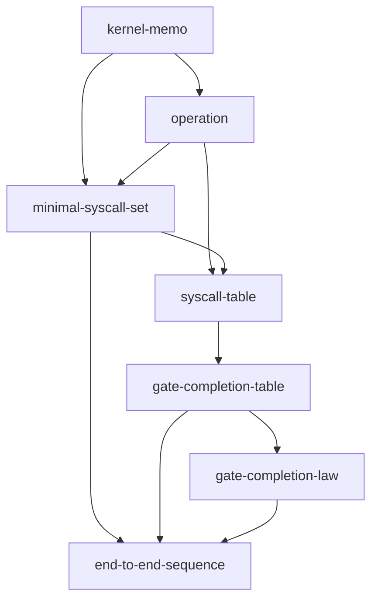

# kernel-interface — Document map

以下は、kernel-interface を構成する文書群の「役割」と「参照方向」を整理した構成案である。
仕様を 1 枚に潰さず、上位の立場文書から下位の syscall 仕様へ一方向に降りる読み筋を作る。

# kernel interface

本ディレクトリは、BSL Shell と executor の接合面を定義する仕様束である。
内容は、operation と kernel component の対応、minimal syscall set、返却スキーマ、gate completion、end to end sequence から構成される。

推奨する読み順は次のとおりである。

1. [minimal-syscall-set.md](./minimal-syscall-set.md)
2. [end-to-end-sequence.md](./end-to-end-sequence.md)
3. 必要に応じて [operation.md](./operation.md)
4. 必要に応じて [syscall-table.md](./syscall-table.md)
5. 必要に応じて [gate-completion-table.md](./gate-completion-table.md)
6. 要約規範として [gate-completion-law.md](./gate-completion-law.md)

## Layer 1 — framing

### kernel-memo

- role: between を meaning kernel として読む立場を固定する
- reader: 全体像を知りたい読者、公開時の入口読者、内部設計の前提を確認したい読者
- contains: purpose, kernel stance, scope of the OS metaphor, minimal kernel components, non-goals, replay law, responsibility boundary
- depends on: なし
- read next: minimal-syscall-set, end-to-end-sequence
- notes: OS 比喩の射程はこの文書でだけ扱う。他文書では比喩を増やさない
- location: `between-core/ja/annex/kernel-memo.md`

## Layer 2 — mapping and interface

### operation

- role: BSL Shell operation と kernel component の対応を示す
- reader: 既存の BSL Shell から接合面を確認したい読者、operation 単位で責務を追いたい読者
- contains: open, select, derive, compare, check, capture, order, commit, recovery の位置づけ
- depends on: kernel-memo
- read next: minimal-syscall-set, syscall-table
- notes: derive の位置づけはこの文書で扱う。minimal syscall の核に入れず supporting call として説明する

### minimal-syscall-set

- role: executor から見た最小問い合わせ面を定義する
- reader: executor 接合面を最短で把握したい読者、仕様の核だけを知りたい読者
- contains: select, compare, check, minimal syscall law, supporting calls の外縁
- depends on: kernel-memo, operation
- read next: syscall-table, end-to-end-sequence
- notes: ここでは 3 syscall に絞る。commit は gate completion call として別層へ置く

## Layer 3 — return schema and completion

### syscall-table

- role: select, compare, check の返却スキーマを横並びで定義する
- reader: 返却値と failure envelope を確認したい読者、実装接続を考える読者
- contains: select_return, compare_return, check_return, common envelope, failure naming boundary
- depends on: minimal-syscall-set, operation
- read next: gate-completion-table
- notes: undefined_type と reason_code の分離はここで読む。phi_snapshot_ref の immutable snapshot 説明もここに置く

### gate-completion-table

- role: check と commit を並べて gate subtype の完結条件を定義する
- reader: approve と certified の違いを確認したい読者、gate completion を実装したい読者
- contains: check_return, commit_return, branch matrix, completion condition
- depends on: syscall-table, minimal-syscall-set
- read next: gate-completion-law, end-to-end-sequence
- notes: commit はここで準核 call として上がる。certify_commit_ref の導線はこの文書が中心

### gate-completion-law

- role: gate completion の規範を短文で固定する
- reader: 表ではなく規範文として確認したい読者、README や要約へ転記したい読者
- contains: approve 先行条件, certification commit 要件, draft-to-certified 条件, hold と failure の分離, incomplete からの再到達条件
- depends on: gate-completion-table
- read next: end-to-end-sequence
- notes: 短い law 集として独立性が高い。README 断片にも転用しやすい

### end-to-end-sequence

- role: select, compare, check, commit の流れを 1 枚で示す
- reader: 全体を視覚的に把握したい読者、表より先に流れを見たい読者
- contains: decision path, hold path, failure path, incomplete path, gate complete path, 図下注釈
- depends on: minimal-syscall-set, gate-completion-table, gate-completion-law
- read next: 必要に応じて syscall-table や operation へ戻る
- notes: normal commit は incomplete path に入る。この図は 1 回の sequence 単位を表す

## Reference flow

## 推奨する閲覧順

公開向け:
kernel-memo → minimal-syscall-set → end-to-end-sequence → 必要に応じて syscall-table → gate-completion-table

内部設計向け:
kernel-memo → operation → minimal-syscall-set → syscall-table → gate-completion-table → gate-completion-law → end-to-end-sequence

## JP-EN mini glossary

| JP | EN |
|---|---|
| 立場文書 | framing document |
| 接合面 | interface |
| 返却スキーマ | return schema |
| 完結条件 | completion condition |
| 規範文 | law set |
| 全体流れ図 | end-to-end sequence |
