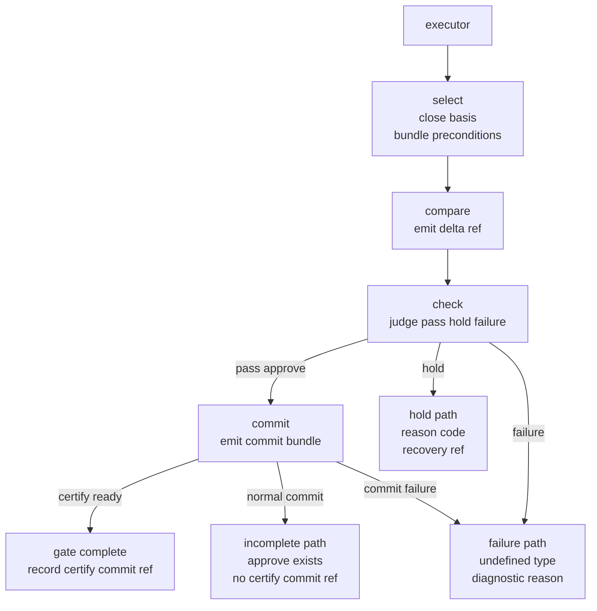

# End-to-end sequence

この図は、select, compare, check, commit を 1 枚に畳み、どこで前提を閉じ、どこで停止し、どこで certified 完結条件に入るかを示したものである。

根拠は、select が basis, reference bundle, preconditions を閉じ、compare が中立差分だけを返し、check が approve, hold, failure を分け、commit が certify_commit_ref を生成したときに gate subtype の完結条件が満たされる、という一連の整理である。

## 読み方

最初に executor は select を呼ぶ。
ここで basis, reference bundle, preconditions が閉じなければ、後ろへ進めない。selected_view_ref, condition_ref, phi_snapshot_ref が揃って初めて、比較可能性が開く。

次に compare が contract を読み、delta_ref を返す。
ここでは decision を返さない。返すのは中立差分だけである。したがって、approve, hold, reject のような語彙をここへ持ち込んではならない。

その後 check が stop rule を評価する。
ここが唯一の判定点である。pass なら gate_decision=approve を返し、hold なら reason_code と recovery_ref を返し、failure なら undefined_type と diagnostic_reason を返す。check_result_ref を evidence に残せない場合は hold ではなく failure である。

check が approve を返したときだけ commit に進む。
commit は diff_ref, basis_ref, action_trace_ref を返す採用更新であり、certification 条件を満たすと certify_commit_ref も返す。これが gate subtype の outputs に記録されると、draft から certified への完結条件が満たされる。

commit の後は 3 分岐になる。

- certify ready — certify_commit_ref が生成され、gate completion が完了する経路
- normal commit — commit_status: ok だが certify_commit_ref を伴わず、certified 完結条件はまだ満たさない経路
- commit failure — commit_status: failure であり、undefined_type と diagnostic_reason を返す経路

## 図下注釈

この sequence は、1 回の select → compare → check → commit を表す単位である。normal commit は commit_status: ok だが certify_commit_ref を伴わないため、failure ではなく incomplete としてこの sequence の終端に入る。draft から certified への遷移には gate_decision=approve と certify_commit_ref の両方が必要であり、incomplete から certified へ到達するには、新たな sequence を開始して完結条件を再度満たさなければならない。

hold は contract が意図した停止であり、reason_code と recovery を伴う。これに対し failure は syscall 自体の不成立であり、undefined_type と diagnostic_reason で返される。したがって incomplete, hold, failure は同じ未完了ではなく、意味的停止、技術的不成立、認証未完了という別々の状態として扱う。

## 最小規範

select が前提を閉じない限り compare を呼んではならない。
compare は delta だけを返し、decision を返してはならない。
check が approve を返さない限り certification commit を呼んではならない。
certify_commit_ref が記録されない限り gate completion は完了しない。

## JP-EN mini glossary

| JP | EN |
|---|---|
| 前提閉包 | precondition closure |
| 中立差分 | neutral delta |
| 停止判定 | stop evaluation |
| 保留経路 | hold path |
| 不成立経路 | failure path |
| 未完了経路 | incomplete path |
| 採用更新 | commit update |
| 完結条件 | completion condition |
| 認証付きコミット参照 | certify commit ref |
