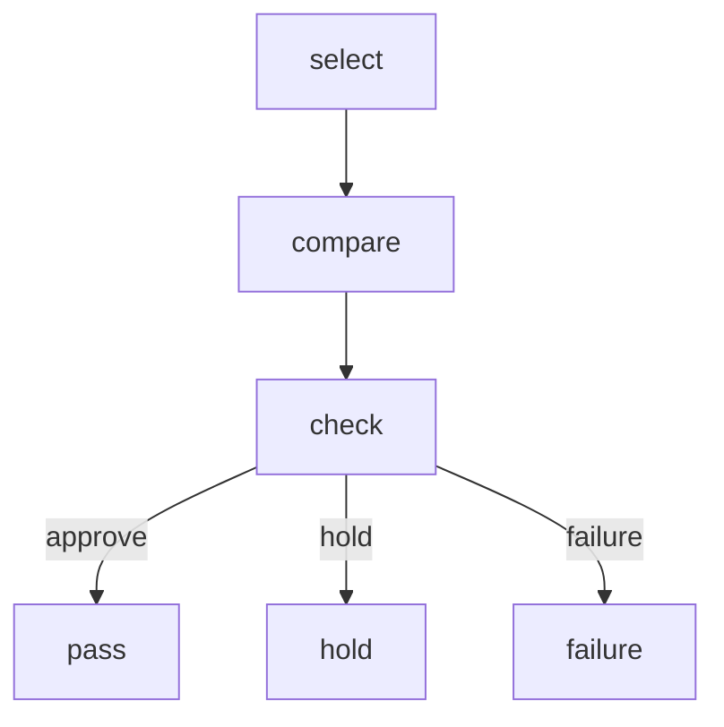

# Minimal syscall set v0

select, compare, check を中核に置く。

理由は、BSL Shell v0.1.39 が実装ではなく「操作の意味と契約」を定義し、その中で select が前提を閉じ、compare が中立な差分を返し、check が継続可否と停止理由を返す流れを持っているためである。さらに card system 側の minimal kernel でも、比較可能性は basis、reference bundle、preconditions、evidence の充足で成立し、stop rule は hold への写像規則を持つ。したがって executor から見た最小 syscall は、この 3 つでほぼ核を構成できる。

以下を、意味 OS における最小 syscall set として置く。

## syscall 1 — select

- purpose: 比較に入る前に前提を閉じる
- reads: basis, reference bundle, preconditions
- returns: selected_view_ref, condition_ref, phi_snapshot_ref
- failure: U1, U2, U3, U4
- notes: どの View を、どの Sidecar 条件で、どの Φ で読むかを確定する。ここで閉じないものは compare に進めない

## syscall 2 — compare

- purpose: 判定前の中立な差分を作る
- reads: contract, basis, reference bundle, preconditions, evidence
- returns: delta_ref
- failure: U1, U2, U3, U4
- notes: decision は返さない。comparison_target と allowed_delta_ref に従い delta を返す

## syscall 3 — check

- purpose: 継続可否を判定し停止点を返す
- reads: stop rule, evidence, context from select/compare
- returns: check_status (pass | hold | failure), check_result_ref, gate_decision (pass 時), reason_code + recovery_ref (hold 時), undefined_type + diagnostic_reason (failure 時)
- failure: U1, U2, U3, U4
- notes: stop rule を評価する。pass なら gate_decision=approve を返す。hold なら reason_code と recovery_ref を返す。failure なら undefined_type と diagnostic_reason を返す。check_result を evidence に append できなければ pass でも hold でもなく failure である

## 3 syscall の役割分担

select は前提閉包である。
BSL Shell では、同一 space_id、必要な basis_id、解決可能な EvalFrameRef、必要なら EffectDeclarationRef を require し、どの View をどの Sidecar 条件とどの Φ で読むかを確定する。したがって select は、kernel component で言う basis、reference bundle、preconditions をまとめて読む入口である。

compare は差分生成である。
ここでは contract の comparison_target と allowed_delta_ref を使って、判定前の中立な Δ だけを返す。minimal kernel でも contract は比較対象と許容差参照を固定する層であり、compare はその実行面に対応する。ここで decision を返さないことが重要である。

check は停止判定である。
BSL Shell では No gate without a check report とされ、Reading(kind="check_result") を残せない場合は不成立である。また minimal kernel では stop rule が reason_code を hold record に写像する。つまり check は、単なる妥当性確認ではなく、gate の前提となる停止制御 syscall である。

## なぜ 3 つで足りるか

この 3 つで、意味 OS の最小循環が閉じる。

- select が比較可能性を開く
- compare が差分の事実を出す
- check が進行か停止かを決める

open, derive, capture, order, commit は重要だが、核ではない。
それらは入口記録、投影生成、証跡固定、採用更新という補助群であり、executor の最小問い合わせ面としては、まず select, compare, check を先に固定した方が責務が明瞭である。BSL Shell も v0.1 では「語彙＋契約＋失敗型」を固定し、詳細な機械運用資産は別層へ分離すると述べている。

## executor から見た最小シーケンス

executor は最初に select で前提を閉じ、次に compare で差分を得て、最後に check で継続可否を問う。check が approve を返したら capture や order や commit の後段へ進む。hold を返したら recovery 側へ進む。failure は syscall 自体の不成立であり、recovery の管轄外である。したがって select, compare, check は、3 層図を executor 側へ圧縮した最小 syscall 列と見なせる。

## minimal syscall law

この 3 syscall を一文で固定するなら、次の形である。

select が basis と reference bundle と preconditions を閉じられない限り compare を呼んではならない。
compare は decision を返してはならず delta のみを返す。
check は stop rule を評価し check_result を evidence に残せない限り gate を成立させてはならない。

## 外側に置くもの

この時点では、次は syscall 外縁として扱う。

- derive は projection 生成
- capture, order は evidence 固定
- commit は採用更新
- recovery は停止後導線

つまり最小核は select, compare, check、その外側に supporting calls がぶら下がる構造である。
この分け方なら、OS 比喩も過剰にならず、executor 接合面だけを先に確定できる。

## JP-EN mini glossary

| JP | EN |
|---|---|
| 最小システムコール集合 | minimal syscall set |
| 前提閉包 | precondition closure |
| 差分生成 | delta generation |
| 停止判定 | stop evaluation |
| 停止理由 | diagnostic reason |
| 保留 | hold |
| 通過 | pass |
